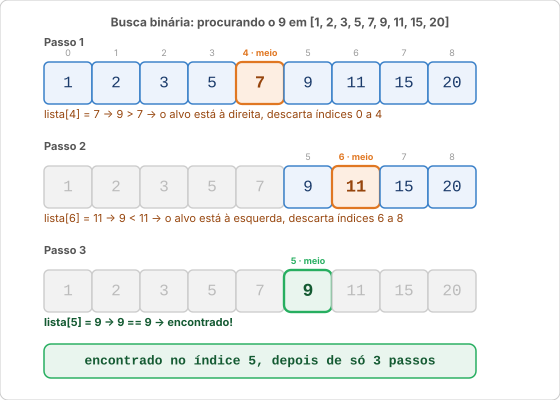
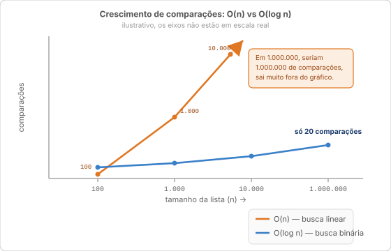

# Apêndice: Algoritmos notáveis

> Este apêndice vai além do conteúdo de CI182/CI240. Você não precisa saber isso para passar na matéria, mas se você ficou curioso sobre como os problemas clássicos de computação são resolvidos, aqui está.

Algoritmo é só uma receita com passos bem definidos para resolver um problema. Existem algoritmos para praticamente tudo: ordenar uma lista, encontrar o caminho mais curto num mapa, comprimir um arquivo. Os que aparecem aqui são os mais clássicos, você vai cruzar com eles de novo em Estrutura de Dados, Algoritmos e em entrevistas de emprego.

---

## Algoritmos de busca

O problema de busca é simples de enunciar: dado um valor, você quer saber se ele está numa coleção e, se estiver, onde.

Parece trivial, mas a forma como você busca faz diferença enorme quando a coleção tem milhões de elementos.

---

### Busca linear

A ideia mais direta possível: percorra a lista do início ao fim, elemento a elemento, até encontrar o que procura (ou acabar a lista).

![Busca linear percorrendo a lista [7, 2, 5, 1, 9, 3] até encontrar o 9 no índice 4, depois de 5 comparações](imagens/busca_linear.svg)

```text
lista = [7, 2, 5, 1, 9, 3]
buscar: 9

passo 1 → lista[0] = 7   → 7 == 9? Não
passo 2 → lista[1] = 2   → 2 == 9? Não
passo 3 → lista[2] = 5   → 5 == 9? Não
passo 4 → lista[3] = 1   → 1 == 9? Não
passo 5 → lista[4] = 9   → 9 == 9? Sim! → índice 4
```

```python
def busca_linear(lista, alvo):
    for i in range(len(lista)):
        if lista[i] == alvo:
            return i       # retorna o índice onde encontrou
    return -1              # convenção: -1 significa "não encontrou"


numeros = [7, 2, 5, 1, 9, 3]
print(busca_linear(numeros, 9))    # 4
print(busca_linear(numeros, 42))   # -1
```

**Python já faz busca linear por baixo dos panos** quando você usa `in` ou `.index()`. Escrever a função à mão é útil para entender o mecanismo; na prática, use o que a linguagem oferece:

```python
9 in numeros           # True
numeros.index(9)       # 4
```

#### Complexidade

No pior caso (o valor está no final ou não está), a busca linear visita todos os `n` elementos da lista: **O(n)**.

Se a lista tem 1.000 elementos, no pior caso você faz 1.000 comparações. Com 10.000, até 10.000 comparações. O tempo cresce proporcionalmente ao tamanho.

#### Quando usar

- A lista **não está ordenada**: é a única opção que funciona sem pré-requisito.
- A lista é **pequena**: para dezenas ou centenas de elementos, a diferença de desempenho é irrelevante.
- Você vai **buscar uma só vez**: não vale ordenar a lista só para uma busca.

---

### Busca binária

A busca linear é como procurar um nome numa lista telefônica lendo do começo. A busca binária é o que você faz na prática: abre no meio, vê se o nome vem antes ou depois, descarta metade e repete.

**Pré-requisito obrigatório: a lista precisa estar ordenada.**

A estratégia é dividir o espaço de busca ao meio a cada passo:



O traço completo, com a conta de cada `meio`:

```text
lista = [1, 2, 3, 5, 7, 9, 11, 15, 20]   (ordenada)
buscar: 9

          0   1   2   3   4   5   6   7   8
        [ 1,  2,  3,  5,  7,  9, 11, 15, 20 ]
          ↑                   ↑               ↑
        início              meio             fim

passo 1 → meio = (0 + 8) // 2 = 4 → lista[4] = 7
          9 > 7 → o alvo está à direita → início passa para meio + 1 = 5

          0   1   2   3   4   5   6   7   8
        [                    9, 11, 15, 20 ]
                             ↑       ↑    ↑
                           início  meio  fim

passo 2 → meio = (5 + 8) // 2 = 6 → lista[6] = 11
          9 < 11 → o alvo está à esquerda → fim passa para meio - 1 = 5

          0   1   2   3   4   5
        [                    9 ]
                             ↑
                        início = meio = fim

passo 3 → meio = (5 + 5) // 2 = 5 → lista[5] = 9
          9 == 9 → Encontrado! índice 5
```

3 passos para achar o elemento numa lista de 9. Com busca linear, seriam 6.

```python
def busca_binaria(lista, alvo):
    inicio = 0
    fim = len(lista) - 1

    while inicio <= fim:
        meio = (inicio + fim) // 2

        if lista[meio] == alvo:
            return meio           # encontrou
        elif lista[meio] < alvo:
            inicio = meio + 1     # alvo está à direita
        else:
            fim = meio - 1        # alvo está à esquerda

    return -1                     # não encontrou


notas = [5, 6, 7, 7, 8, 8, 9, 10]    # deve estar ordenada!
print(busca_binaria(notas, 8))         # 4 (ou 5, depende do meio)
print(busca_binaria(notas, 3))         # -1
```

> **Atenção:** se a lista não estiver ordenada, a busca binária retorna resultados incorretos sem dar erro. Não tem como saber que errou, por isso o pré-requisito é crítico.
>
> **Cuidado com o bug mais famoso desse algoritmo:** é fácil escrever `inicio = meio` em vez de `inicio = meio + 1` (ou o equivalente com `fim`). Parece inofensivo, mas trava o programa num loop infinito: quando sobram só dois elementos, `meio` pode calcular de volta o próprio `inicio`, e o intervalo nunca encolhe.
>
> ```python
> elif lista[meio] < alvo:
>     inicio = meio          # bug: falta o + 1, o intervalo pode nunca encolher
> ```
>
> A correção é sempre garantir que `inicio` ou `fim` avancem de verdade a cada passo: `meio + 1` de um lado, `meio - 1` do outro.

#### Python tem isso pronto: módulo `bisect`

Para usar busca binária sem implementar à mão, Python oferece o módulo `bisect`. Ele não é ensinado em nenhuma aula deste curso, mas se você já viu a Aula 15 e se sente confortável com `import`, é só mais um módulo da biblioteca padrão:

```python
import bisect

notas = [5, 6, 7, 7, 8, 8, 9, 10]

# bisect_left retorna o índice onde o valor está (ou onde seria inserido)
pos = bisect.bisect_left(notas, 8)
if pos < len(notas) and notas[pos] == 8:
    print(f"Encontrado no índice {pos}")   # Encontrado no índice 4
else:
    print("Não encontrado")
```

#### Complexidade

A cada passo, o espaço de busca cai pela metade. Com 1.000 elementos, em 10 passos você chega à resposta. Com 1.000.000, em 20 passos. Isso é **O(log n)**.

| Tamanho da lista | Busca linear (pior caso) | Busca binária (pior caso) |
|-----------------|--------------------------|---------------------------|
| 100             | 100 comparações          | 7 comparações             |
| 1.000           | 1.000 comparações        | 10 comparações            |
| 10.000          | 10.000 comparações       | 14 comparações            |
| 1.000.000       | 1.000.000 comparações    | 20 comparações            |



A diferença parece absurda, e é. Para listas grandes que você vai buscar muitas vezes, vale o custo de manter a lista ordenada só para poder usar busca binária.

#### Quando usar

- A lista é **grande** e você vai buscar **frequentemente**.
- A lista já está **ordenada** (ou você pode ordenar uma vez e buscar várias vezes).
- O custo de ordenar (`O(n log n)`) é amortizado por várias buscas.

---

### Comparando as duas

| | Busca linear | Busca binária |
|---|---|---|
| **Complexidade** | O(n) | O(log n) |
| **Pré-requisito** | Nenhum | Lista ordenada |
| **Listas não ordenadas** | Funciona | Não funciona |
| **Listas pequenas** | Boa escolha | Overkill |
| **Listas grandes** | Lenta | Muito rápida |
| **Implementação** | Trivial | Um pouco mais cuidado |

Regra prática: se a lista não está ordenada e você vai buscar uma só vez, use `in`. Se a lista é grande, está ordenada e você vai buscar muitas vezes, use `bisect`.

---

## O que vem depois

Busca e ordenação são os algoritmos de entrada, todo curso de Estrutura de Dados começa por aí. Se você continuar em Ciência da Computação, vai encontrar algoritmos de:

- **Ordenação**: Bubble Sort, Merge Sort, Quick Sort; por que o Python usa Timsort; quando cada um é melhor (já tem uma introdução em [Custo de operações em listas](custo_de_operacoes.md))
- **Grafos**: BFS (busca em largura) e DFS (busca em profundidade), caminhos mínimos, Dijkstra
- **Recursão e divisão e conquista**: Merge Sort, torres de Hanói, o padrão de "resolve um caso pequeno + chama a si mesmo" (você já viu o básico disso na [Aula 13](../aulas/13_funcoes.md#recursão); a própria busca binária lá em cima é naturalmente recursiva, dá pra reescrever sem o `while`)
- **Programação dinâmica**: quando a recursão resolve o mesmo subproblema várias vezes e você guarda os resultados para não repetir o trabalho
