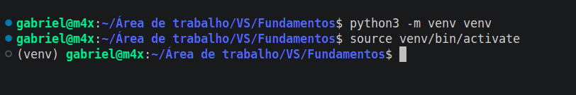

# Apêndice: Ambiente Avançado

Este apêndice cobre tópicos que **você não vai precisar nas aulas iniciais**, mas que são úteis quando os projetos começam a crescer. Pode pular por enquanto e voltar aqui quando precisar, principalmente quando chegar na **Aula 15 (Módulos)**, onde você vai começar a usar bibliotecas externas de verdade, e talvez para o trabalho final da disciplina.

Aqui tem também outras plataformas que não cabem no fluxo da aula principal: Jupyter, Google Colab e VS Code online.

---

## Ambiente virtual com `venv`

Quando você instala uma biblioteca Python, ela vai para um lugar central no seu computador. Isso parece simples, mas cria um problema: e se o projeto A precisar da versão 1.0 de uma biblioteca, e o projeto B precisar da versão 2.0? Eles vão se conflitar.

O **ambiente virtual** resolve isso criando uma pasta isolada para cada projeto, com as próprias bibliotecas. Se você tiver dois projetos com dependências diferentes no mesmo semestre, ou no trabalho final da disciplina usando uma biblioteca específica, é aqui que o `venv` passa a fazer sentido.

### Criando o ambiente

Dentro da pasta do seu projeto, no terminal:

```bash
python3 -m venv venv
```

Isso cria uma pasta chamada `venv` com tudo que o ambiente precisa. Você só faz isso uma vez por projeto.

### Ativando o ambiente

Antes de trabalhar no projeto, ative o ambiente:

```bash
source venv/bin/activate    # Linux / Mac
venv\Scripts\activate       # Windows
```

> **No Windows, com o terminal do VS Code em PowerShell:** se aparecer um erro do tipo `... cannot be loaded because running scripts is disabled on this system`, é a política de segurança do PowerShell bloqueando o script de ativação, não um erro no seu código. Resolve rodando uma vez: `Set-ExecutionPolicy -Scope CurrentUser RemoteSigned`. Depois disso o `venv\Scripts\activate` funciona normalmente.



Quando ativo, o nome `(venv)` aparece no início da linha do terminal: é o sinal de que está dentro do ambiente isolado.

Enquanto o ambiente estiver ativo, tudo que você instalar vai para dentro dele, não para o sistema inteiro.

### Desativando

Quando terminar de trabalhar rode:

```bash
deactivate
```

O `(venv)` some e você volta ao Python do sistema. O comando é `deactivate` mesmo.

---

## Instalando bibliotecas com `pip`

O `pip` é o gerenciador de pacotes do Python. Se você já usa Linux, pense nele como um `apt` para pacotes Python, um comando que instala qualquer biblioteca disponível. Se não, sem analogia mesmo: você digita o nome da biblioteca e ele baixa e instala para você.

### Comandos mais usados

```bash
# Instalar uma biblioteca
pip install requests

# Instalar uma versão específica
pip install requests==2.31.0

# Ver o que está instalado no ambiente atual
pip list

# Desinstalar
pip uninstall requests
```

### Salvando as dependências do projeto

Quando você termina de configurar um projeto, é boa prática registrar quais bibliotecas ele usa:

```bash
pip freeze > requirements.txt
```

Isso cria um arquivo `requirements.txt` com a lista exata de tudo instalado. Se outra pessoa (ou você mesmo, em outro computador) quiser rodar o projeto, basta:

```bash
pip install -r requirements.txt
```

E o ambiente fica idêntico ao original. Útil quando você entrega o trabalho final da disciplina e quer garantir que o professor consegue rodar sem precisar instalar as dependências manualmente.

---

## Organização de projetos maiores

Pra um exercício das aulas, um único `main.py` resolve. Mas quando o projeto cresce, cinco responsabilidades diferentes disputando espaço no mesmo arquivo já não é tão simples de acompanhar.

A ideia é a mesma que você já viu na [Aula 15 (Módulos)](../aulas/15_modulos.md): separar o código por responsabilidade, cada arquivo cuidando de uma parte, importado de onde for preciso. Arquivos irmãos na mesma pasta já se importam entre si com `from arquivo import nome`; `__init__.py` só entra em cena quando você quer importar de uma subpasta como pacote.

Um exemplo real, deste próprio repositório: `docs/projetos/copa_penaltis/` divide o jogo em `jogadores.py` (classes de jogador e goleiro), `campeonato.py` (dados do chaveamento), `partida.py` (regras de uma cobrança de pênalti) e `main.py`, que só importa dos outros três e orquestra o jogo. Nenhum arquivo fazendo mais do que a própria responsabilidade pede.

Uma estrutura comum pra quando o projeto passa de "um arquivo só" para "vários arquivos com um ponto de entrada":

```text
meu_projeto/
  main.py           ← ponto de entrada, importa dos outros arquivos
  venv/             ← ambiente virtual (gerado automaticamente, não mexa nele)
  requirements.txt  ← lista de dependências
  calculos.py       ← um módulo por responsabilidade
  utilitarios.py
```

Não existe regra fixa de quando dividir. A pergunta que vale a pena fazer é "consigo achar rápido onde mexer quando algo quebrar?". Se a resposta for não, é hora de separar.

---

## Outras plataformas

### Jupyter Notebook

O Jupyter é uma interface de notebook, você escreve código em células separadas e executa uma por vez, vendo o resultado logo abaixo de cada célula. É muito usado em ciência de dados e análise de dados.

Para instalar:

```bash
pip install notebook
jupyter notebook
```

Isso abre o Jupyter no seu navegador. Para a disciplina CI182/CI240, o Jupyter não é o ambiente padrão, mas se você seguir para áreas de dados depois, provavelmente vai encontrá-lo com frequência.

### Google Colab

O Google Colab é um Jupyter que roda no navegador, sem instalar nada, usando a infraestrutura do Google. Funciona com qualquer conta Google.

Acesse em [colab.research.google.com](https://colab.research.google.com).

Útil para experimentos rápidos ou para quem está num computador sem Python instalado. Limitações: o ambiente reseta a cada sessão (as instalações de bibliotecas somem) e o acesso a arquivos locais exige passos extras.

Os gabaritos das listas que fiz na disciplina foram feitos inteiramente no Google Colab.

### VS Code online

O VS Code tem uma versão que roda direto no navegador em [vscode.dev](https://vscode.dev). É o mesmo editor, mas sem terminal, não dá para executar código Python. Serve para editar arquivos, navegar no repositório ou fazer ajustes rápidos de qualquer computador.

Para rodar código Python no navegador com o VS Code, a alternativa é o **GitHub Codespaces**, que abre um ambiente de desenvolvimento completo no cloud. Tem um nível gratuito suficiente para projetos de estudo.

---

No dia a dia eu uso VS Code local para praticamente tudo e só recorro ao Colab quando preciso rodar algo rápido num computador que não é meu. Nenhuma dessas ferramentas é obrigatória para a disciplina, mas se um dia um projeto seu começar a esbarrar num desses problemas (dependências conflitando, notebook de outra pessoa, editar código sem instalar nada), agora você sabe onde procurar.
