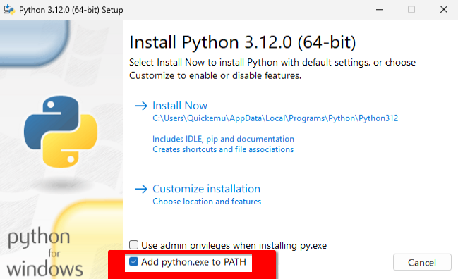
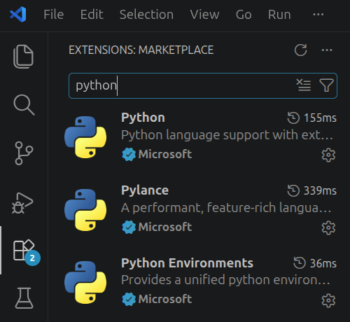
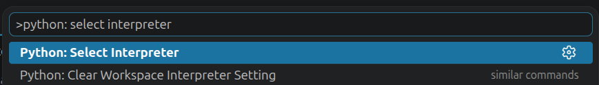
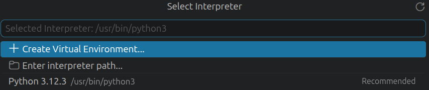
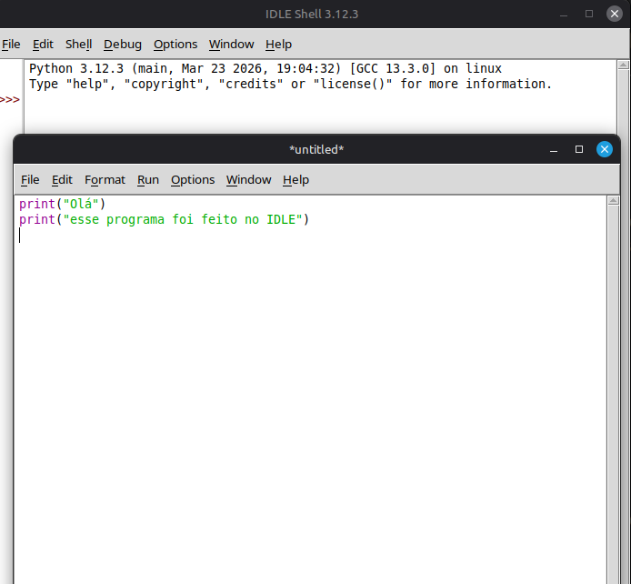
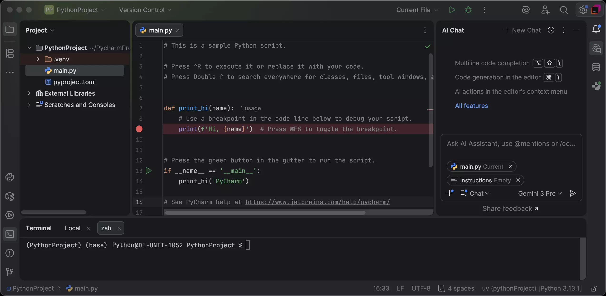
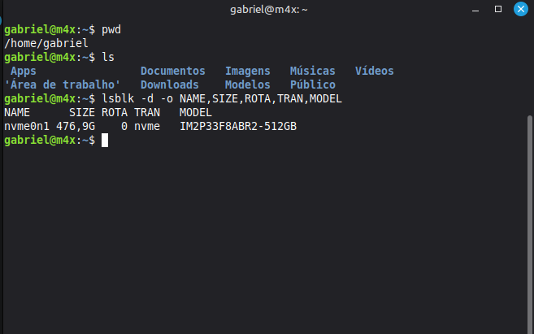

# Aula 01: Ambiente de Desenvolvimento Python

Antes de escrever qualquer linha de código, você precisa preparar o seu computador. Não pule esta etapa, configurar o ambiente agora vai evitar dor de cabeça lá na frente.

Nesta aula você vai instalar o Python e conhecer as principais opções de ambiente de desenvolvimento. A disciplina não exige nenhuma ferramenta específica, então vou cobrir as que aparecem com mais frequência: IDLE, PyCharm e VS Code. O foco maior vai ser no **VS Code**, que é o que eu recomendo: é gratuito, leve e serve tanto para os exercícios da disciplina quanto para projetos maiores lá na frente.

> O [Apêndice: Ambiente Avançado](../apendices/ambiente_avancado.md) cobre mais plataformas e ferramentas relacionadas: ambientes virtuais com `venv`, gerenciador de pacotes com `pip`, organização de projetos maiores e outras opções de ambiente (Jupyter, Google Colab e VS Code online).

---

## Instalando o Python

### Qual versão baixar?

Baixe sempre a **versão mais recente estável** disponível no site. Quando escrevi essa aula, era a **3.13**. Se aparecer uma versão mais nova, pode baixar sem problema.

Uma observação importante: versões muito antigas (abaixo de 3.8) podem ter comportamento diferente em alguns exemplos das aulas. Se você já tem Python instalado e a versão for 3.10 ou superior, não precisa atualizar se não quiser.

### Linux

A maioria das distribuições Linux já vem com Python instalado. Antes de instalar qualquer coisa, verifique no seu terminal:

```bash
python3 --version
```

Se aparecer algo como `Python 3.11.x`, você já está pronto. Se o comando não for reconhecido, instale pelo gerenciador de pacotes da sua distribuição:

```bash
# Ubuntu / Debian
sudo apt update
sudo apt install python3

# Fedora
sudo dnf install python3

# Arch Linux
sudo pacman -S python
```

Depois de instalar, rode `python3 --version` novamente para confirmar.

### Windows

1. Acesse [python.org/downloads](https://python.org/downloads): o site detecta que você está no Windows e já sugere o instalador correto.
2. Clique em **Download Python 3.x.x** e execute o arquivo baixado.
3. Na primeira tela do instalador, **marque obrigatoriamente a opção "Add Python to PATH"** antes de clicar em qualquer coisa. Essa é a etapa que a maioria esquece, sem ela, o terminal não vai reconhecer o comando `python` e você vai precisar reinstalar.
4. Clique em **Install Now** e aguarde.



Para verificar que funcionou, abra o **Prompt de Comando** (`Win + R`, digite `cmd`, Enter) e rode:

```cmd
python --version
```

Se aparecer a versão, está pronto. Se aparecer um erro ou abrir a loja do Windows, o PATH não foi configurado, desinstale e reinstale marcando a opção correta.

### Mac

O macOS pode ter uma versão antiga do Python 2 pré-instalada, mas você precisa do Python 3. Verifique primeiro:

```bash
python3 --version
```

Se não estiver instalado ou a versão for antiga, você tem duas opções:

**Opção 1: Instalador oficial** (mais simples): acesse [python.org/downloads](https://python.org/downloads), baixe o instalador `.pkg` para macOS e siga o assistente normalmente.

**Opção 2: Homebrew** (recomendada se você já usa o Homebrew para outras coisas):

```bash
brew install python
```

Após instalar, confirme com `python3 --version`.

---

## VS Code ★

O VS Code (Visual Studio Code) é o editor que vou usar como base neste repositório. Como eu falei antes: é gratuito, leve, tem terminal integrado e suporte excelente para Python.

### Instalando

1. Acesse [code.visualstudio.com](https://code.visualstudio.com), o site detecta seu sistema e sugere o download certo.
2. Execute o instalador. No Windows, marque a opção **"Adicionar ao PATH"** durante a instalação, facilita abrir o VS Code pelo terminal mais tarde.

### Extensão Python

O VS Code é um editor genérico por padrão, ele não sabe que você está escrevendo Python até você instalar a extensão correta:

1. Pressione `Ctrl+Shift+X` para abrir o painel de extensões (ou vá no ícone de extensões).
2. Digite **Python** na busca.
3. Instale a extensão **Python** da **Microsoft** (a primeira da lista, com milhões de instalações).



Com ela, o VS Code passa a destacar a sintaxe com cores, sublinhar erros enquanto você digita e sugerir completações.

### Selecionando o interpretador

Após instalar a extensão, o VS Code precisa saber qual Python usar, pode haver mais de uma versão no computador. Pressione `Ctrl+Shift+P`, digite **Python: Select Interpreter** e pressione Enter:



Em seguida escolha a versão que você instalou na lista que aparece, geralmente marcada como "Recommended":



Se isso não aparecer agora, não se preocupe, o VS Code vai perguntar quando você tentar rodar o primeiro arquivo.

### Abrindo seu projeto

Sempre abra a **pasta** do projeto, não um arquivo avulso. A diferença importa: quando você abre só o arquivo, o terminal abre na pasta errada e o VS Code não enxerga o contexto do projeto. Quando você abre a pasta, tudo funciona junto.

Para abrir: `Arquivo > Abrir Pasta` (ou `Ctrl+K`, `Ctrl+O`), selecione a pasta e confirme.

### Rodando um arquivo Python

Com um arquivo `.py` aberto, você tem duas formas de rodar:

- **Botão play**: o triângulo no canto superior direito do arquivo. Prático para testes rápidos.
- **Terminal integrado**: abre com **Ctrl+&#96;** (crase). Nele você pode passar argumentos, ver o histórico de execuções e interagir com o programa enquanto ele roda.

Para rodar pelo terminal:

```bash
python3 main.py    # Linux / Mac
python main.py     # Windows
```

Se o botão play executar o arquivo errado ou usar o Python errado, prefira o terminal, ele sempre roda exatamente o que você digitar.

### Extensões úteis (opcionais)

- **Pylance**: análise de código mais inteligente, detecta erros antes de você rodar. Instale pelo mesmo painel de extensões.
- **indent-rainbow**: colore os níveis de indentação com cores diferentes. Ajuda bastante caso tenha dificuldades com a indentação.

---

## Outros ambientes de desenvolvimento

O VS Code é o editor que uso como base neste repositório, mas para a disciplina o que importa é ter Python instalado e rodando. As opções abaixo são as que você mais vai ouvir falar, tanto nos materiais da disciplina quanto fora delas.

---

### IDLE

O IDLE aparece bastante nas aulas presenciais da disciplina, é o ambiente que costuma estar nos slides dos professores e nos tutoriais mais antigos do curso. Se você assistir uma aula e o professor estiver usando uma janela simples com fundo branco e texto colorido, provavelmente é o IDLE.



O IDLE funciona em **Windows, Linux e Mac**, mas o comportamento varia por sistema:

- **Windows e Mac**: vem instalado junto com o Python. Se você instalou o Python pelo site oficial, o IDLE já está na sua máquina.
- **Linux**: o IDLE é um pacote separado, instalar o `python3` não o inclui automaticamente. Você precisa instalar à parte:

```bash
# Ubuntu / Debian
sudo apt install idle3

# Fedora
sudo dnf install python3-idle

# Arch Linux
sudo pacman -S tk   # o IDLE depende do tk para funcionar
```

**Como abrir:**
- **Windows**: menu Iniciar → procure por *IDLE* ou *IDLE (Python 3.x)*
- **Linux**: no terminal, depois de instalar, digite `idle3` ou `idle`
- **Mac**: Launchpad ou Spotlight → *IDLE*

**Como funciona:**

O IDLE tem duas janelas:

1. **Shell**: abre automaticamente quando você inicia o IDLE. É um console interativo: você digita uma linha de Python, pressiona Enter, e o resultado aparece imediatamente na tela. Útil para testar expressões rápidas.

2. **Editor**: para escrever arquivos `.py` completos. Abra com `Arquivo > Novo Arquivo` (ou `Ctrl+N`). Quando quiser rodar, pressione `F5`, o IDLE salva o arquivo e executa no Shell.

**Limitações reais:** sem terminal integrado, sem autocomplete avançado, sem controle de versão, sem extensões. Para os exercícios das primeiras aulas funciona bem, é o que alguns professores usam nas aulas justamente por ser o padrão. Para projetos com mais de um arquivo ou que usam bibliotecas, você vai sentir falta de recursos.

---

### PyCharm



O PyCharm é um IDE completo desenvolvido pela JetBrains. A versão **Community é gratuita** e funciona em **Windows, Linux e Mac**.

**Como instalar:**

Acesse [jetbrains.com/pycharm](https://www.jetbrains.com/pycharm/) e baixe a versão **Community**, não confunda com a Professional, que é paga. Siga o instalador normalmente.

Na primeira vez que abrir, o PyCharm vai pedir para você configurar um projeto e selecionar o interpretador Python, escolha o Python que você instalou anteriormente.

> **Licença estudantil:** estudantes com e-mail institucional geralmente têm acesso à versão Professional gratuitamente. Se você tem e-mail `@ufpr.br`, cadastre-se em [jetbrains.com/community/education](https://www.jetbrains.com/community/education/) para liberar todas as ferramentas da JetBrains sem custo.

**Na prática:**

Honestamente, não usei muito o PyCharm, acabei sempre voltando pro VS Code por hábito. O que senti de diferença real: ele é mais pesado para abrir, especialmente no primeiro carregamento. O depurador é o recurso que mais me chamou atenção: você coloca um breakpoint (aquele ponto vermelho na lateral da linha, que aparece na imagem acima) e executa o programa passo a passo, vendo o valor de cada variável em tempo real. É o tipo de coisa que faz diferença quando você tem um bug que não entende de onde veio. Fora isso, o autocomplete é mais agressivo que o do VS Code, o que pode ajudar ou atrapalhar dependendo do gosto.

Para os exercícios da disciplina, eu acho o PyCharm um pouco exagerado. Ele começa a fazer sentido quando os projetos crescem: múltiplos arquivos, bibliotecas, código que outras pessoas também vão ler. Mas, se fosse para escolher um, eu ainda iria no VS Code.

---

### Replit: descontinuado como editor

> **O Replit não é mais uma opção viável para a disciplina.** Deixo essa seção aqui só para contextualizar, caso você tenha ouvido falar dele em aula ou visto citado em algum material antigo.

O Replit era uma plataforma que rodava direto no navegador, sem instalar nada, funcionava em qualquer computador com internet. Era exatamente o tipo de coisa útil para quem está no laboratório ou não quer configurar ambiente. O meu professor usava nas aulas e um dos materiais da disciplina também citava como alternativa.

O problema é que a plataforma mudou completamente. A interface hoje é um chat de agente de IA. Você descreve o que quer e a IA escreve o código por você. Os templates para linguagens específicas, que eram o caminho para usar o editor tradicional, foram removidos. A mensagem oficial da plataforma é:

> *"Templates have been removed. Developer framework templates are no longer available on Replit. Start a new project from the home page and let Replit Agent build it for you."*

Para os exercícios da disciplina, onde o objetivo é você escrever o código, esse modelo não faz sentido. A melhor alternativa é configurar o ambiente localmente mesmo.

---

### Resumo

| Ambiente | Sistemas | Instalação | Melhor para |
|----------|----------|-----------|-------------|
| IDLE | Win / Linux / Mac | Já vem com o Python | Seguir o que os professores usam |
| VS Code ★ | Win / Linux / Mac | [code.visualstudio.com](https://code.visualstudio.com) | Equilíbrio entre leveza e recursos |
| PyCharm Community | Win / Linux / Mac | [jetbrains.com/pycharm](https://www.jetbrains.com/pycharm/) | Projetos maiores |
| Repl.it | - | ~~Sem instalação~~ | **descontinuado como editor** |

---

## Terminal



O terminal é uma janela de texto onde você dá comandos diretamente ao computador. No começo parece estranha, mas com o tempo se torna natural. E em programação você vai usá-la bastante.

No VS Code, o terminal já abre automaticamente dentro da pasta do projeto. Para abrir: **Ctrl+&#96;** ou `Terminal > Novo Terminal` no menu.

### Comandos essenciais

```bash
# Ver em qual pasta você está
pwd

# Listar arquivos e pastas da pasta atual
ls          # Linux / Mac
dir         # Windows

# Entrar em uma pasta
cd nome-da-pasta

# Voltar para a pasta anterior
cd ..

# Executar um arquivo Python
python3 arquivo.py    # Linux / Mac
python arquivo.py     # Windows
```

### Exemplo prático

Imagine que você criou um arquivo chamado `main.py` dentro de uma pasta `meu_projeto`. No terminal:

```bash
cd meu_projeto        # entra na pasta
python3 main.py       # roda o arquivo
```

Se estiver usando o terminal do VS Code com a pasta já aberta, basta:

```bash
python3 main.py
```

> Dica: use a tecla `Tab` para completar nomes de arquivos e pastas automaticamente, assim você não precisa digitar tudo.

---

## Como organizar seu projeto

Para os exercícios da disciplina, um único `main.py` já é suficiente. Conforme o projeto cresce, pode fazer sentido criar pastas para separar as coisas:

```text
meu_projeto/
  main.py           ← arquivo principal, ponto de entrada do programa
  venv/             ← ambiente virtual (quando precisar, veja o apêndice)
  requirements.txt  ← lista de dependências (quando usar bibliotecas externas)
  src/              ← módulos e funções do projeto
  docs/             ← material de apoio, anotações
```

Não tem regra rígida aqui, mas adicionar estrutura de pastas num projeto pequeno atrapalha mais do que ajuda. Um único arquivo bem nomeado já resolve para qualquer exercício das aulas. A estrutura completa faz mais sentido quando o projeto tem vários arquivos e outras pessoas também vão trabalhar nele.

> Ambientes virtuais, gerenciador de pacotes e mais detalhes sobre organização de projetos estão no [Apêndice: Ambiente Avançado](../apendices/ambiente_avancado.md).

---

## Exercício sugerido: teste seu ambiente

Antes de avançar para a próxima aula, confirme que tudo está funcionando:

1. Crie uma pasta chamada `primeiro_projeto` em algum lugar no seu computador.
2. Abra essa pasta no VS Code (`Arquivo > Abrir Pasta`).
3. Crie um arquivo chamado `main.py` dentro dela.
4. Escreva no arquivo:

   ```python
   print("Olá! Meu ambiente está funcionando.")
   print("Python está pronto para começar.")
   ```

5. Rode com o triângulo no canto superior direito ou abra o terminal integrado do VS Code (**Ctrl+&#96;**) e rode:

   ```bash
   python3 main.py     # Linux / Mac
   python main.py      # Windows
   ```

Se as duas mensagens aparecerem no terminal, ótimo, você está pronto!

---

### Parte 2: provoque o erro de pasta

Agora que funcionou, tente intencionalmente errar. Abra um terminal **fora do VS Code**: o Terminal do sistema no Linux/Mac, ou o Prompt de Comando no Windows (`Win + R` → `cmd`) e, sem navegar para nenhuma pasta, rode direto:

```bash
python3 main.py
```

Você vai ver algo parecido com:

```text
python3: can't open file 'main.py': [Errno 2] No such file or directory
```

Esse erro não significa que o Python quebrou, significa que ele procurou `main.py` na pasta em que você está agora e não encontrou, porque você está em outro lugar. Para resolver:

```bash
# Veja onde você está
pwd

# Entre na pasta do projeto
cd primeiro_projeto

# Confirme que o arquivo está lá
ls

# Agora rode
python3 main.py
```

Isso é a diferença entre o terminal avulso e o terminal integrado do VS Code: o VS Code abre o terminal automaticamente dentro da pasta do projeto. No terminal avulso, você navega até onde o arquivo está e quando aparecer esse erro em qualquer outra situação, a primeira pergunta é sempre "em qual pasta eu estou?".

---

Se aparecer algum erro no passo 1, leia a mensagem com calma. O erro mais comum é o Python não estar no PATH (no Windows), nesse caso, reinstale marcando a opção "Add Python to PATH".

E se travar em alguma coisa na configuração, bem-vindo ao clube. Na minha primeira vez, instalei tudo certo, abri o terminal, digitei `python3`, e o terminal respondeu que o comando não existia. Passei um tempo achando que tinha feito algo errado até descobrir que era uma variável de ambiente que não tinha sido configurada. Configurar ambiente parece simples, mas às vezes empaca num detalhe. Não desanima.
