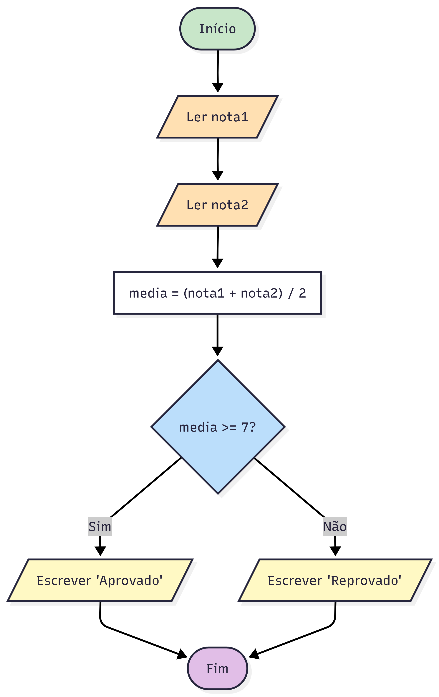

# Aula 02: Fundamentos da Computação e Lógica

Na Aula 01 você configurou o ambiente, Python instalado, editor pronto. Agora, antes de escrever a primeira linha de código, vale a pena entender **como o computador pensa**, e spoiler: ele não pensa. Ele só segue instruções. Sua tarefa como programador é escrever essas instruções de forma clara e organizada.

---

## O que é programação?

Programar é escrever instruções que o computador pode seguir. Essas instruções formam um **programa**, e a sequência ordenada de passos para resolver um problema é chamada de **algoritmo**.

Pense assim:
- **Algoritmo** → receita de bolo. Passos claros, na ordem certa.
- **Programa** → essa receita escrita em Python (ou outra linguagem).

Quase todo sistema segue a mesma estrutura básica:

```
Entrada → Processamento → Saída
```

- **Entrada**: dados que o programa recebe (do usuário, de um arquivo, de outro sistema).
- **Processamento**: cálculos, decisões e transformações aplicadas a esses dados.
- **Saída**: resultado exibido na tela, salvo em arquivo ou enviado para outro lugar.

Por curiosidade, a primeira pessoa da história a escrever um algoritmo pensado para ser executado por uma máquina foi Ada Lovelace, em 1843. Ela tinha 27 anos, era matemática, e escreveu o que é considerado até hoje o primeiro programa da história.

---

## Hardware vs Software

- **Hardware** é a parte física: processador, memória, teclado, tela.
- **Software** são os programas que rodamos no hardware.

O software só funciona porque o hardware executa as instruções. Você escreve o software e o hardware faz o trabalho pesado.

---

## Interpretador vs Compilador

Quando você escreve código, o computador não entende Python diretamente, ele só entende sequências de 0s e 1s. Alguém precisa fazer essa tradução. Existem duas formas de fazer isso:

**Interpretador**: traduz e executa o código *linha por linha*, em tempo real. É como um intérprete de idiomas que vai traduzindo o discurso à medida que o orador fala. O Python funciona assim.

**Compilador**: lê o código *inteiro* de uma vez, traduz tudo para um formato que o computador entende, e só depois executa. C e C++ funcionam assim.

Para você agora, o que importa é uma vantagem do Python: por ser interpretado, **o ciclo de trabalho é muito rápido**, você escreve, roda, vê o resultado, ajusta, roda de novo. Não precisa esperar uma compilação.

---

## Lógica de programação

Lógica de programação é pensar em **como organizar as ações** para resolver um problema.

Matemática aparece sim, você vai ver isso ao longo das aulas, em matrizes, teoria dos conjuntos, formatação de números. Mas o núcleo da lógica não é cálculo, é **raciocínio organizado**. Áreas como desenvolvimento web, automação e criação de aplicativos usam pouca matemática avançada. Outras, como inteligência artificial, gráficos 3D e criptografia, usam bastante.

O que todas têm em comum é a necessidade de pensar com clareza e sequenciar ações sem ambiguidade, e é isso que esta disciplina treina.

Você já sabe fazer café. Se fosse escrever o passo a passo para alguém que nunca nem viu um fogão, você teria que ser bem preciso. Programar é exatamente isso, descrever passos de forma que não haja ambiguidade.

Recentemente minha avó me pediu pra ajudar a recuperar umas fotos antigas que estavam no celular dela. Achei as fotos, mas precisava delas no meu celular. Falei: "vó, manda essas fotos pra mim."

Ela falou "tá bom" e desligou.

Uns minutos depois chegou uma mensagem no WhatsApp. Era uma foto. Uma foto da tela do celular dela, mostrando a foto original que eu queria, tirada com outro celular, de pertinho, levemente torta, com o reflexo na tela.

Ela assumiu que não podia enviar pelo celular dela e pediu emprestado o de alguém da casa, fotogrou a tela do próprio celular e mandou pra mim. Do ponto de vista dela, eu pedi pra mandar uma foto, ela mandou uma foto. Missão cumprida.

Foi pelo método mais complicado que achou, mas seguiu exatamente o que eu pedi. Assim funciona um computador: ele não sabe o que você quis dizer, só o que você disse. Se a instrução tem brecha, ele preenche do jeito dele.

### Sequência lógica

O computador executa as instruções exatamente na ordem em que você escreveu, de cima para baixo. Trocar a ordem muda o resultado ou quebra o programa.

```
coloque água na chaleira
ligue a chaleira          
espere ferver           ← ordem importa, esperar ferver antes de ligar vai ser no mínimo entediante
coloque o pó no coador
despeje a água quente
```

### Fluxo de execução

O programa nem sempre segue um caminho reto. Dependendo de condições, ele pode tomar caminhos diferentes, isso é o **fluxo de execução**.

Imagine o programa chegando numa bifurcação na estrada: ele lê a placa (a condição) e decide qual caminho seguir. Você vai entender isso na prática quando chegar na [aula de condicionais](06_condicionais.md).

---

## Pseudocódigo e fluxogramas

Antes de escrever código de verdade, **rascunhe a solução em português**. Isso parece um passo desnecessário, mas às vezes economiza muito tempo. É muito mais fácil reorganizar ideias em texto do que debugar código.

**Pseudocódigo** é essa versão em português estruturado, sem se preocupar com sintaxe de linguagem nenhuma. 

***Exemplo para calcular a média de duas notas:***

```
leia nota1
leia nota2
media = (nota1 + nota2) / 2
se media >= 7        ← isso é exatamente o que você vai escrever em Python na Aula 06
    escreva "Aprovado"
senão
    escreva "Reprovado"
```

**Fluxograma** é a versão visual do mesmo raciocínio, um diagrama com símbolos. 
Ex:
- Retângulo → ação (ler, calcular, exibir)
- Losango → decisão (sim ou não)
- Setas → direção do fluxo

O fluxograma do pseudocódigo acima fica assim:



Repare como o fluxo chega no losango ("média >= 7?"), divide em dois caminhos e cada um leva a uma saída diferente. Esse é o padrão básico de qualquer decisão em programação.

Você não precisa dominar fluxogramas agora, mas saber lê-los ajuda bastante a visualizar o que um programa faz.

---

## Pensamento computacional

Pensamento computacional é uma forma de encarar problemas que funciona muito bem em programação e também fora dela. Não é uma habilidade que você adquire do dia pra noite, mas são quatro ideias que vão ficando mais naturais conforme você avança nas aulas:

**Abstração**: focar no que importa e ignorar o resto. Para calcular a média de uma turma, você não precisa saber o nome de cada aluno, só as notas. Abstrair é saber o que é relevante para o problema e o que pode ser descartado.

**Modularização**: dividir o problema em partes menores. Um sistema de inscrição em disciplinas pode ser dividido em: verificar se o aluno existe, checar pré-requisitos, registrar a inscrição. Cada parte é menor e mais fácil de resolver. Isso não é um conselho filosófico, é uma estratégia real. Quando você tiver que fazer um trabalho maior na disciplina, vai usar isso sem perceber. Você vai ver isso formalizado na [Aula 13](13_funcoes.md), quando chegar em Funções.

**Reconhecimento de padrões**: perceber quando dois problemas têm a mesma estrutura. Calcular média de notas e calcular média de preços são problemas diferentes, mas têm a mesma lógica. Reconhecer isso poupa muito trabalho.

**Raciocínio algorítmico**: planejar os passos *antes* de sair codando. É a diferença entre construir uma casa com planta e sem planta.

---

## Como estudar esta aula

Esta aula é mais conceitual, não tem código para rodar ainda. Isso é proposital. O pseudocódigo que você vai escrever aqui é quase Python: na [Aula 03](03_python_basico.md) você vai ver como é pequeno o passo de um para o outro.

1. Leia com calma, sem pressa.
2. Tente reescrever os conceitos com suas próprias palavras, como se fosse explicar para alguém. Ensinar é uma das melhores formas de fixar o conteúdo.
3. Crie um pseudocódigo para um problema simples do seu dia a dia.
4. Quando avançar nas próximas aulas, volte e observe como cada conceito aparece no código.

---

## Exercício sugerido

Escolha uma tarefa do dia a dia: fazer uma compra, preparar um lanche, decidir o que vestir. Escreva o passo a passo como pseudocódigo.

Tente incluir:
- pelo menos uma **decisão** ("se estiver chovendo, leve guarda-chuva")
- pelo menos uma **repetição** ("enquanto houver itens na lista, adicione ao carrinho"), isso é o que você vai ver formalmente na [Aula 07](07_repeticao.md); por ora, escreva em português mesmo

Não precisa ser perfeito nem seguir nenhuma sintaxe específica. O objetivo é começar a pensar de forma estruturada.
