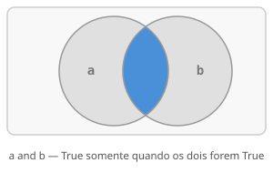
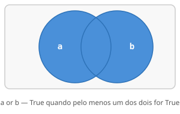
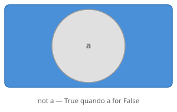

# Aula 04: Operadores em Python

Operadores são o que transforma Python num calculador de verdade. Sem eles, você declara variáveis mas não faz nada útil com elas. Na **[Aula 03](03_python_basico.md)** você já usou os mais básicos, aqui vamos fundo nos três aritméticos que causam mais dúvida (`//`, `%`, `**`) e vamos conhecer os operadores que são a base de toda lógica de programação: os relacionais, os lógicos e os de atribuição.

---

## Operadores aritméticos além do básico

Adição, Subtração, Multiplicação e Divisão funcionam exatamente como você já conhece. Vamos focar logo nos 3 operadores que faltaram para entender o motivo de causarem dúvidas e como você pode utilizá-los:

### Divisão inteira `//`

A divisão normal `/` sempre retorna um `float`, mesmo que o resultado seja exato:

```python
print(10 / 2)    # 5.0, não 5, sempre float
print(10 / 3)    # 3.3333333333333335
```

Isso pode ser um problema quando você precisa de um número inteiro de verdade, por exemplo, o número de grupos numa divisão. É aí que entra o `//`.

A divisão inteira `//` faz a mesma divisão, mas **descarta a parte decimal**, como se você dividisse da maneira que era feito no ensino fundamental, com quociente e resto mas pegando só com o quociente:

```python
print(10 // 2)   # 5
print(10 // 3)   # 3, não 3.33, só a parte inteira
print(17 // 5)   # 3, pode ser entendido como a quantidade de vezes que 5 cabe em 17
```

Um exemplo concreto que aparece bastante: converter segundos em minutos.

```python
tempo = 155  # segundos

minutos = tempo // 60   # quantas vezes 60 cabe em 155           → 2
segundos = tempo % 60   # o que sobrou (logo vai ser mostrado)   → 35

print(minutos, "min", segundos, "s")   # 2 min 35 s
```

O `//` e o `%` são feitos para se completarem: `//` pega o quociente, `%` pega o resto. Você vai ver esse par aparecer bastante.

**Tipo do resultado:** `//` retorna `int` quando os dois operandos são inteiros. Se qualquer um for `float`, o resultado também é `float`, mas ainda sem casas decimais:

```python
print(10 // 3)     # 3    → int
print(10.0 // 3)   # 3.0  → float, mas sem parte fracionária
```

**Atenção com negativos:** Python usa divisão de piso (*floor division*): arredonda sempre para o lado negativo, não para zero. Isso é diferente do que você veria em C ou Java:

```python
print(-7 // 2)   # -4, não -3: Python vai para o lado mais negativo
print(7 // -2)   # -4
```

Nos exercícios da disciplina você vai usar `//` quase sempre com números positivos, onde o comportamento é mais intuitivo. Mas é bom saber que esse detalhe existe antes de se deparar com ele.

### Módulo `%`

Como foi brevemente mostrado anteriormente, o `%` retorna o que sobrou depois de dividir o máximo de vezes possível:

```python
print(10 % 3)    # 1, 10 = 3×3 + 1, sobrou 1
print(17 % 5)    # 2, 17 = 5×3 + 2, sobrou 2
print(8  % 4)    # 0, divisão exata, não sobrou nada
```

O uso mais clássico do `%` é verificar se um número é par ou ímpar. Como todo operador relacional, o resultado é um `bool`, `True` ou `False`:

```python
numero = 14
print(numero % 2 == 0)   # True, resto zero significa par

numero = 7
print(numero % 2 == 0)   # False, resto um significa ímpar
```

Se o resto da divisão por 2 é zero, o número é par. Simples assim. Você vai ver esse padrão com frequência a partir da **[Aula 06 (Condicionais)](06_condicionais.md)** e da **[Aula 07 (Repetição)](07_repeticao.md)**.

### Potência `**`

Potência é uma multiplicação repetida: `2 ** 3` significa `2 × 2 × 2 = 8`. Expoentes fracionários merecem atenção: `9 ** 0.5` é raiz quadrada porque `√x = x^(1/2)`, expoente 0.5 equivale à raiz. Expoentes negativos viram frações: `2 ** -1 = 1/2`.

```python
print(2 ** 10)   # 1024
print(9 ** 0.5)  # 3.0, raiz quadrada (expoente 0.5 = raiz)
print(2 ** -1)   # 0.5, potência negativa = fração
```

### Tabela completa

| Operador | Significado | Exemplo | Resultado |
|----------|-------------|---------|-----------|
| `+` | soma | `10 + 5` | `15` |
| `-` | subtração | `10 - 3` | `7` |
| `*` | multiplicação | `4 * 3` | `12` |
| `/` | divisão decimal | `10 / 4` | `2.5` |
| `//` | divisão inteira | `10 // 4` | `2` |
| `%` | resto da divisão | `10 % 3` | `1` |
| `**` | potência | `2 ** 8` | `256` |

---

## Operadores relacionais

Operadores relacionais comparam dois valores e retornam sempre `True` ou `False`, valores do tipo `bool`, que você viu na **[Aula 03](03_python_basico.md)**. Esses resultados são a base de todo `if` e `while` que você vai escrever (você vai entender bem o porquê na **[Aula 06 (Condicionais)](06_condicionais.md)** e na **[Aula 07 (Repetição)](07_repeticao.md)**):

| Operador | Significado | Exemplo | Resultado |
|----------|-------------|---------|-----------|
| `==` | igual a | `5 == 5` | `True` |
| `!=` | diferente de | `5 != 3` | `True` |
| `>` | maior que | `7 > 10` | `False` |
| `<` | menor que | `3 < 8` | `True` |
| `>=` | maior ou igual | `5 >= 5` | `True` |
| `<=` | menor ou igual | `4 <= 3` | `False` |

```python
idade = 18
print(idade >= 18)    # True
print(idade == 17)    # False
print(idade != 20)    # True
```

**Erro muito comum:** usar `=` onde devia usar `==`. O `=` é atribuição, guarda um valor na variável. O `==` é comparação, avalia se dois valores são iguais e retorna `True` ou `False`. Misturar os dois causa um `SyntaxError`.

```python
idade = 18           # atribuição: guarda 18 em idade

print(idade == 18)   # True, comparação: é igual a 18?
print(idade == 20)   # False, comparação: é igual a 20?
```

**Cuidado com `==` em floats:** comparar resultados de ponto flutuante com `==` pode surpreender.

```python
print(0.1 + 0.2 == 0.3)   # False, não é bug do seu código, é como decimais funcionam em binário
```

Computadores representam decimais em binário e `0.1` não tem representação exata nessa base, o resultado de `0.1 + 0.2` da algo como `0.3000000000001` que faz a comparação falhar. Quando precisar comparar floats, use `round()`:

```python
print(round(0.1 + 0.2, 10) == 0.3)   # True
```

Na prática isso raramente aparece em exercícios da disciplina, mas é bom saber antes de levar um susto. Tem mais detalhes no [FAQ](../extras/faq.md#por-que-01--02-não-é-03).

---

## Operadores lógicos

Às vezes uma única comparação não é suficiente. Você precisa checar duas coisas ao mesmo tempo, ou aceitar qualquer uma de várias opções. É para isso que existem os operadores lógicos: `and`, `or` e `not`.

### `and`: as duas precisam ser verdadeiras

Pense no `and` como o literal "E" do dia a dia: "para fazer isso, preciso de A **e** de B".

```python
idade = 20
tem_carteira = True

pode_dirigir = (idade >= 18 and tem_carteira)
print(pode_dirigir) # True
```

`pode_dirigir` só é verdade se **as duas** condições forem `True` ao mesmo tempo. Se a pessoa tiver 20 anos mas não tiver carteira, não entra. Se tiver carteira mas tiver 16 anos, também não entra. As duas precisam passar.

Visualmente, o `and` é a **intersecção** de dois conjuntos. O diagrama abaixo representa `a and b`: o círculo da esquerda é `a`, o da direita é `b`. O resultado só é `True` na área onde os dois se sobrepõem, o restante é `False`.



### `or`: basta uma ser verdadeira

Se `and` é o **"E"**, `or` é o **"OU"**: "aceito A **ou** B, qualquer um serve".

```python
dia = "sábado"
print(dia == "sábado" or dia == "domingo")   # True, é final de semana

dia = "segunda"
print(dia == "sábado" or dia == "domingo")   # False, não é final de semana
```

Aqui basta uma das condições ser `True`. Sábado retorna `True`. Domingo também. Segunda retorna `False`.

Um detalhe importante: o `or` em programação **não é exclusivo**, se as duas condições forem verdadeiras ao mesmo tempo, o resultado ainda é `True`. Ele só retorna `False` quando as **duas** são falsas.

```python
nota = 8.0
aprovado_por_nota = nota >= 7          # True
aprovado_por_frequencia = True

aprovado = aprovado_por_nota or aprovado_por_frequencia
print(aprovado)   # True, mesmo que só um critério passe
```

No diagrama de Venn, o `or` é a **união**, tudo que estiver em `a`, em `b`, ou nos dois ao mesmo tempo. Só fica de fora o que não pertence a nenhum dos dois:



### `not`: inverte o resultado

O `not` nega uma condição: transforma `True` em `False` e `False` em `True`.

```python
logado = False
print(not logado)   # True, não está logado

logado = True
print(not logado)   # False, está logado
```

Para negar um booleano, você poderia escrever `logado == False`, que funciona, mas `not logado` é mais limpo e mais natural de ler. As duas expressões são equivalentes:

```python
logado = False

print(logado == False)   # True, funciona, mas é verboso
print(not logado)        # True, prefira esse
```

O `not` é o **complemento**: tudo que não está dentro de `a`. No diagrama, o círculo cinza é `a` e a região azul ao redor é exatamente o `not a`:



### Combinando os três

Em problemas reais você não compara sempre só uma coisa, é aí que combinar `and`, `or` e `not` na mesma expressão faz sentido. Quando fizer isso, use parênteses para deixar a intenção explícita:

```python
idade = 17
tem_autorizacao = True

pode_participar = (idade >= 18) or (idade >= 16 and tem_autorizacao)
print(pode_participar)   # True, 17 >= 16 e tem autorização
```

### Tabela verdade

Se você nunca ouviu falar em tabela verdade, é mais simples do que parece. É apenas uma tabela que mostra **todos os resultados possíveis** de um operador lógico, para cada combinação de `True` e `False`.

Como `a` e `b` só têm dois valores possíveis cada, existem exatamente 4 combinações. A tabela lista todas de uma vez para você consultar:

| `a` | `b` | `a and b` | `a or b` | `not a` |
|-----|-----|-----------|----------|---------|
| `True` | `True` | `True` | `True` | `False` |
| `True` | `False` | `False` | `True` | `False` |
| `False` | `True` | `False` | `True` | `True` |
| `False` | `False` | `False` | `False` | `True` |

Lendo linha por linha:
- Quando os dois são `True`: `and` retorna `True`, `or` retorna `True`.
- Quando só um é `True`: `and` retorna `False` (precisa dos dois), `or` retorna `True` (basta um).
- Quando os dois são `False`: ambos retornam `False`.
- O `not a` é independente de `b`, ele simplesmente inverte o valor de `a`.

Você não precisa decorar essa tabela. A disciplina não cobra isso e com o tempo, o comportamento de `and` e `or` vai se tornar instintivo.

---

## Operadores de atribuição

Em vez de escrever `contador = contador + 1`, você pode usar a forma compacta com `+=`:

```python
contador = 0
contador += 1    # mesmo que contador = contador + 1  → 1
contador += 1    # → 2
contador += 1    # → 3
```

É o atalho que você mais vai usar, aparece em todo contador e acumulador de soma (você vai entender bem o porquê na **[Aula 07: Repetição](07_repeticao.md)**).

Os quatro mais comuns no dia a dia:

```python
pontos = 10

pontos += 5    # soma e reatribui     → 15
pontos -= 3    # subtrai e reatribui  → 12
pontos *= 2    # multiplica           → 24
pontos /= 4    # divide               → 6.0
```

Existem versões compostas para todos os operadores aritméticos (`//=`, `**=`, `%=`) mas você raramente vai encontrar elas em exercícios da disciplina. Não me lembro de ter visto um `//=` ou um `**=` aparecer em lugar nenhum nas minhas aulas nem na monitoria. Se encontrar, você já sabe o padrão: `x //= y` é o mesmo que `x = x // y`.

---

## Operadores de identidade e pertencimento

### `is` e `is not`: identidade

> **Nota:** esta parte é um pouco mais avançada e não aparece muito na disciplina. Se não ficar completamente claro agora, tudo bem. O uso mais importante você aprende aqui; o restante fica mais natural depois da **[Aula 09 (Listas)](09_listas.md)**.

O `is` verifica se duas variáveis apontam para o **mesmo objeto na memória**, o que é diferente de verificar se têm o mesmo valor. Para comparar valores normais (números, strings), use sempre `==`. O `is` é para identidade de objetos. Se ficou curioso sobre como o Python guarda valores na memória, tem uma explicação detalhada no [FAQ](../extras/faq.md#como-o-python-guarda-variáveis-na-memória--e-o-que-o-is-realmente-verifica).

Na prática, o uso que aparece com mais frequência é verificar `None`, saber se uma variável está vazia ou ainda não foi preenchida:

```python
resultado = None
print(resultado is None)   # True, variável não foi preenchida

resultado = 42
print(resultado is None)   # False, já tem um valor
```

Use `is None` em vez de `== None`. Tecnicamente os dois funcionam aqui, mas `is None` é o "correto" em Python e o que você vai ver em todo código mais experiente.

### `in` e `not in`: pertencimento

O `in` responde a uma pergunta simples: **"esse valor está aqui dentro?"** Ele retorna `True` ou `False` e funciona com qualquer sequência: strings, listas, e outras estruturas que você vai conhecer mais à frente.

**Em strings**, verifica se um trecho de texto existe dentro de outro:

```python
nome = "Gabriel"
print("a" in nome)        # True, a letra "a" existe em "Gabriel"
print("bri" in nome)      # True, a sequência "bri" existe em "Gabriel"
print("x" in nome)        # False, "x" não existe em "Gabriel"
print("gabriel" in nome)  # False, maiúsculas e minúsculas importam!
```

Exemplo prático: verificar se um e-mail tem arroba:

```python
email = "gabriel@ufpr.br"
print("@" in email)   # True, tem arroba, parece válido

email = "gabrielufpr.br"
print("@" in email)   # False, sem arroba, inválido
```

Outro uso comum: verificar se uma letra é vogal.

```python
vogais = "aeiouAEIOU"
print("a" in vogais)   # True, a é vogal
print("b" in vogais)   # False, b não é vogal
print("E" in vogais)   # True, maiúsculas também cobertas
```

**O `not in`** é o oposto, retorna `True` quando o valor *não* está na sequência:

```python
vogais = "aeiouAEIOU"
print("z" not in vogais)   # True, z não é vogal
print("i" not in vogais)   # False, i é vogal
```

O `in` também funciona com listas, dicionários e outras estruturas que você vai ver mais à frente. É um dos operadores que mais vi sendo usados no dia a dia além dos matemáticos. O alcance total dele aparece na **[Aula 07 (Repetição)](07_repeticao.md)** e na **[Aula 09 (Listas)](09_listas.md)**.

---

## Precedência: a ordem em que o Python calcula

O Python usa a mesma ordem de operações que você aprendeu no ensino médio, com algumas adições para os operadores lógicos:

1. `()`: parênteses, sempre primeiro
2. `**`: potência
3. `*`, `/`, `//`, `%`: multiplicação e divisão
4. `+`, `-`: soma e subtração
5. `==`, `!=`, `>`, `<`, `>=`, `<=`: comparações
6. `not`
7. `and`
8. `or`

```python
print(2 + 3 * 4)         # 14, * antes do +
print((2 + 3) * 4)       # 20, parênteses mudam a ordem
print(10 > 5 and 3 < 1)  # False, compara os dois, depois aplica and
```

Uma expressão que confunde bastante no começo:

```python
resultado = not 5 > 3 and 2 < 4
# Python avalia assim:
# 1. 5 > 3          → True
# 2. not True       → False
# 3. 2 < 4          → True
# 4. False and True → False
print(resultado)  # False
```

**Sugestão prática:** quando tiver dúvida sobre a ordem, use parênteses. Eles não custam nada e deixam a intenção explícita.

---

Exemplo rodável desta aula: [`exemplos/04_operadores.py`](../exemplos/04_operadores.py)

---

## O essencial desta aula

| Operador(es) | Tipo | Quando você vai usar |
| --- | --- | --- |
| `+` `-` `*` `/` `//` `%` `**` | Aritmético | Cálculos e transformações de valores |
| `==` `!=` `>` `<` `>=` `<=` | Relacional | Toda comparação em `if` e `while` |
| `and` `or` `not` | Lógico | Combinar condições |
| `+=` `-=` `*=` `/=` | Atribuição composta | Atualizar variáveis (o `+=` é o mais frequente) |
| `is` / `is not` | Identidade | Verificar se algo é `None` |
| `in` / `not in` | Pertencimento | Verificar se um valor está em uma sequência |

---

## Exercício sugerido

Você acabou de ver os cinco tipos de operadores do Python, agora coloque tudo junto num único programa. O objetivo é combinar aritmética, comparação e exibição de resultados numa sequência que faz sentido:

1. Peça três números inteiros ao usuário.
2. Exiba a soma dos três.
3. Exiba a média.
4. Exiba o quociente e o resto da divisão do primeiro pelo segundo.
5. Exiba `True` se for par, `False` se for ímpar.
6. Exiba o resultado de `media > terceiro`.

Para exibir os resultados, use `print()` passando os valores separados por vírgula, por exemplo: `print("Soma:", soma)`. Se já chegou na **[Aula 05 (Entrada e Saída)](05_entrada_saida.md)**, use f-strings para deixar a saída mais legível.

> **Resposta do exercício:** [`respostas/04_operadores.py`](../respostas/04_operadores.py)
