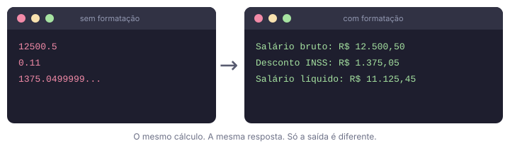

# Aula 05: Entrada e Saída de Dados

Nas **Aulas 03 e 04** você já usou `print()` e `input()` nos exemplos. Aqui vamos parar para entender essas duas funções em profundidade, tem muito mais nelas do que parece.

Na monitoria, uma das coisas que mais me incomodam é ver um programa que calcula tudo certo mas joga o resultado assim na tela: `1375.0499999...`. A pessoa passou um tempo vendo a lógica, chegou no número certo, e na hora de mostrar o resultado esqueceu de deixar agradável para o ser humano do outro lado. Pode ser puramente estético mas as vezes isso custa nota em prova. Dominar formatação de saída e leitura de dados é o que separa um programa que funciona de um programa que alguém consegue usar de verdade.

---

## `print()` em profundidade

O básico você já conhece: `print("texto")` exibe algo na tela. Mas a função aceita vários argumentos ao mesmo tempo e tem dois parâmetros opcionais muito úteis.

### Passando múltiplos valores

```python
nome = "Ana"
idade = 21
print("Nome:", nome, "| Idade:", idade)
# Nome: Ana | Idade: 21
```

Por padrão, `print()` insere um **espaço** entre cada valor passado.

### `sep`: mudando o separador

O parâmetro `sep` define o que vai entre os valores (padrão é o espaço vazio como dito acima):

```python
print("2026", "05", "22", sep="-")      # 2026-05-22
print("ana", "gmail.com", sep="@")      # ana@gmail.com
print("A", "B", "C", sep=" -> ")        # A -> B -> C
print("linha", "sem", "espaço", sep="") # linhasemespaço
```

### Caracteres especiais: `\n`, `\t` e outros

Dentro de uma string, certas combinações começando com `\` representam caracteres que não dá para digitar diretamente. Os mais usados:

| Sequência | O que faz |
|-----------|-----------|
| `\n` | Pula uma linha (enter) |
| `\t` | Insere uma tabulação (tab) |
| `\\` | Barra invertida literal `\` |
| `\"` | Aspas duplas dentro de string com aspas duplas |
| `\'` | Aspas simples dentro de string com aspas simples |

```python
print("Linha 1\nLinha 2\nLinha 3")
# Linha 1
# Linha 2
# Linha 3

print("Nome:\tGarcias\nIdade:\t18")
# Nome:   Garcias
# Idade:  18

print("Caminho: C:\\Users\\Garcias")   # barra invertida literal
# Caminho: C:\Users\Garcias
```

O `\n` é exatamente o que `print()` coloca automaticamente no final de cada linha.

---

### `end`: mudando o fim da linha

Como dito acima, por padrão, `print()` pula uma linha ao final (`\n`). O parâmetro `end` muda isso:

```python
print("Carregando", end="")
print("... concluído!")
# Saída: Carregando... concluído!   (na mesma linha)

# Útil para colocar vários valores na mesma linha:
print(0, end=" ")
print(1, end=" ")
print(2, end=" ")
# Saída: 0 1 2
```

---

## Formatação com f-string

Se você chegou até aqui pela ordem das aulas, isso foi prometido. Na **[Aula 03](03_python_basico.md)** você leu: *"na Aula 05 você vai ver como formatar a saída: controlar casas decimais, alinhar colunas e usar f-strings de verdade."* No exercício da **[Aula 04](04_operadores.md)** apareceu de novo: *"se já chegou na Aula 05, use f-strings para deixar a saída mais legível."*

Chegou a hora.

---

### Por que você precisa de formatação?

Imagine que você quer exibir o nome de um aluno e a nota dele. A primeira ideia de quem está começando é juntar os pedaços com `+`:

```python
nome = "Ana"
nota = 8.7531

print("Aluna: " + nome + ", Nota: " + nota)
```

Isso já dá erro na primeira execução:

```
TypeError: can only concatenate str (not "float") to str
```

Você lembra de converter para string:

```python
print("Aluna: " + nome + ", Nota: " + str(nota))
# Aluna: Ana, Nota: 8.7531
```

Funcionou! Mas exibiu quatro casas decimais quando você queria duas. Então você adiciona mais uma chamada:

```python
print("Aluna: " + nome + ", Nota: " + str(round(nota, 2)))
# Aluna: Ana, Nota: 8.75
```

Agora imagine fazer isso com cinco variáveis ao mesmo tempo. O código vira uma sequência de `str()` e `round()` misturados, difícil de ler e fácil de errar. Era exatamente o que eu ficava fazendo antes de conhecer f-strings.

---

### As quatro formas de montar texto com variáveis, e por que f-string vence todas

Existem quatro formas de resolver esse problema em Python. Vou mostrar as três mais antigas para você reconhecer quando encontrar em código de outra pessoa e depois a que você realmente deve usar.

**Problema:** exibir `Aluna: Ana, Nota: 8.75, Situação: Aprovada`

```python
nome = "Ana"
nota = 8.7531
situacao = "Aprovada"
```

#### Forma 1: Concatenação com `+`

```python
print("Aluna: " + nome + ", Nota: " + str(round(nota, 2)) + ", Situação: " + situacao)
```

Precisa de `str()` para cada número, `round()` separado para arredondar, e o código fica horizontalmente interminável. A cada variável nova, mais um `+ str(...)`.

#### Forma 2: Formatação com `%` (estilo C)

```python
print("Aluna: %s, Nota: %.2f, Situação: %s" % (nome, nota, situacao))
```

O jeito mais antigo, herdado da linguagem C. Os `%s` e `%.2f` são marcadores de posição, `%s` para string, `%.2f` para float com duas casas. Você tem que lembrar a correspondência entre cada marcador e o valor no final, e a ordem importa. Aparece muito em código antigo; evite escrever código novo com isso.

#### Forma 3: Método `.format()`

```python
print("Aluna: {}, Nota: {:.2f}, Situação: {}".format(nome, nota, situacao))
```

Melhor que o `%`. A formatação dentro das `{}` funciona e a sintaxe é mais limpa. Mas a string e os valores ficam separados, você tem que contar as chaves e combinar com os argumentos do `.format()` na sequência certa. Em strings longas com muitas variáveis, isso cansa. Aparece bastante em tutoriais mais antigos; se você encontrar, sabe o que é.

#### Forma 4: F-string

```python
print(f"Aluna: {nome}, Nota: {nota:.2f}, Situação: {situacao}")
```

Cada variável vai direto para onde ela aparece no texto. A formatação (`.2f`) fica junto da variável, dentro das chaves. Não há nada para contar, nenhum argumento separado em outro lugar. Você lê a string e já sabe o que vai sair.

F-string é de longe a forma mais usada em código moderno, mais legível, mais curta de escrever e tecnicamente mais rápida de executar do que as alternativas. Se você ainda estiver usando `.format()` ou `%s`, pode parar (a não ser que o seu professor obrigue a usar outra coisa).

Eu fiquei um bom tempo usando a concatenação com `+`. Ficava fazendo `"Olá, " + nome + "! Você tem " + str(idade) + " anos."` e achando que era assim mesmo. Quando descobri as f-strings foi uma mistura estranha de felicidade e raiva. Felicidade porque simplificou tudo, raiva porque eu podia ter tido esse conhecimento desde o começo. 

Use f-string desde já.

---

### Como funciona a f-string

A diferença de uma f-string para uma string normal são dois detalhes:

1. O `f` (ou `F`) antes das aspas
2. As variáveis ou qualquer expressão Python vão dentro de `{}`

```python
nome = "Ana"
idade = 21

# String normal: imprime o texto literalmente
print("Nome: nome, Idade: idade")       # Nome: nome, Idade: idade

# F-string: insere as variáveis no lugar das chaves
print(f"Nome: {nome}, Idade: {idade}")  # Nome: Ana, Idade: 21
```

O Python executa o que está dentro das `{}` e substitui pelo resultado no lugar. Qualquer coisa fora das chaves é texto literal, não é interpretado.

Dentro das chaves, você pode adicionar `:` seguido de um **especificador de formato** para controlar como o valor vai ser exibido:

```
{variavel:formato}
```

O que vem depois dos `:` é a especificação de formato. Vamos ver cada opção.

---

### Controlando casas decimais

O formato `:.Nf` define quantas casas decimais exibir. O `N` é o número de casas e o `f` indica que é um número de ponto flutuante (float):

```python
preco = 1234.5678

print(f"{preco:.2f}")   # 1234.57  (2 casas, arredonda automaticamente)
print(f"{preco:.0f}")   # 1235     (sem casas decimais)
print(f"{preco:.4f}")   # 1234.5678 (4 casas)
```

Repare que o Python arredonda corretamente: `1234.5678` com `.2f` vira `1234.57`, não `1234.56`.

Compare com o que você teria que fazer sem f-string:

```python
# Sem f-string, verboso
print(str(round(preco, 2)))   # 1234.57 (funciona, mas é trabalhoso)

# Com f-string, direto
print(f"{preco:.2f}")          # 1234.57
```

---

### Separador de milhar

Adicione uma vírgula antes do `.Nf` para inserir separador de milhar:

```python
salario = 12500.50
populacao = 215000000

print(f"R$ {salario:,.2f}")      # R$ 12,500.50
print(f"{populacao:,}")          # 215,000,000
```

O separador padrão do Python é a vírgula (padrão americano). Se precisar do formato brasileiro (ponto como milhar, vírgula como decimal), é possível converter com `.replace()`. Isso é ensinado com detalhes na **Aula 08**, quando você já conhece os métodos de string. Por enquanto, o formato com vírgula é suficiente.

---

### Largura mínima e alinhamento

Você pode reservar um espaço fixo para um valor e decidir como ele se alinha dentro desse espaço. Isso é essencial para montar saídas organizadas visualmente.

A sintaxe é `{valor:alinhamento largura}`:

- `<` alinha à **esquerda** (padrão para texto)
- `>` alinha à **direita** (padrão para números)
- `^` **centraliza**

```python
# O | no final serve só para visualizar onde a largura termina
print(f"{'esquerda':<15}|")   # esquerda       |
print(f"{'centro':^15}|")     #    centro      |
print(f"{'direita':>15}|")    #        direita |
```

O número `15` é a largura reservada. Se o conteúdo for menor, o espaço restante é preenchido com espaços em branco. Se for maior, o Python não corta, o conteúdo vai ultrapassar.

Você pode substituir o espaço em branco por qualquer caractere, colocando-o antes do sinal de alinhamento:

```python
print(f"{'título':=^30}")   # ============título============
print(f"{'OK':->20}")       # ------------------OK
print(f"{'item':.>20}")     # ................item
```

---

### Combinando formatos

Largura, alinhamento, casas decimais e separador de milhar podem ser usados juntos na mesma expressão. A ordem dentro dos `:` é `[caractere_preenchimento][alinhamento][largura][,][.precisão][tipo]`:

```python
valor = 42.5
print(f"{valor:>10.2f}")       #      42.50  (direita, 10 chars, 2 casas)

preco = 9875.3
print(f"R$ {preco:>10,.2f}")   # R$  9,875.30 (direita, 10 chars, milhar, 2 casas)
```

**Exemplo prático: montando uma tabela**

Imagine exibir uma lista de produtos com preços alinhados. Sem formatação, fica assim:

```
Arroz 5.99
Feijão 8.5
Macarrão 3.75
```

Com alinhamento, fica assim:

```python
print(f"{'Produto':<12} {'Preço':>8}")
print("-" * 22)
print(f"{'Arroz':<12} R$ {5.99:>5.2f}")
print(f"{'Feijão':<12} R$ {8.50:>5.2f}")
print(f"{'Macarrão':<12} R$ {3.75:>5.2f}")
```

> Repetitivo, mas com o que você sabe agora é assim que fica. Nas **Aulas 07 e 09** você vai ver como gerar essa tabela automaticamente com poucas linhas usando loop e lista.

Saída:
```
Produto         Preço
----------------------
Arroz         R$  5.99
Feijão        R$  8.50
Macarrão      R$  3.75
```

Todos os preços ficam alinhados à direita, independente do tamanho do nome do produto.

---

### Expressões dentro das chaves

Não precisa ser só uma variável, qualquer expressão Python válida funciona dentro das chaves:

```python
a = 7
b = 3

print(f"Soma: {a + b}")               # Soma: 10
print(f"Dobro de a: {a * 2}")         # Dobro de a: 14
print(f"Média: {(a + b) / 2:.1f}")    # Média: 5.0

# Até condicionais funcionam:
print(f"{a} é {'par' if a % 2 == 0 else 'ímpar'}")   # 7 é ímpar
```

Não se preocupe com essa última parte, você entenderá melhor na **[Aula 06 (Condicionais)](06_condicionais.md)**.

---

## `input()` em profundidade

### Lendo vários valores de uma vez

Até agora cada `input()` lê um valor por vez. Mas é possível pedir que o usuário digite vários valores separados por espaço em uma única linha, e depois separar com `split()`.

`split()` é um método de string que divide o texto nos espaços e devolve cada parte separadamente. Para capturar direto nas variáveis:

```python
# Usuário digita: 10 20 30
a, b, c = input("Digite três números separados por espaço: ").split()

a = int(a)
b = int(b)
c = int(c)

print(f"Soma: {a + b + c}")
```

O que acontece na linha `a, b, c = ...`: o `split()` divide a entrada nos espaços e o Python distribui cada parte numa variável diferente. Isso funciona quando você sabe de antemão quantos valores o usuário vai digitar. Os detalhes de por que `split()` funciona assim aparecem na **[Aula 08 (Strings)](08_strings.md)**; o que ele retorna internamente você vai ver na **[Aula 09 (Listas)](09_listas.md)**.

---

## Boas práticas de I/O

### Mensagens claras no `input()`

O usuário não tem como saber o que o programa espera a não ser pela mensagem que você escreve. Uma boa mensagem diz **o quê** pedir, **em qual unidade** e, quando fizer sentido, **qual o intervalo válido**:

```python
# Ruim: o usuário não sabe o que fazer
x = input("x: ")
n = input("n: ")

# Bom: claro e sem ambiguidade
salario = input("Digite o salário bruto (R$, use ponto como decimal): ")
nota    = input("Nota 1 (de 0 a 10): ")
```

Parece detalhe, mas faz diferença real: um programa que confunde quem usa tem pouco valor, mesmo que os cálculos estejam certos.

---

### Sempre converta antes de calcular

`input()` **sempre** retorna uma string, não importa o que o usuário digitar. Se o usuário digitar `5`, o que chega para o programa é a string `"5"`, não o número `5`. Tentar operar diretamente com ela dá resultado errado ou erro:

```python
valor = input("Digite um número: ")   # usuário digita 10

print(valor + 5)       # TypeError: can only concatenate str (not "int") to str
print(valor + "5")     # "105"  (concatenou as strings, não somou!)
```

Por isso a conversão é obrigatória antes de qualquer cálculo:

```python
valor = int(input("Digite um número: "))
print(valor + 5)   # 15  (correto)
```

Nunca assuma que o tipo está certo, a conversão é sua responsabilidade, não do Python.

---

### Dados brutos na tela não comunicam nada



Não é puramente estética, é clareza. Um programa que exige que o usuário interprete muito a saída é um programa incompleto. Use f-string com formatação de casas decimais, alinhamento e rótulos descritivos.

---

## Exemplo completo

O arquivo de exemplo desta aula reúne tudo que você viu aqui: leitura de dados com `input()`, conversão de tipo, cálculo com os operadores da **[Aula 04](04_operadores.md)** e saída formatada com f-string, alinhamento e separador de milhar. Abra, rode e tente prever cada linha antes de ela aparecer na tela.

---

Exemplo rodável desta aula: [`exemplos/05_entrada_saida.py`](../exemplos/05_entrada_saida.py)

## Exercício sugerido

Crie um programa de contracheque simples:

1. Leia o nome do funcionário.
2. Leia o salário bruto.
3. Leia o percentual de desconto do INSS (ex: `11` para 11%).
4. Calcule o valor do desconto e o salário líquido.
5. Exiba um relatório como este:

```
==============================
       CONTRACHEQUE
==============================
Funcionário : João Silva
Salário bruto: R$ 5,000.00
Desconto INSS: R$   550.00
Salário líquido: R$ 4,450.00
==============================
```

Use alinhamento com f-string para que os valores fiquem na mesma coluna.

---

## Lista da disciplina

> Você terminou as aulas de entrada, saída e operações. Este é o momento certo para resolver a **Lista 01: Entradas, Saídas e Operações**, disponível em `docs/listas/`.
>
> Os exercícios dessa lista usam exatamente o que você viu nas aulas 03, 04 e 05: variáveis, operadores e formatação de saída. Tente resolver sem olhar exemplos, é assim que o conteúdo fixa de verdade.
>
> **Atenção:** os Exercícios 1 e 5 usam `.upper()` e fatiamento de string (`texto[0:2]`), que você vai ver formalmente na **Aula 08**. A lista já traz as dicas necessárias para resolver, não precisa entender tudo por trás agora, só seguir o padrão que ela mostra.

Resposta do exercício da aula: [`respostas/05_entrada_saida.py`](../respostas/05_entrada_saida.py)
