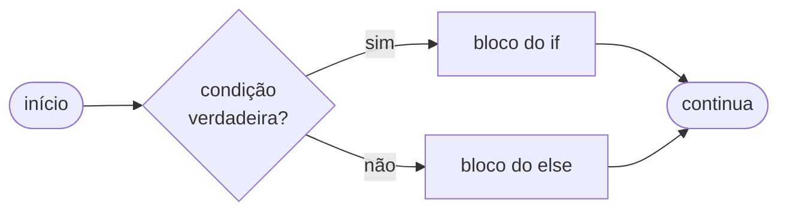
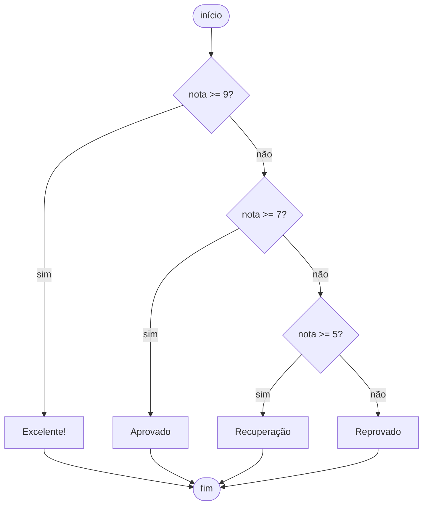
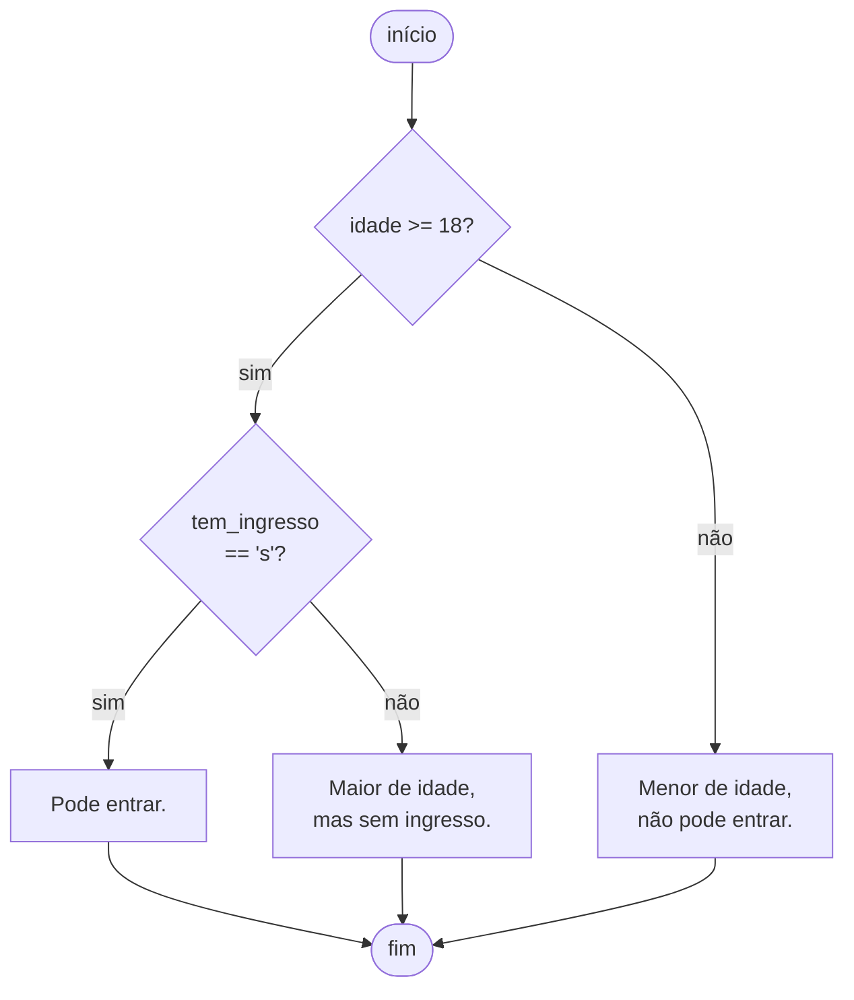

# Aula 06: Condicionais

Na **[Aula 02](02_introducao.md)** apareceu a imagem de um programa chegando numa bifurcação e decidindo qual caminho seguir dependendo de uma placa. Chegou a hora de colocar isso em código.

Até aqui, todos os programas que escrevemos executam as linhas de cima para baixo sem nunca desviar. Os condicionais quebram esse fluxo: o programa lê uma condição, decide qual caminho tomar, e o código muda de comportamento dependendo do que encontrar.

---

## O que é uma condição?

Uma condição é qualquer expressão que o Python consegue avaliar como verdadeira (`True`) ou falsa (`False`). Você já viu isso na **[Aula 04](04_operadores.md)**: `idade >= 18`, `nota == 10`, `nome != ""`, todas essas expressões retornam `True` ou `False` dependendo dos valores.

```python
print(10 > 5)    # True
print(10 < 5)    # False
print(10 == 10)  # True
print(10 != 10)  # False
```

Todo condicional funciona assim: Python avalia a condição, obtém `True` ou `False`, e decide qual bloco de código executar.

---

## `if`

A estrutura mais simples: execute um bloco **apenas se** a condição for verdadeira.

```python
idade = int(input("Digite sua idade: "))

if idade >= 18:
    print("Você é maior de idade.")
    print("Acesso permitido.")
```

Se o usuário digitar 20, as duas linhas dentro do `if` executam. Se digitar 15, o Python pula tudo dentro do `if` e continua depois. Nesse exemplo, nenhuma mensagem aparece na tela.

### A indentação é a estrutura do código

Repare no `:` no final do `if` e no **recuo** nas linhas seguintes. Isso não é estética, é a forma que o Python usa para saber o que pertence ao `if`. Tudo que estiver recuado depois do `if` faz parte do bloco. Quando a indentação volta ao nível anterior, o bloco terminou.

```python
idade = 20

if idade >= 18:
    print("Esta linha está dentro do if.")   # executa se entrar no if
    print("Esta também.")                    # executa se entrar no if

print("Esta linha está fora do if.")        # executa sempre
```

Esquecer a indentação é um erro muito comum no começo. O Python vai reclamar com `IndentationError`:

```python
if idade >= 18:
print("Erro!")
```

```text
  File "prog.py", line 2
    print("Erro!")
    ^^^^^
IndentationError: expected an indented block after 'if' statement on line 1
```

---

## `else`

Sem o `else`, quando a condição do `if` é falsa o programa simplesmente continua sem fazer nada. O `else` cobre esse outro lado: você garante que sempre haverá uma resposta, independente do que o usuário digitar.

```python
idade = int(input("Digite sua idade: "))

if idade >= 18:
    print("Maior de idade, acesso liberado.")
else:
    print("Menor de idade, acesso negado.")

print("Programa encerrado.")   # sempre executa, independente do if
```

Usando a analogia da bifurcação na estrada: você vai pela direita ou pela esquerda, nunca pelos dois lados mas sempre por um deles. Depois da bifurcação, é como se a estrada se unisse de novo, o código após o `if`/`else` sempre executa.



Outro exemplo prático:

```python
saldo = float(input("Saldo em conta (R$): "))
saque = float(input("Valor do saque (R$): "))

if saque <= saldo:
    saldo = saldo - saque
    print(f"Saque realizado. Novo saldo: R$ {saldo:.2f}")
else:
    print("Saldo insuficiente.")
```

---

## `elif` e os múltiplos caminhos

Quando há mais de duas possibilidades, use `elif` (abreviação de "else if"). O Python testa as condições **de cima para baixo** e para no primeiro que for verdadeiro, os outros nem são avaliados:

```python
nota = float(input("Digite sua nota (0 a 10): "))

if nota >= 9:
    print("Excelente!")
elif nota >= 7:
    print("Aprovado")
elif nota >= 5:
    print("Recuperação")
else:
    print("Reprovado")
```

O fluxo de execução fica assim:



Por que a ordem importa? Imagine que a nota seja `9.5`. O Python testa:

1. `9.5 >= 9` → **True**, entra aqui, imprime "Excelente!" e **pula todo o resto**
2. As outras condições nunca são avaliadas

Se você inverter a ordem e colocar `nota >= 5` primeiro, qualquer nota acima de 5 entraria aí, incluindo notas 9 e 10. A ordem define a prioridade.

Esse é um dos bugs mais silenciosos que você vai encontrar: o programa roda sem nenhum erro, mas dá resultado errado.

### O que o `elif` já sabe

Uma coisa que confunde bastante no começo: por que o `elif nota >= 7` não precisa dizer `nota >= 7 and nota < 9`?

Porque quando o Python chega nessa linha, ele **já sabe** que `nota >= 9` é falso, foi exatamente por isso que o `if` anterior não entrou. O `elif` só é avaliado quando todas as condições acima falharam. Então, ao chegar em `elif nota >= 7`, o Python já tem certeza que a nota é menor que 9. Você não precisa verificar isso de novo.

Acompanhe o raciocínio para uma nota `7.5`:

```text
if nota >= 9:     → 7.5 >= 9 é False. Python descarta e continua.
elif nota >= 7:   → 7.5 >= 7 é True. Mas o Python já sabe que 7.5 < 9.
                     Então essa linha equivale a: 7 <= nota < 9. Sem precisar escrever isso.
```

Escrever `elif nota >= 7 and nota < 9` não está errado, funciona. Só é redundante, porque o `elif` já garante que as condições anteriores falharam. Com o tempo isso fica natural, mas no começo é comum querer escrever a condição completa "só para ter certeza".

Você pode ter quantos `elif` precisar. Um exemplo simples com quatro casos completos:

```python
estacao = input("Estação do ano (verao/outono/inverno/primavera): ")

if estacao == "verao":
    print("Vai ficar quente, passa protetor solar.")
elif estacao == "outono":
    print("O ar esfria e as manhãs enganam.")
elif estacao == "inverno":
    print("Curitiba no inverno é cabuloso.")
elif estacao == "primavera":
    print("Três dias de sol, um de chuva.")
else:
    print("Estação inválida.")
```

---

## Condicionais aninhados

Você pode colocar um `if` dentro de outro. Isso é útil quando a segunda decisão só faz sentido se a primeira já for verdadeira:

```python
idade = int(input("Idade: "))
tem_ingresso = input("Tem ingresso? (s/n): ")

if idade >= 18:
    if tem_ingresso == "s":
        print("Pode entrar.")
    else:
        print("Maior de idade, mas sem ingresso.")
else:
    print("Menor de idade, não pode entrar.")
```



Aqui, a pergunta sobre o ingresso só aparece se a pessoa já for maior de idade. Faz sentido: não precisamos checar o ingresso de quem não pode entrar de qualquer forma.

**Cuidado com o excesso**: condicionais muito aninhados ficam difíceis de ler. Se você estiver com três ou mais níveis de `if` dentro de `if`, geralmente há uma forma mais simples de escrever o mesmo código com `and` e `or`.

Meus primeiros códigos eram uma escadaria. `if` dentro de `if` dentro de `if`, cada nível mais recuado que o anterior, até o código ficar parecendo uma pirâmide deitada. Eu achava que estava sendo cuidadoso, cobrindo todos os casos. Na prática estava criando um labirinto que nem eu mesmo conseguia ler dois dias depois. Se o seu código estiver com essa cara, pensa se dá para combinar as condições com `and` e `or`. Quase sempre dá.

---

## Condições compostas

`and`, `or`, `not`, `in` e `not in` foram explicados na **[Aula 04](04_operadores.md)**. Aqui só veremos o padrão de uso dentro de condicionais.

```python
if nota >= 0 and nota <= 10:       # and: os dois precisam passar
    print(f"Nota: {nota:.1f}")

if nota < 5 or faltas > 25:        # or: basta um
    print("Reprovado.")

if not logado:                     # not: inverte
    print("Faça login primeiro.")

if "@" not in email:               # not in: ausência
    print("E-mail inválido.")
```

**Uma coisa que a Aula 04 não mostrou:** Python aceita comparações encadeadas, igual à notação matemática. Em vez de `nota >= 0 and nota <= 10`, você pode escrever diretamente:

```python
if 0 <= nota <= 10:
    print("Nota válida.")
```

Funciona para qualquer cadeia de comparações: `a < b < c`, `x >= y >= z`. O Python avalia par a par da esquerda para a direita. É mais legível e evita repetir a variável do meio.

### Combinando tudo numa condição só

```python
idade = int(input("Idade: "))
tem_cpf = input("Tem CPF? (s/n): ") == "s"
bloqueado = False

if idade >= 18 and tem_cpf and not bloqueado:
    print("Cadastro aprovado.")
else:
    print("Cadastro não autorizado.")
```

> O `is None` da **[Aula 04](04_operadores.md)** também funciona em condicionais (`if resultado is None:`), mas aparece pouco nos exercícios do curso. Não precisa se preocupar com ele agora.

---

## Guardando o resultado de uma condição

Uma condição retorna `True` ou `False`, e você pode guardar isso em uma variável. Isso é útil quando a mesma condição aparece em vários lugares, ou quando ela é longa e você quer um nome mais descritivo:

```python
idade = int(input("Idade: "))
nota = float(input("Nota: "))

maior_de_idade = idade >= 18
aprovado = nota >= 7

if maior_de_idade and aprovado:
    print("Aprovado e habilitado.")

if not aprovado:
    print("Procure o professor para recuperação.")
```

É basicamente documentação embutida no código.

---

## Expressão condicional em uma linha

Existe uma forma compacta de escrever um `if`/`else` simples em uma única linha. É chamada de **expressão condicional** (ou operador ternário):

```python
# Forma longa
if nota >= 7:
    situacao = "Aprovado"
else:
    situacao = "Reprovado"

# Forma compacta (mesma coisa em uma linha)
situacao = "Aprovado" if nota >= 7 else "Reprovado"
```

A sintaxe é: `valor_se_verdadeiro if condição else valor_se_falso`.

Funciona bem dentro de f-strings também, você viu isso passar rapidamente na **[Aula 05](05_entrada_saida.md)** sem explicação; agora faz sentido:

```python
print(f"{nome} está {'Aprovado' if nota >= 7 else 'Reprovado'}")
```

Se tiver que explicar o que aquela linha faz para outra pessoa, ou para você mesmo dois dias depois, provavelmente não vale usar o ternário.

---

## `match`: quando há muitas alternativas fixas (Python 3.10+)

O `match` é útil quando você precisa comparar uma variável com um conjunto fixo de valores possíveis, como um menu de opções. É mais limpo do que uma sequência longa de `elif == "valor"`:

```python
opcao = input("Escolha (1-Depósito, 2-Saque, 3-Saldo): ")

match opcao:
    case "1":
        print("Depósito selecionado.")
    case "2":
        print("Saque selecionado.")
    case "3":
        print("Consulta de saldo.")
    case _:
        print("Opção inválida.")
```

O `case _` funciona como o `else`: é o caso padrão, executado quando nenhum outro combina. Você pode combinar valores em um mesmo `case` com `|`:

```python
match dia.lower():
    case "sábado" | "domingo":
        print("Fim de semana!")
    case _:
        print("Dia útil.")
```

> **Atenção:** `match` foi introduzido no Python 3.10. Se você estiver usando uma versão mais antiga, use `elif` no lugar. Além disso, não vi muitos professores que mostram isso e muito menos que cobram. Se esse for seu caso, fica como uma curiosidade!

---

## Erros comuns

**Usar `=` em vez de `==`**

```python
if nota = 7:   # SyntaxError: = é atribuição, não comparação
if nota == 7:  # correto
```

O `=` guarda um valor na variável; o `==` compara dois valores e retorna `True` ou `False`. Esse erro é um dos mais fáceis de cometer.

**Esquecer a indentação**

```python
if nota >= 7:
print("Aprovado")
```

```text
  File "prog.py", line 2
    print("Aprovado")
    ^^^^^
IndentationError: expected an indented block after 'if' statement on line 1
```

**Condições que nunca executam por causa da ordem**

```python
# ERRADO: nota >= 5 captura tudo acima de 5, incluindo 9 e 10
if nota >= 5:
    print("Recuperação")
elif nota >= 7:
    print("Aprovado")   # nunca vai chegar aqui!

# CORRETO: do maior para o menor
if nota >= 7:
    print("Aprovado")
elif nota >= 5:
    print("Recuperação")
```

**Comparar strings com `==` sem checar maiúsculo e minúsculo**

```python
resposta = input("Continuar? (s/n): ")

if resposta == "s":         # não aceita "S"
    ...

if resposta.lower() == "s": # aceita "s" e "S"
    ...
```

---

> **Nota:** muitos exercícios desta lista pedem para detectar entradas inválidas. Com o que você viu aqui, dá para identificar o problema e exibir uma mensagem de erro, mas não para repetir o pedido automaticamente. Esse padrão (`while True` com `break` quando a entrada é válida) aparece na **[Aula 07](07_repeticao.md)**.

Exemplo rodável desta aula: [`exemplos/06_condicionais.py`](../exemplos/06_condicionais.py)

## Exercício sugerido

Faça um programa que:

1. Leia o peso (em kg) e a altura (em metros) de uma pessoa.
2. Calcule o IMC: `peso / altura ** 2`
3. Classifique conforme a tabela abaixo.
4. Exiba o IMC com duas casas decimais e a classificação.

| IMC            | Classificação  |
|----------------|----------------|
| Abaixo de 18,5 | Abaixo do peso |
| 18,5 a 24,9    | Peso normal    |
| 25,0 a 29,9    | Sobrepeso      |
| 30,0 ou acima  | Obesidade      |

Teste com: 60 kg / 1,70 m; 80 kg / 1,70 m; 100 kg / 1,70 m. Os resultados fazem sentido com o que você esperaria?

---

## Lista da disciplina

> Você terminou a aula de condicionais. Este é o momento certo para resolver a **Lista 02: Condicionais e Operadores Lógicos**, disponível em `docs/listas/`.
>
> Os exercícios usam `if`, `elif`, `else` e os operadores lógicos (`and`, `or`, `not`) que você viu nas aulas 04 e 06. Tente resolver cada exercício antes de consultar qualquer exemplo.

---

## Exercícios de debug relacionados

| Nível | Arquivo |
|-------|---------|
| Fácil | [`../debug/facil/02_condicionais.py`](../debug/facil/02_condicionais.py) |
| Médio | [`../debug/medio/01_condicionais.py`](../debug/medio/01_condicionais.py) |

Tente corrigir sem rodar. Depois compare com a saída esperada descrita no cabeçalho de cada arquivo.

> **Resposta do exercício:** [`respostas/06_condicionais.py`](../respostas/06_condicionais.py)
