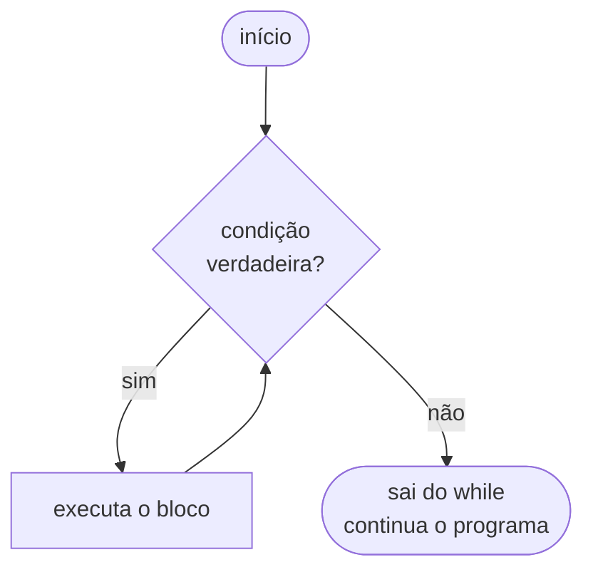
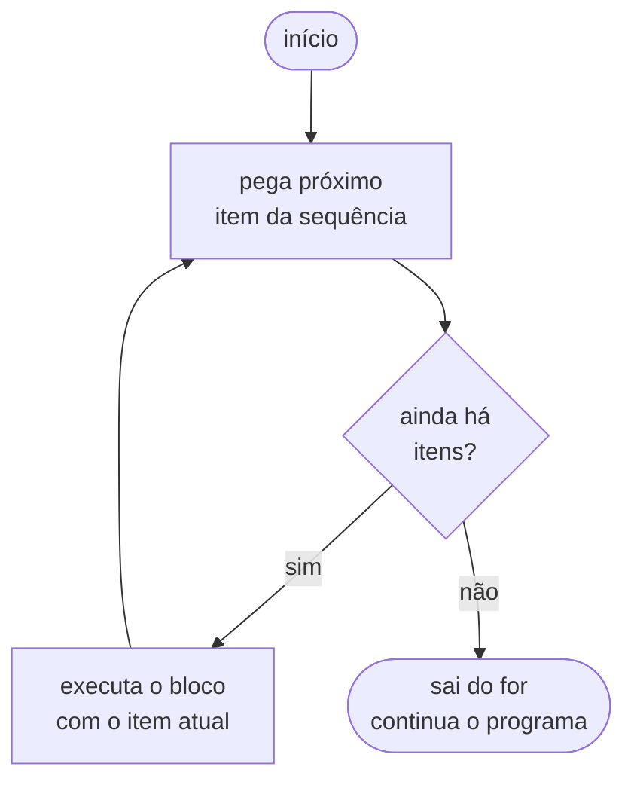
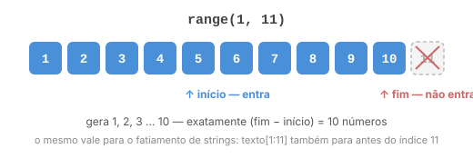
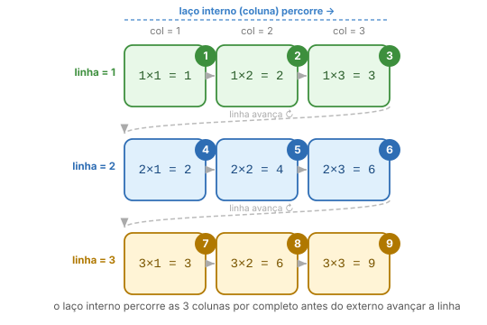
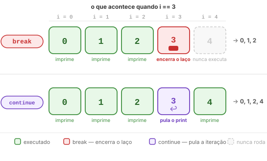

# Aula 07: Repetições (Laços)

Na [Aula 06](06_condicionais.md) você aprendeu a fazer o programa escolher entre caminhos diferentes com `if`. Agora o problema é outro: imagine precisar imprimir os números de 1 a 100. Você poderia escrever 100 `print()`s, um embaixo do outro... ou pedir para o computador repetir um bloco de código sozinho. É isso que um laço faz, ele repete instruções sem você precisar copiar e colar nada, e faz isso muito mais rápido do que qualquer humano conseguiria.

---

## `while`: repita enquanto for verdade

O `while` funciona parecido com o `if` que você viu na [Aula 06](06_condicionais.md): ele avalia uma condição e executa o bloco se ela for verdadeira. A diferença é que o `while` **continua repetindo** enquanto a condição permanecer verdadeira, não executa uma vez só.

```python
contador = 0

while contador < 5:
    print(contador)
    contador += 1
```

Saída: `0 1 2 3 4`

Vale acompanhar o que acontece em cada rodada (chamada de **iteração**):

| Iteração | `contador` no início | `contador < 5`? | O que executa |
|----------|----------------------|-----------------|---------------|
| 1ª | 0 | True | imprime 0, contador vira 1 |
| 2ª | 1 | True | imprime 1, contador vira 2 |
| 3ª | 2 | True | imprime 2, contador vira 3 |
| 4ª | 3 | True | imprime 3, contador vira 4 |
| 5ª | 4 | True | imprime 4, contador vira 5 |
| 6ª | 5 | **False** | bloco não executa, sai do while |

A condição é avaliada **antes** de cada iteração. Quando ela vira `False`, o Python sai do `while` e continua o programa normalmente depois dele.



---

## Contadores: controlando quantas vezes o laço roda

Um **contador** é uma variável numérica usada para contar quantas vezes algo aconteceu, ou para controlar até quando o laço deve continuar. O padrão sempre segue três passos:

1. **Inicializar** antes do laço (geralmente em `0` ou `1`)
2. **Incrementar** dentro do laço (somar 1 a cada rodada)
3. **Usar na condição** do `while` para definir quando parar

```python
contador = 0          # passo 1, começa em zero

while contador < 5:   # condição: continua enquanto for menor que 5
    print(contador)
    contador += 1     # passo 2, incrementa 1 a cada iteração

# passo 3: quando contador chega em 5, a condição vira False e o while para
```

O `contador += 1` (a atribuição composta que você viu na [Aula 04](04_operadores.md)) é o mais comum, mas você pode incrementar por qualquer valor:

```python
contador = 0
while contador <= 10:
    print(contador)
    contador += 2   # conta de 2 em 2: 0, 2, 4, 6, 8, 10
```

Também é possível **decrementar**: começar alto e ir diminuindo:

```python
contador = 5
while contador > 0:
    print(f"Contagem regressiva: {contador}")
    contador -= 1   # subtrai 1 a cada rodada

print("Lançar!")
```

**Esquecer de incrementar o contador** é o erro mais comum com `while`. O valor nunca muda, a condição nunca vira `False` e o programa fica travado para sempre. Se o seu programa parecer que travou, esse é o primeiro lugar para checar.

---

## Acumuladores: somando ao longo do laço

Um padrão muito comum é usar uma variável que acumula valores a cada iteração. Você inicializa ela antes do laço, atualiza dentro, e lê o resultado depois:

```python
soma = 0
n = int(input("Quantos números você vai digitar? "))

i = 1
while i <= n:
    valor = float(input(f"Número {i}: "))
    soma += valor   # equivale a soma = soma + valor
    i += 1

print(f"Soma total: {soma:.2f}")
print(f"Média: {soma / n:.2f}")
```

A variável `soma` começa em `0` e vai crescendo a cada número digitado. Esse padrão, inicializar fora, acumular dentro, usar depois, vai aparecer o tempo todo: soma de notas, contagem de respostas, total de uma compra. Vale gravar a sequência das três partes.

Você pode acumular de outras formas também: contar ocorrências, guardar o maior valor visto até agora, concatenar strings, etc.

```python
maior = 0
i = 1
while i <= 5:
    valor = int(input(f"Número {i}: "))
    if valor > maior:
        maior = valor
    i += 1

print(f"Maior número digitado: {maior}")
```

---

## Cuidado com laços infinitos

Se a condição do `while` nunca ficar falsa, o programa fica preso para sempre. Isso é chamado de **laço infinito** e é um erro muito fácil de cometer no começo:

```python
# ERRADO: contador nunca muda, condição nunca vira False
contador = 0
while contador < 5:
    print(contador)
    # esqueceu o contador += 1 !
```

O programa vai imprimir `0` para sempre até você forçar o encerramento.

Sempre garanta que algo dentro do laço vai eventualmente tornar a condição falsa. As formas mais comuns são:

- Incrementar/decrementar um contador
- Atualizar a variável que a condição verifica
- Usar `break` (que você vai ver logo abaixo)

> **Dica:** se o seu programa travar num laço infinito, pressione **Ctrl+C** no terminal para forçar o encerramento. O Python vai exibir um erro `KeyboardInterrupt`, é normal, significa que você interrompeu manualmente.

Aliás, você já parou para pensar por que chamamos um erro de software de "bug" (inseto, em inglês)? A história mais contada é que veio de um inseto de verdade: em 1947, a programadora Grace Hopper estava na equipe que encontrou uma mariposa presa nos relés do computador Mark II causando uma falha. Então, alguém da equipe colou o bicho no diário de bordo com a anotação *"first actual case of bug being found"* ("primeiro caso real de um bug encontrado").

O episódio é real e sempre foi me contado como a origem da palavra. Mas, pesquisando um pouco, não é bem assim: engenheiros já usavam "bug" para falhas técnicas décadas antes (Thomas Edison escrevia sobre isso em cartas dos anos 1870). O que Hopper e sua equipe fizeram foi popularizar o termo na computação, encontrando um bug que era literalmente um inseto.

---

## `for`: percorra uma sequência

O `for` é diferente do `while`: em vez de checar uma condição, ele **percorre uma sequência** de valores, um por vez. A cada iteração, a variável de controle recebe o próximo valor da sequência.

```python
for i in range(5):
    print(i)
```

Saída: `0 1 2 3 4`

Lendo em voz alta: "para cada `i` na sequência `range(5)`, execute o bloco". O `i` assume os valores `0, 1, 2, 3, 4` em ordem, um por rodada.

O `for` é ideal quando você sabe exatamente o que vai percorrer. Você nunca vai criar um laço infinito acidentalmente com `for`, ele termina quando a sequência acaba.



---

## `range()`: gerando sequências de números

`range()` gera uma sequência de números inteiros. Tem três formas de usar:

### `range(n)`: de 0 até n-1

```python
for i in range(5):
    print(i)   # 0, 1, 2, 3, 4
```

Por que começa em 0? A resposta curta: o índice de um elemento é o número de posições de distância do início, e o primeiro elemento está a *zero* posições. Vem do jeito que a memória do computador funciona. `range(5)` gera exatamente 5 números, o que é uma consequência direta disso. Se quiser a história completa (hardware, Dijkstra, por que Python não fugiu disso): [FAQ: Por que a contagem começa em 0 e não em 1?](../extras/faq.md#por-que-a-contagem-começa-em-0-e-não-em-1).

### `range(início, fim)`: de início até fim-1

```python
for i in range(1, 11):
    print(i)   # 1, 2, 3, 4, 5, 6, 7, 8, 9, 10
```

O `fim` é **exclusivo**, o laço vai até `fim - 1`. Isso é o mesmo comportamento do fatiamento de strings que você vai ver na [Aula 08](08_strings.md).



### `range(início, fim, passo)`: pulando de N em N

```python
for i in range(0, 20, 5):
    print(i)   # 0, 5, 10, 15

for i in range(10, 0, -1):
    print(i)   # 10, 9, 8, 7, 6, 5, 4, 3, 2, 1  (contagem regressiva)

for i in range(0, 11, 2):
    print(i)   # 0, 2, 4, 6, 8, 10  (só pares)
```

O passo pode ser negativo para percorrer de trás para frente. Para o `range` gerar algum número nesse caso, o `início` precisa ser maior que o `fim`, se não for, o Python **não dá erro**: ele simplesmente devolve uma sequência vazia, e o `for` não executa nenhuma vez. Se um laço seu "sumir" sem rodar e sem mensagem de erro, esse é um bom lugar para checar.

---

## Percorrendo listas diretamente

Você ainda não viu listas formalmente, isso vem na [Aula 09](09_listas.md), mas a sintaxe é simples: uma sequência de valores entre colchetes, separados por vírgula. Por enquanto, vamos só usar como algo para o `for` percorrer; ele funciona com qualquer sequência, não só números:

```python
turma = ["Ana", "Bruno", "Carla"]

for aluno in turma:
    print(aluno)
# Ana
# Bruno
# Carla
```

Isso é muito mais legível do que usar índices (`turma[0]`, `turma[1]`...). Prefira quando puder.

> Listas serão aprofundadas na **[Aula 09](09_listas.md)**, aqui só estamos usando como sequência para o `for`. Lá você também vai ver `enumerate()`, que permite percorrer uma lista tendo o índice e o valor ao mesmo tempo.

---

## Laços aninhados

Um laço dentro de outro. O laço interno **roda completo** para cada iteração do laço externo.

```python
for linha in range(1, 4):
    for coluna in range(1, 4):
        print(f"{linha}x{coluna}={linha*coluna}", end="  ")
    print()   # pula linha ao terminar cada linha da tabuada
```

Saída:
```
1x1=1  1x2=2  1x3=3
2x1=2  2x2=4  2x3=6
3x1=3  3x2=6  3x3=9
```

Para entender a quantidade de iterações: o laço externo (`linha`) roda 3 vezes e, para cada uma delas, o laço interno (`coluna`) roda outras 3, então o bloco mais interno executa `3 × 3 = 9` vezes, exatamente os 9 resultados que aparecem na saída.



Repare na ordem: o laço interno **termina todas as suas voltas** antes do laço externo avançar uma posição, é por isso que a tabuada sai linha por linha, e não misturada.

Laços aninhados são muito usados para trabalhar com **matrizes** (listas de listas), você vai ver isso em detalhes na [Aula 10](10_matrizes.md).

---

## `break` e `continue`: controlando o fluxo

Duas palavras-chave que modificam o comportamento normal do laço:

### `break`: sai do laço imediatamente

Quando o Python encontra um `break`, ele para o laço na hora, as iterações restantes são ignoradas:

```python
for i in range(10):
    if i == 5:
        break
    print(i)
# 0, 1, 2, 3, 4  (parou antes do 5)
```

`break` sai apenas do laço **mais interno**. Se houver laços aninhados, ele sai do laço onde está, não de todos.

### `continue`: pula para a próxima iteração

Quando o Python encontra um `continue`, ele ignora o que vem depois dele naquela iteração e vai direto para a próxima:

```python
for i in range(10):
    if i % 2 == 0:
        continue       # pula o print para números pares
    print(i)
# 1, 3, 5, 7, 9  (só os ímpares)
```

A diferença entre `break` e `continue`:
- `break` **encerra** o laço
- `continue` **pula** aquela iteração e continua o laço

```python
# Visualizando a diferença com o mesmo laço:

print("Com break:")
for i in range(5):
    if i == 3:
        break
    print(i)
# 0, 1, 2

print("Com continue:")
for i in range(5):
    if i == 3:
        continue
    print(i)
# 0, 1, 2, 4
```




> **Curiosidade: `for ... else`**
>
> Python tem uma construção que quase ninguém sabe que existe: um bloco `else` depois de um `for` ou `while`. Ele executa quando o laço termina normalmente, ou seja, sem `break`. Se o `break` for acionado, o `else` não roda.
>
> ```python
> for i in range(10):
>     if i == 5:
>         print("Encontrei o 5!")
>         break
> else:
>     print("5 não encontrado")   # só roda se o break não aconteceu
> ```
>
> É útil para substituir uma variável flag (`encontrado = False`), mas é pouco usado na prática, muita gente nunca viu e acha a sintaxe confusa. Eu não fazia ideia que isso existia até pesquisar para montar esse repositório. Decidi não incluir como conteúdo principal justamente por isso, mas achei que valia a menção.

---

## Quando usar `while` e quando usar `for`?

| Situação | Use |
|----------|-----|
| Sabe exatamente quantas vezes repetir | `for` + `range()` |
| Quer percorrer uma lista ou sequência | `for` |
| Não sabe quantas vezes vai repetir | `while` |
| Repete até o usuário fazer algo | `while` (com `break`) |
| Repete enquanto uma condição for verdadeira | `while` |

Na dúvida: se você consegue escrever "repita N vezes" ou "percorra cada item", use `for`. Se a frase natural é "repita enquanto..." ou "repita até...", use `while`.

---

## Aplicação prática: validando entradas do usuário

Na [Aula 06](06_condicionais.md) ficou uma dívida em aberto: os exercícios da Lista 02 pediam para detectar entradas inválidas, mas com `if` sozinho você só conseguia exibir uma mensagem de erro, não dava para repetir o pedido automaticamente.

Com `while`, `break` e `continue`, dá para resolver exatamente isso: o usuário pode digitar qualquer coisa (letras onde você espera números, valores fora do intervalo esperado) e o programa simplesmente continua pedindo até receber uma entrada válida:

```python
while True:
    entrada = input("Digite um número inteiro positivo: ")

    if not entrada.isdigit():
        print("Erro: use apenas dígitos, sem letras, vírgulas ou sinal de menos.")
        continue        # volta para o início do loop

    numero = int(entrada)

    if numero == 0:
        print("Erro: o número precisa ser positivo (maior que zero).")
        continue        # volta para o início do loop

    break   # chegou aqui = entrada válida, sai do loop

print(f"Número aceito: {numero}")
```

Lendo o fluxo: o `while True` cria um loop que teoricamente dura para sempre mas o `break` impede isso. As verificações com `if` + `continue` fazem o loop reiniciar sempre que algo estiver errado. Só quando tudo está certo o código chega no `break` e encerra.

O `isdigit()` é um **método de string**, você vai ver formalmente o que isso significa na [Aula 08](08_strings.md). Por enquanto, basta saber que ele devolve `True` ou `False` dizendo se a string parece representar um número inteiro, e que é necessário checar isso antes de converter (Se tentar `int("abc")` diretamente, o Python lança um erro). A [Aula 08](08_strings.md) retoma esse exato exemplo para mostrar um detalhe sutil sobre quais caracteres o `isdigit()` aceita, vale revisitar este trecho quando chegar lá.

Esse padrão de `while True` com `break` ao final aparece muito em programas reais. É interessante decorar a estrutura.

---

Exemplo rodável desta aula: [`exemplos/07_repeticao.py`](../exemplos/07_repeticao.py)

> O exemplo usa caracteres como `█`, `▲`, `◆` e `░` na saída. São strings normais em Python, não tem nada de especial, o terminal só precisa de uma fonte com suporte a Unicode, o que hoje em dia quase todo terminal tem por padrão. Se quiser usar nos seus próprios programas, pode copiar daqui mesmo ou pesquisar por "unicode block elements" numa tabela online.

## Exercício sugerido

Faça um programa que:
1. Leia números digitados pelo usuário, um de cada vez.
2. Pare quando o usuário digitar `0`.
3. No final, mostre: a soma, a quantidade de números digitados (excluindo o zero), a média e o maior número.

> **Resposta do exercício:** [`respostas/07_repeticao.py`](../respostas/07_repeticao.py)
---

## Lista da disciplina

> Você terminou a aula de repetição. Este é o momento certo para resolver a **Lista 03: Estruturas de Repetição**, disponível em `docs/listas/`.
>
> Os exercícios combinam `while`, `for`, `break` e `continue`. Alguns vão precisar de laços aninhados, releia a seção correspondente se precisar.

---

## Exercícios de debug relacionados

| Nível | Arquivo |
|-------|---------|
| Fácil | [`../debug/facil/03_repeticao.py`](../debug/facil/03_repeticao.py) |
| Médio | [`../debug/medio/02_repeticao.py`](../debug/medio/02_repeticao.py) |


