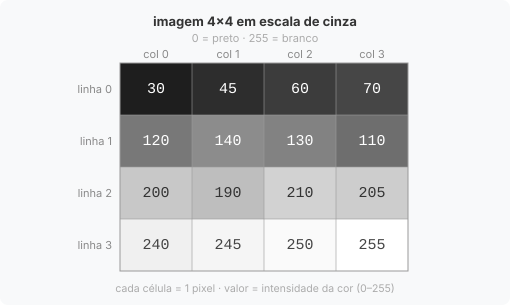
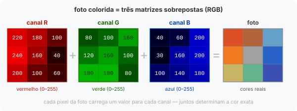
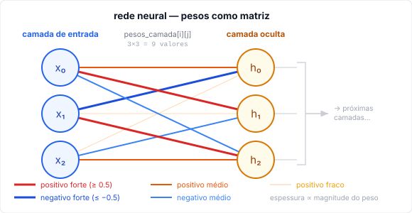
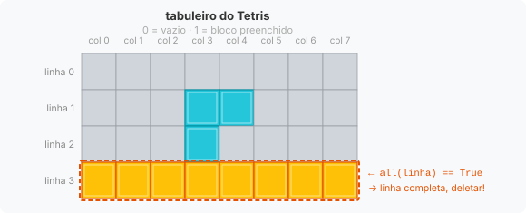

# Aula 10: Matrizes

Na Aula 09 você viu que listas guardam sequências. Agora damos um passo além: e quando os dados têm **duas dimensões**? Linhas *e* colunas ao mesmo tempo?

Para isso existe aquela estrutura matemática que você vê muito em geometria analítica, a **matriz**: uma tabela de valores onde cada célula é identificada por dois índices, a linha e a coluna em que ela está.

Em Python não existe um tipo nativo chamado "matriz". A forma natural de representar matrizes é usar **listas de listas**: a lista externa é a coleção de linhas, e cada lista interna é uma linha com seus elementos.

---

## Visualizando a estrutura

Antes de qualquer código, vale ter a imagem na cabeça. Uma matriz 3×3 se parece com isso:

```
          col 0   col 1   col 2
linha 0  [  1,      2,      3  ]
linha 1  [  4,      5,      6  ]
linha 2  [  7,      8,      9  ]
```

Em Python:

```python
matriz = [
    [1, 2, 3],   # linha 0
    [4, 5, 6],   # linha 1
    [7, 8, 9],   # linha 2
]
```

A lista externa tem 3 elementos, as três linhas. Cada linha tem 3 elementos, as três colunas. Para acessar qualquer célula, você informa primeiro a linha, depois a coluna: `matriz[linha][coluna]`.

---

## Dimensões da matriz

Antes de operar em uma matriz, você quase sempre precisa saber quantas linhas e quantas colunas ela tem. Cada uma vem de um `len()` diferente, e o visual abaixo mostra exatamente o que cada um está contando:

![Dimensões de uma matriz 3×3: seta azul horizontal indica len(matriz[0]) = 3 colunas; seta vermelha vertical indica len(matriz) = 3 linhas](imagens/10_dimensoes_matriz.svg)

- `len(matriz)` conta quantas listas internas existem, ou seja, quantas **linhas**.
- `len(matriz[0])` pega a primeira linha e conta quantos elementos ela tem, ou seja, quantas **colunas**.

```python
linhas  = len(matriz)       # 3, conta as listas internas (linhas)
colunas = len(matriz[0])    # 3, conta os elementos da primeira linha (colunas)

print(f"{linhas} linhas x {colunas} colunas")   # 3 linhas x 3 colunas
```

Não existe um `len_colunas()` pronto. Para saber o número de colunas, você precisa olhar dentro de uma linha, qualquer linha serve, e `[0]` é a primeira. Funciona porque assumimos que todas as linhas têm o mesmo comprimento, o que é verdade em qualquer matriz bem formada.

### Verificação de segurança

`len(matriz[0])` quebra se a matriz estiver vazia, você estaria tentando acessar a linha 0 de algo que não tem linha nenhuma. Quando não tem certeza se a matriz pode estar vazia, verifique antes:

```python
if matriz and matriz[0]:
    linhas  = len(matriz)
    colunas = len(matriz[0])
```

O que cada parte protege:

| Expressão   | O que verifica                | Caso que falha sem ela |
|-------------|-------------------------------|------------------------|
| `matriz`    | lista externa não está vazia  | `matriz = []`          |
| `matriz[0]` | primeira linha não está vazia | `matriz = [[]]`        |

Na prática, quando você mesmo preenche a matriz no programa, essa guarda não é necessária, você já sabe que ela tem conteúdo. Fica útil quando a matriz vem de um arquivo ou de entrada do usuário, onde você não controla o que chegou.

---

## Acessando elementos

Use dois índices: `matriz[linha][coluna]`. Índices começam em `0`, tanto para linhas quanto para colunas.

```python
matriz = [
    [1, 2, 3],
    [4, 5, 6],
    [7, 8, 9],
]

print(matriz[0][0])    # 1, linha 0, coluna 0 (canto superior esquerdo)
print(matriz[0][2])    # 3, linha 0, coluna 2 (canto superior direito)
print(matriz[1][1])    # 5, centro
print(matriz[2][0])    # 7, linha 2, coluna 0 (canto inferior esquerdo)
print(matriz[-1][-1])  # 9, última linha, última coluna
```

Acessar uma linha inteira é só acessar um elemento da lista externa:

```python
print(matriz[0])   # [1, 2, 3], linha 0 completa
print(matriz[2])   # [7, 8, 9], linha 2 completa
```

Modificar um elemento funciona da mesma forma:

```python
matriz[1][1] = 99
print(matriz[1])   # [4, 99, 6]
```

---

É muito comum errar a ordem `[linha][coluna]`. Se a sua matriz estiver parecendo transposta ou lançando `IndexError` sem motivo aparente, confira a ordem dos índices antes de mais nada.

---

## Percorrendo com laços aninhados

Para acessar todos os elementos, use um `for` dentro de outro. O laço externo percorre as linhas; o laço interno percorre os elementos de cada linha:

```python
for linha in matriz:
    for elemento in linha:
        print(elemento, end=" ")
    print()   # quebra de linha ao terminar cada linha
```

Saída:
```
1 2 3
4 5 6
7 8 9
```

O `print()` sem argumentos ao final do laço externo serve só para pular para a próxima linha, sem ele, todos os elementos sairiam na mesma linha.

Quando você precisa dos índices (a posição de cada elemento), use `enumerate` nos dois laços, o mesmo que vimos na [Aula 09](09_listas.md):

```python
for i, linha in enumerate(matriz):
    for j, elemento in enumerate(linha):
        print(f"[{i},{j}]={elemento}", end="  ")
    print()
```

Saída:
```
[0,0]=1  [0,1]=2  [0,2]=3
[1,0]=4  [1,1]=5  [1,2]=6
[2,0]=7  [2,1]=8  [2,2]=9
```

Perceba o padrão: para cada iteração do laço externo (`i`), o laço interno completa todas as colunas (`j`). Só depois `i` avança para a próxima linha.

---

## Exibindo a matriz de forma legível

Imprimir com `print(matriz)` devolve tudo em uma linha, difícil de ler. A forma correta é percorrer linha a linha com formatação:

```python
matriz = [
    [1,  2,  3],
    [4,  5,  6],
    [7,  8,  9],
]

for linha in matriz:
    for elemento in linha:
        print(f"{elemento:3}", end="")
    print()
```

Saída:
```
  1  2  3
  4  5  6
  7  8  9
```

O `{elemento:3}` reserva 3 caracteres para cada número, isso mantém as colunas alinhadas mesmo quando os valores têm tamanhos diferentes (por exemplo, `1` e `10` ocupariam espaços diferentes sem isso). Ter isso pronto desde o início é útil para conferir o resultado de qualquer operação enquanto pratica.

---

## Criando matrizes dinamicamente

Quando você não conhece o conteúdo com antecedência, ou quer criar a matriz com tamanho variável, precisa construí-la com laços.

Uma matriz é uma lista de linhas, então o processo é **construir cada linha e adicioná-la à matriz**. O laço externo controla quantas linhas criar; o laço interno preenche cada linha com seus elementos:

```python
linhas  = 3
colunas = 4

matriz = []               # começa vazia, vai receber as linhas uma a uma

for i in range(linhas):   # repete 3 vezes (uma por linha)
    linha = []            # começa uma linha nova, vazia
    for j in range(colunas):
        linha.append(0)   # adiciona 0 em cada coluna dessa linha
    matriz.append(linha)  # linha completa → adiciona à matriz
```

Para entender o que acontece a cada iteração:

| Iteração (`i`) | `linha` criada | `matriz` ao final |
|:--------------:|----------------|-------------------|
| 0 | `[0, 0, 0, 0]` | `[[0, 0, 0, 0]]` |
| 1 | `[0, 0, 0, 0]` | `[[0, 0, 0, 0], [0, 0, 0, 0]]` |
| 2 | `[0, 0, 0, 0]` | `[[0, 0, 0, 0], [0, 0, 0, 0], [0, 0, 0, 0]]` |

O ponto importante: `linha = []` está **dentro** do laço externo. Isso significa que a cada iteração uma lista nova é criada do zero, são três listas independentes, não três referências para a mesma (a armadilha do `*` que você verá a seguir).

```python
print(matriz)
# [[0, 0, 0, 0],
#  [0, 0, 0, 0],
#  [0, 0, 0, 0]]
```

Você pode trocar o `0` por qualquer valor inicial (`None`, `""`, `False`) dependendo do que a matriz vai representar.

### A armadilha do `*` com listas

Parece tentador criar uma matriz assim:

```python
# ERRADO: não faça isso!
matriz = [[0] * 4] * 3
```

O resultado parece correto à primeira vista:

```python
print(matriz)
# [[0, 0, 0, 0],
#  [0, 0, 0, 0],
#  [0, 0, 0, 0]]
```

Mas ao modificar qualquer célula, o problema aparece:

```python
matriz[0][0] = 9

print(matriz)
# [[9, 0, 0, 0],
#  [9, 0, 0, 0],   ← todas as linhas foram afetadas!
#  [9, 0, 0, 0]]
```

O motivo é o mesmo que vimos na seção de cópias da [Aula 09](09_listas.md): `[[0] * 4] * 3` não cria três listas independentes, cria **a mesma lista com três nomes**. Qualquer modificação feita por um desses nomes aparece para todos, porque são a mesma lista. Se quiser entender o mecanismo de memória por trás disso, tem uma explicação detalhada no [FAQ](../extras/faq.md).

```
[0] * 4  →  cria uma lista: [0, 0, 0, 0]
       * 3  →  cria três nomes para essa mesma lista

matriz[0] ──┐
matriz[1] ──┼──→  [0, 0, 0, 0]   (uma única lista na memória)
matriz[2] ──┘
```

A versão correta com laço cria três listas distintas a cada iteração:

```python
matriz = []
for i in range(3):
    matriz.append([0] * 4)   # cada iteração cria uma lista nova

matriz[0][0] = 9
print(matriz)
# [[9, 0, 0, 0],
#  [0, 0, 0, 0],   ← só a linha 0 foi afetada
#  [0, 0, 0, 0]]
```

O `[0] * 4` dentro do laço é seguro porque números são imutáveis, repetir um número não cria o mesmo problema. O problema só ocorre quando você repete uma **lista** com `*` na lista externa.

Para copiar uma matriz existente de forma segura, precisaria copiar cada linha individualmente com `.copy()`. Existe também `copy.deepcopy()` que faz isso de uma vez, mas envolve importar um módulo, verá na [Aula 15](15_modulos.md).

---

## Operações comuns

### Soma de todos os elementos

O padrão é o mesmo acumulador que você viu na [Aula 07](07_repeticao.md), só que agora com dois laços:

```python
matriz = [
    [1, 2, 3],
    [4, 5, 6],
    [7, 8, 9],
]

total = 0
for linha in matriz:
    for elemento in linha:
        total += elemento

print(total)   # 45
```

### Soma e média por linha e por coluna

Percorrer linhas é direto, cada `linha` já é uma lista pronta para somar. Percorrer colunas é diferente: você precisa fixar o índice da coluna (`j`) e variar o índice da linha (`i`), coletando um elemento de cada linha:

```python
notas = [
    [7.0, 8.5, 6.0],   # aluno 0
    [9.0, 7.5, 8.0],   # aluno 1
    [5.5, 6.0, 7.0],   # aluno 2
]

# Média de cada aluno, percorre por linha
for i, linha in enumerate(notas):
    media = sum(linha) / len(linha)
    print(f"Aluno {i}: média {media:.1f}")

# Média de cada prova, percorre por coluna
num_provas = len(notas[0])
num_alunos = len(notas)

for j in range(num_provas):
    soma = 0
    for i in range(num_alunos):
        soma += notas[i][j]       # pega o elemento da coluna j em cada linha i
    media = soma / num_alunos
    print(f"Prova {j}: média {media:.1f}")
```

Para linhas usamos `for linha in notas` e chamamos `sum(linha)` diretamente. Para colunas não existe esse atalho, precisamos construir a soma manualmente com `range`.

### Diagonal principal e diagonal secundária

Em uma matriz **quadrada** (mesmo número de linhas e colunas), existem duas diagonais:

```
1  2  3        1  2  3
4  5  6        4  5  6
7  8  9        7  8  9

principal:     secundária:
[1, 5, 9]      [3, 5, 7]
```

A **diagonal principal** é onde `linha == coluna`, ou seja, os índices `[0,0]`, `[1,1]`, `[2,2]`:

```python
matriz = [
    [1, 2, 3],
    [4, 5, 6],
    [7, 8, 9],
]

n = len(matriz)

diagonal_principal = []
for i in range(n):
    diagonal_principal.append(matriz[i][i])

print(diagonal_principal)        # [1, 5, 9]
print(sum(diagonal_principal))   # 15
```

A **diagonal secundária** vai do canto superior direito ao inferior esquerdo, os índices `[0,2]`, `[1,1]`, `[2,0]`. Testando com `n=3`: para `i=0` a coluna é `3-1-0 = 2`; para `i=1` é `3-1-1 = 1`; para `i=2` é `3-1-2 = 0`. Daí vem a fórmula da coluna: `n - 1 - i`:

| `i` (linha) | `n - 1 - i` (coluna) | elemento |
|:-----------:|:--------------------:|:--------:|
| 0 | 2 | `matriz[0][2]` = 3 |
| 1 | 1 | `matriz[1][1]` = 5 |
| 2 | 0 | `matriz[2][0]` = 7 |

```python
diagonal_secundaria = []
for i in range(n):
    diagonal_secundaria.append(matriz[i][n - 1 - i])

print(diagonal_secundaria)       # [3, 5, 7]
print(sum(diagonal_secundaria))  # 15
```

### Matriz identidade

Com o conceito de diagonal em mente, fica fácil entender a **matriz identidade**: uma matriz quadrada com `1` em toda a diagonal principal e `0` no resto.

A lógica de criação é direta: para cada célula `[i][j]`, se `i == j` estamos na diagonal, colocamos `1`. Caso contrário, colocamos `0`:

```python
n = 4
identidade = []
for i in range(n):
    linha = []
    for j in range(n):
        if i == j:
            linha.append(1)   # diagonal principal
        else:
            linha.append(0)   # fora da diagonal
    identidade.append(linha)

# [[1, 0, 0, 0],
#  [0, 1, 0, 0],
#  [0, 0, 1, 0],
#  [0, 0, 0, 1]]
```

### Transposta: trocar linhas por colunas

Transposta é uma daquelas operações que parecem abstratas até você precisar delas, e quando precisar, vai querer lembrar que é só trocar linha por coluna. Uma matriz 2×3 vira 3×2: Uma matriz 2×3 vira 3×2:

```
original:       transposta:
1  2  3         1  4
4  5  6    →    2  5
                3  6
```

Para construir a transposta, percorremos as **colunas** da original como laço externo. Para cada coluna `j`, percorremos todas as linhas `i` e coletamos `[i][j]`, isso forma uma nova linha da transposta:

```python
original = [
    [1, 2, 3],
    [4, 5, 6],
]

linhas  = len(original)
colunas = len(original[0])

transposta = []
for j in range(colunas):
    nova_linha = []
    for i in range(linhas):
        nova_linha.append(original[i][j])
    transposta.append(nova_linha)

print(transposta)
# [[1, 4],
#  [2, 5],
#  [3, 6]]
```

Os laços estão invertidos em relação ao normal: o externo varia `j` (coluna) e o interno varia `i` (linha). Isso porque estamos lendo a original "de lado", coluna a coluna em vez de linha a linha.

Você provavelmente já esbarrou com esses conceitos de matriz transposta, identidade e outras (se você já fez ou faz Geometria Analítica, com toda a certeza essas já são caras conhecidas, e talvez não tragam boas lembranças). Matrizes estão presentes em muitas áreas diferentes da computação. Você verá mais à frente.

---

## Buscando um valor na matriz

Para encontrar a posição de um valor específico, podemos percorrer toda a matriz até encontrá-lo e paramos assim que acharmos:

```python
notas = [
    [7.0, 8.5, 6.0],
    [9.0, 7.5, 8.0],
    [5.5, 6.0, 9.5],
]

valor_procurado = 9.5
encontrado = False

for i, linha in enumerate(notas):
    for j, elemento in enumerate(linha):
        if elemento == valor_procurado:
            print(f"Valor {valor_procurado} encontrado em [{i},{j}]")
            encontrado = True
            break          # sai do laço interno (colunas)
    if encontrado:
        break              # sai do laço externo (linhas)

if not encontrado:
    print(f"Valor {valor_procurado} não encontrado")
```

> **Floats e `==`:** floats são armazenados em binário, e nem todo decimal tem representação binária exata. `4.7 + 4.8` em Python não é `9.5`, é `9.499999999999998`. A comparação com `==` pode falhar mesmo que os números "pareçam iguais". O mais seguro é trabalhar com inteiros sempre que possível. (Entenda o porquê no [FAQ: por que `0.1 + 0.2` não é `0.3`?](../extras/faq.md#por-que-01--02-não-é-03))

O `break` sempre encerra apenas o laço **mais interno** onde ele está, por isso são necessários dois. A variável `encontrado` funciona como uma "bandeira" (*flag*): começa `False` e vira `True` quando o valor é achado, esse padrão foi apresentado na [Aula 07](07_repeticao.md). O laço externo checa essa bandeira ao final de cada linha e, se já encontrou, não continua procurando nas linhas seguintes.

---

## Exemplo completo: boletim escolar

```python
alunos = ["Ana", "Bruno", "Carlos"]
provas = ["P1", "P2", "P3"]

notas = [
    [8.0, 7.5, 9.0],
    [6.5, 7.0, 5.5],
    [9.0, 8.5, 9.5],
]

# Cabeçalho
print(f"{'Aluno':<10}", end="")
for prova in provas:
    print(f"{prova:>6}", end="")
print(f"{'Média':>8}")
print("-" * 38)

# Uma linha por aluno
for i, aluno in enumerate(alunos):
    print(f"{aluno:<10}", end="")
    for nota in notas[i]:
        print(f"{nota:>6.1f}", end="")
    media = sum(notas[i]) / len(notas[i])
    print(f"{media:>8.1f}")
```

Saída:
```
Aluno          P1    P2    P3   Média
--------------------------------------
Ana           8.0   7.5   9.0     8.2
Bruno         6.5   7.0   5.5     6.3
Carlos        9.0   8.5   9.5     9.0
```

`:<10` alinha o texto à esquerda reservando 10 caracteres. `:>6.1f` alinha o número à direita em 6 caracteres com 1 casa decimal. Essa formatação de alinhamento foi apresentada na [Aula 05](05_entrada_saida.md).

---

## Matrizes no mundo real

Quando aprendi matrizes no colégio, pareceu algo muito abstrato de matemática. Conforme fui estudando, percebi que matrizes aparecem em um número surpreendente de lugares. Achei interessante demais pra não comentar aqui.

### Imagens são matrizes

Toda imagem digital é uma matriz. Cada célula é um **pixel**, e o valor armazenado é a intensidade da cor:





Uma foto colorida tem **três matrizes** empilhadas, vermelho, verde e azul (RGB). Aquele filtro do Instagram que deixa a foto mais quente? É uma operação matemática aplicada sobre essas três matrizes. O desfoque (*blur*)? Cada pixel novo é a média dos pixels vizinhos na grade.

### Inteligência artificial usa matrizes o tempo todo

As redes neurais por trás de modelos de linguagem, reconhecimento de imagem e tradução automática são, na essência, sequências de multiplicações de matrizes. Os "pesos" que um modelo aprende são matrizes de números:

```python
# cada camada de uma rede neural é uma matriz de pesos (valores inventados)
pesos_camada = [
    [ 0.23, -0.71,  0.14],
    [ 0.58,  0.09, -0.33],
    [-0.42,  0.87,  0.25],
]
# "esse modelo tem X bilhões de parâmetros" = X bilhões de números em matrizes assim
```



Toda aquela "inteligência" emerge de somar e multiplicar matrizes repetidamente em cima de dados, o que é muito impressionante e complexo.

### Jogos que você provavelmente já jogou

Qualquer jogo com mapa ou tabuleiro em grade usa uma matriz por baixo:



- **Minecraft**: cada posição `[y][z][x]` diz que bloco existe ali. Quando você cava, está zerando uma célula dessa matriz gigante.
- **Candy Crush**: detectar três peças iguais em sequência é percorrer linhas e colunas procurando o padrão.
- **Hollow Knight**, **Celeste**, **Terraria**: mapas baseados em tiles, cada tile é uma célula, o arquivo salvo é essencialmente uma matriz com o tipo de terreno em cada posição.

### Mais além

Tomografias médicas, planilhas do Excel, renderização 3D, o PageRank do Google, toda vez que você vir um problema com estrutura de grade, tabela ou mapa, provavelmente tem uma matriz por baixo.

Se quiser trabalhar com matrizes grandes de verdade em Python, existe a biblioteca NumPy, você vai conhecê-la na [Aula 15 (Módulos)](15_modulos.md).

---

Exemplo rodável desta aula: [`exemplos/10_matrizes.py`](../exemplos/10_matrizes.py)

## Exercício sugerido

1. Crie uma matriz 4×4 preenchida com zeros usando laços.
2. Preencha a diagonal principal com `1` (sem laço aninhado, só um `for`).
3. Exiba a matriz formatada como tabela.
4. Peça ao usuário coordenadas `(linha, coluna)` e um valor para inserir.
5. Exiba a matriz atualizada e calcule a soma de cada linha e de cada coluna.

---

## Exercícios de debug

| Nível | Arquivo |
| --- | --- |
| Médio | [`../debug/medio/05_matrizes.py`](../debug/medio/05_matrizes.py) |

---

## Lista da disciplina

> Você terminou a aula de matrizes. Este é o momento certo para resolver a **Lista 05: Estruturas de Dados Matrizes**, disponível em `docs/listas/`.
>
> Os exercícios envolvem listas de listas com laços aninhados. Resolva a Lista 04 (listas simples) antes desta se ainda não fez.

Resposta do exercício: [`respostas/10_matrizes.py`](../respostas/10_matrizes.py)
