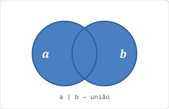
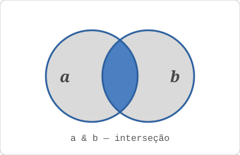
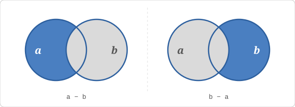
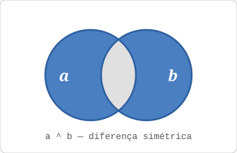
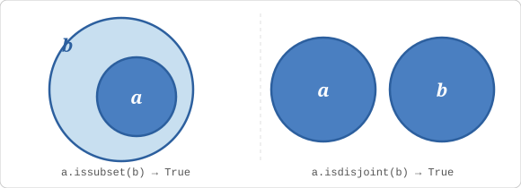

# Aula 12: Tuplas e Sets

Você já tem lista, string e dicionário. Duas lacunas ainda ficam: o que usar quando os dados são fixos e não devem mudar, e como guardar valores garantindo que não haverá repetição. É aí que entram **tuplas** e **sets**.

---

## Tuplas

### O que é uma tupla?

Tupla é uma sequência **ordenada e imutável**, parecida com lista, mas depois de criar, nada pode mudar.

```python
coordenadas = (10.5, -23.4)
cores_rgb   = (255, 128, 0)
vazia       = ()
unitaria    = (42,)   # vírgula obrigatória para tupla com um elemento!
```

A vírgula é o que faz a tupla, não os parênteses. `(42)` é só um número entre parênteses. `(42,)` é uma tupla com um elemento. Portanto, você pode criar uma tupla sem parênteses nenhum:

```python
ponto = 10.5, -23.4   # também é uma tupla, a vírgula basta
print(type(ponto))    # <class 'tuple'>
```

Os parênteses aparecem nos exemplos porque deixam o código mais legível para quem lê, não porque sejam obrigatórios.

### Acessando itens

Igual a listas e strings, índices e fatiamento funcionam da mesma forma:

```python
ponto = (10, 20, 30)

print(ponto[0])     # 10
print(ponto[-1])    # 30
print(ponto[1:])    # (20, 30)
print(len(ponto))   # 3
print(20 in ponto)  # True
```

O que não funciona é modificar:

```python
ponto[0] = 99   # TypeError: 'tuple' object does not support item assignment
```

### Desempacotamento: atribuindo em múltiplas variáveis

Desempacotamento é um recurso geral do Python, não exclusivo de tuplas, você já o usou nas aulas anteriores sem que o nome fosse dado:

- `for i, fruta in enumerate(frutas)`: desempacota cada par `(índice, valor)` da [Aula 09](09_listas.md)
- `for chave, valor in aluno.items()`: desempacota cada par `(chave, valor)` da [Aula 11](11_dicionarios.md)

Na [Aula 09](09_listas.md) surgiu a dúvida: por que `for i, fruta in frutas` (sem `enumerate()`) dá `ValueError`? Agora você tem a resposta, e ela é mais sutil do que parece.

Python **não** rejeita strings automaticamente. Ele trata string como sequência de caracteres e tenta desempacotá-la normalmente. O problema de `"maçã"` não é "isso é uma string, não posso desempacotar", é que `"maçã"` tem **4 caracteres**, e Python está tentando colocá-los em **2 variáveis**. Sobrou:

```python
frutas = ["maçã", "banana", "laranja"]

for i, fruta in frutas:   # "maçã" tem 4 chars → 4 valores para 2 variáveis
    print(i, fruta)
# ValueError: too many values to unpack (expected 2)
```

A parte traiçoeira: se a lista tivesse strings de exatamente 2 caracteres, **nenhum erro apareceria**. O código rodaria, mas daria resultado silenciosamente errado:

```python
for i, fruta in ["ab", "cd"]:   # 2 chars cada → 2 valores para 2 variáveis
    print(i, fruta)
# a b
# c d
```

Esse é um bug bem difícil de achar: o programa não explode, produz lixo, e você fica sem entender de onde veio.

O `for i, fruta in` só funciona quando cada elemento da coleção já é, ele mesmo, um par com exatamente 2 valores. É exatamente o que `enumerate()` faz por baixo: transforma `["maçã", "banana", "laranja"]` nos pares `(0, "maçã")`, `(1, "banana")`, `(2, "laranja")` (**tuplas de 2 elementos**) e aí o desempacotamento funciona.

A ideia é sempre a mesma: quando você tem um grupo de valores agrupados, pode distribuí-los em variáveis separadas em uma única linha. O Python verifica se a quantidade de variáveis bate com a de valores.

Tuplas são o lugar mais natural para ver isso com clareza: elas existem justamente para agrupar valores que pertencem juntos: coordenadas, data, resultado de uma função. Desempacotá-las é a forma natural de usá-las:

```python
ponto = (10, 20)
x, y = ponto
print(x)   # 10
print(y)   # 20
```

Funciona com qualquer sequência, seja lista, tupla, string:

```python
a, b, c = [1, 2, 3]      # lista
p, q, r = "abc"           # string: p="a", q="b", r="c"
```

Se o número de variáveis não bater com o de valores, Python lança `ValueError`, o mesmo que você viu em `remove()` e `index()` na [Aula 09](09_listas.md). Para casos onde o número de variáveis é menor que o de valores, você quer capturar os primeiros e jogar o resto numa lista, Python tem o operador `*`:

```python
primeiro, *resto = [10, 20, 30, 40]
print(primeiro)   # 10
print(resto)      # [20, 30, 40]

*inicio, ultimo = [10, 20, 30, 40]
print(inicio)     # [10, 20, 30]
print(ultimo)     # 40
```

O `*` pode estar em qualquer posição e captura tudo que sobrar naquela posição.

Um caso de uso concreto: quando o primeiro item de uma lista é especial (um cabeçalho, um total, um nome), mas o resto é homogêneo:

```python
cabecalho, *linhas = ["Nome", "Ana", "Bruno", "Carlos"]
print(cabecalho)  # "Nome"
print(linhas)     # ["Ana", "Bruno", "Carlos"]
```

> **Tuplas em funções:** quando uma função retorna mais de um valor separados por vírgula, Python os empacota automaticamente numa tupla e você pode desempacotá-los exatamente como viu acima. Você vai ver isso em ação na [Aula 13](13_funcoes.md), quando funções forem introduzidas.

### Por que usar tupla em vez de lista?

- **Imutabilidade como intenção**: usar tupla comunica "esses dados não devem mudar".
- **Levemente mais eficiente** que listas para dados fixos, na prática raramente vai sentir a diferença, mas é um bônus grátis.
- **Podem ser chaves de dicionário**: dicionários exigem chaves imutáveis, então tuplas servem e listas não.

```python
# Posições geográficas como chaves de dicionário:
cidades = {
    (-23.5, -46.6): "São Paulo",
    (-22.9, -43.2): "Rio de Janeiro",
}
```

Na prática, uso lista quase sempre e tupla quando quero deixar explícito que o dado é constante, quando preciso usar como chave de dicionário, ou quando uma função precisa devolver mais de um resultado (você vai ver isso na [Aula 13](13_funcoes.md)).

### Métodos de tupla

Tuplas têm só dois métodos, já que não podem ser modificadas, você já os viu em listas na [Aula 09](09_listas.md), o comportamento é o mesmo:

```python
t = (1, 2, 3, 2, 1, 2)
print(t.count(2))   # 3, quantas vezes 2 aparece
print(t.index(3))   # 2, posição da primeira ocorrência de 3
```

---

## Sets (Conjuntos)

### O que é um set?

Um set é uma coleção onde cada valor aparece no máximo uma vez, em nenhuma ordem garantida, é o conjunto da matemática, mas em Python.

```python
numeros = {1, 2, 3, 3, 2, 1}
print(numeros)   # {1, 2, 3}, as duplicatas foram removidas
```

### `{}` cria set ou dicionário?

Se você se perguntou isso, a resposta é: **depende do conteúdo**. Python distingue pelos **dois pontos**:

```python
meu_dict = {"nome": "Ana", "nota": 8.5}   # tem chave: valor → dicionário
meu_set  = {"Ana", "Bruno", "Carlos"}      # só valores, sem : → set
```

Então sim, `{1, 2, 3, 3}` cria um **set**, não um dicionário, não há dois pontos separando chave de valor, são só valores soltos. Python vê isso e cria um set, eliminando as duplicatas.

O único caso especial é o `{}` **vazio**: como não há conteúdo para Python analisar, ele não consegue decidir. Por razões históricas (dicionários existem desde o início do Python, sets vieram depois), `{}` vazio é sempre um **dicionário**:

```python
tipo_a = {1, 2, 3}    # set, valores sem dois pontos
tipo_b = {1: "um"}    # dicionário, par chave: valor
tipo_c = {}           # dicionário vazio, Python escolhe dict por padrão

print(type(tipo_a))   # <class 'set'>
print(type(tipo_b))   # <class 'dict'>
print(type(tipo_c))   # <class 'dict'>
```

Para criar um **set vazio**, use `set()` não `{}`:

```python
vazio_dict = {}       # dicionário vazio
vazio_set  = set()    # set vazio, única forma correta
```

Isso não foi mencionado na [Aula 11](11_dicionarios.md) de dicionários porque sets ainda não tinham sido apresentados. Agora que você conhece os dois, a regra fica clara: **dois pontos = dicionário, sem dois pontos = set**, exceto `{}` vazio que é sempre dict.

### Adicionando e removendo

```python
cores = {"vermelho", "azul", "verde"}

cores.add("amarelo")    # adiciona um elemento
cores.add("azul")       # não faz nada, "azul" já existe no set

cores.remove("azul")    # remove, lança KeyError se o elemento não existir
cores.discard("azul")   # remove, silencioso se não existir (preferível)
```

`add()` ignora silenciosamente elementos que já estão no set, é o comportamento esperado, não um bug.

`remove()` e `discard()` fazem a mesma coisa quando o elemento existe. A diferença é o que acontece quando **não existe**: `remove()` lança `KeyError`, `discard()` não faz nada. A tentação é sempre usar `discard()` por ser "mais seguro", mas isso esconde bugs.

Use `discard()` quando a ausência é um caso normal e você quer seguir em frente de qualquer jeito. Use `remove()` quando o elemento *deveria* estar lá, se não estiver, é sinal de que algo deu errado antes, e você quer saber disso agora, não depois de horas caçando um comportamento estranho:

```python
# O usuário deveria estar logado, se não estiver, algo quebrou antes disso
sessoes_ativas.remove("ana")    # KeyError se Ana não estiver → aviso imediato

# Limpando uma lista de bloqueios, pode ou não existir, tudo bem
bloqueados.discard("ana")       # silencioso se não existir → comportamento esperado
```

É a mesma lógica de `[]` vs `.get()` em dicionários da [Aula 11](11_dicionarios.md): use o que levanta erro quando a ausência *não deveria acontecer*.

Existe também `pop()`, mas ele remove um elemento **sem você escolher qual**, e isso nos leva direto ao próximo tópico.

### Por que a ordem é indefinida?

Sets não garantem ordem porque internamente usam uma estrutura chamada tabela hash para busca ultra-rápida. Não existe "primeiro" ou "último" num set, só existe "está aqui" ou "não está".

Você consegue ver isso diretamente: crie um set e veja o que Python exibe:

```python
s = {5, 1, 4, 2, 3}
print(s)   # {1, 2, 3, 4, 5}, parece ordenado!
```

Para inteiros pequenos no CPython, o hash do número é o próprio número, então sets de inteiros pequenos frequentemente aparecem em ordem crescente por coincidência, não por design. Com strings fica evidente que a ordem não é a de inserção:

```python
s = {"banana", "abacaxi", "kiwi", "manga"}
print(s)   # pode sair em qualquer ordem, não é a que você digitou
```

E como consequência direta da falta de ordem: **sets não têm índice**. Tentar acessar por posição causa erro:

```python
s = {10, 20, 30}
print(s[0])   # TypeError: 'set' object is not subscriptable
```

Se precisar percorrer um set em ordem, converta com `sorted()` ([Aula 09](09_listas.md)):

```python
for item in sorted(s):
    print(item)   # sempre em ordem crescente
```

O [FAQ](../extras/faq.md#por-que-1-2-3-não-preserva-a-ordem-que-eu-digitei) tem um padrão para quando você precisa de valores únicos E quer preservar a ordem de inserção.

### Verificação de pertencimento: por que sets são mais rápidos

`x in lista` percorre do começo ao fim. Sets calculam um **hash** do valor e vão direto ao endereço de memória correspondente: uma operação, independente do tamanho.

```python
palavras_lista = ["oi", "olá", "spam", "tchau"]
print("spam" in palavras_lista)   # percorreu 3 posições antes de achar

palavras_set = {"oi", "olá", "spam", "tchau"}
print("spam" in palavras_set)     # foi direto, sem percorrer
```

O padrão clássico é um filtro de palavras:

```python
palavras_proibidas = {"spam", "hack", "phishing", "fraude"}

mensagem = "esse email parece spam"
for palavra in mensagem.split():
    if palavra in palavras_proibidas:
        print(f"Alerta: palavra suspeita '{palavra}'")
# Saída: Alerta: palavra suspeita 'spam'
```

Se quiser entender como o hash funciona internamente e por que listas não podem ser chaves, veja o [Apêndice: Como funciona uma tabela hash](../apendices/tabela_hash.md).

### Operações de conjunto

Essas operações vêm diretamente da **Teoria dos Conjuntos**, a mesma dos diagramas de Venn que você provavelmente viu em matemática. Python implementa todas elas.

Para os exemplos: `a = {1, 2, 3, 4, 5}` e `b = {3, 4, 5, 6, 7}`.

**União** (`a | b`): tudo que aparece em pelo menos um dos dois:



```python
a = {1, 2, 3, 4, 5}
b = {3, 4, 5, 6, 7}

print(a | b)       # {1, 2, 3, 4, 5, 6, 7}
print(a.union(b))  # mesmo resultado
```

**Interseção** (`a & b`): só o que aparece nos dois ao mesmo tempo:



```python
print(a & b)              # {3, 4, 5}
print(a.intersection(b))  # mesmo resultado
```

**Diferença** (`a - b`): a ordem importa:



```python
print(a - b)            # {1, 2}, o que está só em a
print(b - a)            # {6, 7}, o que está só em b
print(a.difference(b))  # mesmo que a - b
print(b.difference(a))  # mesmo que b - a
```

**Diferença simétrica** (`a ^ b`): o que está em exatamente um dos dois, mas não nos dois:



```python
print(a ^ b)                       # {1, 2, 6, 7}
print(a.symmetric_difference(b))   # mesmo resultado
```

Com um exemplo de disciplinas de uma faculdade fica mais claro por que essas operações são úteis:

```python
matematica = {"Ana", "Bruno", "Carlos", "Diana"}
fisica     = {"Carlos", "Diana", "Eva", "Fábio"}

print(matematica | fisica)    # quem cursou pelo menos uma disciplina
print(matematica & fisica)    # quem cursou as duas
print(matematica - fisica)    # quem cursou só matemática
print(matematica ^ fisica)    # quem cursou exatamente uma delas (não as duas)
```

### Subconjuntos, superconjuntos e disjuntos



Um conjunto é **subconjunto** de outro quando todos os seus elementos estão contidos no outro. **Superconjunto** é a relação inversa, `issubset` e `issuperset` são perspectivas opostas da mesma relação:

```python
a = {1, 2, 3}
b = {1, 2, 3, 4, 5}

print(a.issubset(b))    # True, todo elemento de a existe em b
print(b.issuperset(a))  # True, b contém todos os elementos de a
```

**Disjunto** significa que os dois sets não têm nenhum elemento em comum, a interseção seria vazia:

```python
pares   = {2, 4, 6, 8}
impares = {1, 3, 5, 7}
print(pares.isdisjoint(impares))    # True, nenhum número é par e ímpar ao mesmo tempo

turma_a = {"Ana", "Bruno"}
turma_b = {"Bruno", "Carlos"}
print(turma_a.isdisjoint(turma_b))  # False, Bruno está nos dois
```

Quando vi sets pela primeira vez, pareceu uma estrutura sem utilidade óbvia, "é como uma lista que não preserva ordem e não aceita repetidos, tá." Aí surgiu a necessidade de checar se uma lista tinha valores duplicados. Ia fazer loop, comparar cada elemento com os outros... lembrei dos sets. `len(nums) != len(set(nums))`. Terminado. Às vezes a ferramenta certa transforma cinco linhas em uma.

### Caso de uso: eliminar duplicatas

```python
emails = ["a@x.com", "b@x.com", "a@x.com", "c@x.com", "b@x.com"]

unicos = list(set(emails))
print(unicos)   # os três emails únicos, mas a ordem pode ser qualquer uma
```

Na maioria dos casos `list(set(...))` resolve. Se a ordem importar, você quer manter a sequência original em que os emails aparecem, o padrão abaixo faz isso:

```python
vistos = set()
sem_duplicatas = []
for email in emails:
    if email not in vistos:
        sem_duplicatas.append(email)
        vistos.add(email)
```

---

## Comparando todas as estruturas

| Característica | Lista | Tupla | Dicionário | Set |
| --- | --- | --- | --- | --- |
| Sintaxe | `[1, 2]` | `(1, 2)` | `{"a": 1}` | `{1, 2}` |
| Ordenada | Sim | Sim | Sim (inserção)¹ | Não |
| Mutável | Sim | Não | Sim | Sim |
| Duplicatas | Sim | Sim | Não (chaves) | Não |
| Acesso | Por índice | Por índice | Por chave | Só verificação |
| Use quando | Sequência modificável | Dados fixos | Mapeamento | Valores únicos / conjuntos |

¹ Dicionários garantem ordem de inserção a partir do Python 3.7.

---

Exemplo rodável desta aula: [`exemplos/12_tuplas_sets.py`](../exemplos/12_tuplas_sets.py)

## Exercício sugerido

1. Crie uma lista com 10 números onde alguns se repetem.
2. Usando set, descubra quantos valores únicos há.
3. Crie dois sets: alunos que cursaram Matemática e alunos que cursaram Física.
4. Descubra quem cursou as duas (interseção), quem cursou só uma delas (diferença simétrica) e quem cursou pelo menos uma (união).
5. Crie uma lista com 3 pontos onde cada ponto é uma tupla `(latitude, longitude)`. Percorra a lista com `for lat, lon in pontos:` e exiba cada coordenada separada.

> **Resposta do exercício:** [`respostas/12_tuplas_sets.py`](../respostas/12_tuplas_sets.py)

---
