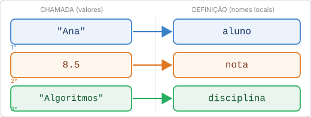
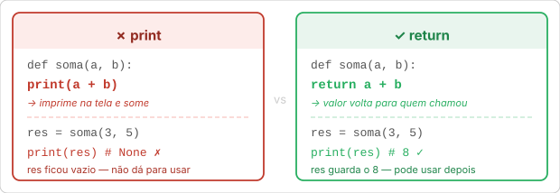
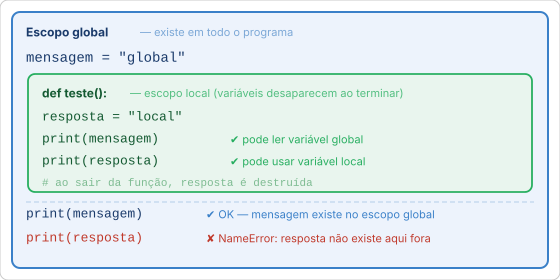
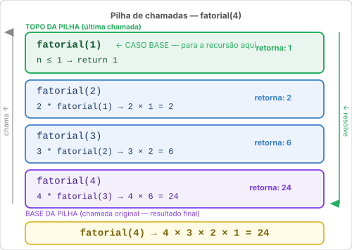

# Aula 13: Funções

Conforme o seu programa cresce, um problema aparece: você começa a repetir blocos de código. Calcula uma média aqui, depois recalcula lá embaixo, depois de novo em outro lugar. Se precisar corrigir um erro na lógica, tem que lembrar de corrigir em todos os lugares, e em algum momento vai esquecer algum.

Funções resolvem isso de um jeito simples: você escreve o código **uma vez**, dá um **nome** para ele, e pode executar esse bloco chamando o nome quantas vezes quiser, de qualquer lugar do programa.

Mas funções não são só sobre evitar repetição. Elas também são sobre **clareza**. Um programa cheio de funções bem nomeadas se lê quase como texto, imagine que você já escreveu as três funções abaixo, cada uma fazendo uma coisa só:

```python
nota = ler_nota()
if eh_aprovado(nota):
    exibir_parabens()
else:
    exibir_recuperacao(nota)
```

Você não precisa saber como `ler_nota()` funciona por dentro para entender o que o programa faz. Você lê os nomes e entende o fluxo. Daqui a pouco você vai escrever funções exatamente assim.

---

## Criando uma função

Use `def` (abreviação de *define*) seguido do nome, parênteses e dois pontos. O corpo da função fica indentado:

```python
def saudacao():
    print("Olá! Seja bem-vindo.")
```

Isso **define** a função, mas ainda não executa nada. Para executar, você **chama** a função pelo nome seguido de parênteses:

```python
saudacao()   # chama, executa o código dentro
saudacao()   # pode chamar quantas vezes quiser
```

A diferença entre definir e chamar é importante: a definição é como criar uma receita. A chamada é como cozinhar usando essa receita. Você cria a receita uma vez, mas pode cozinhar com ela quantas vezes quiser.

### Anatomia de uma função

```python
def calcular_media(notas):          # def nome(parâmetros):
    soma = sum(notas)               #     corpo da função
    media = soma / len(notas)       #     indentado
    return media                    #     return valor
```

- `def`: palavra reservada que inicia a definição
- `calcular_media`: nome da função
- `(notas)`: parâmetros que a função recebe (pode ser vazio `()`)
- `:`: dois pontos obrigatórios, como no `if` e `for`
- corpo indentado: tudo que executa quando a função é chamada
- `return`: devolve um valor para quem chamou (detalhes na seção abaixo)

### O que acontece durante uma chamada

Quando você escreve `media = calcular_media([7, 8, 9])`, o Python faz exatamente quatro coisas, nesta ordem:

**1. Localiza a definição.** O Python procura no código onde `calcular_media` foi definida e encontra o `def`.

**2. Cria os parâmetros.** Cria a variável local `notas` com o valor `[7, 8, 9]`. Esse espaço existe só durante esta chamada.

**3. Executa o corpo.** Roda cada linha dentro da função: calcula `soma`, calcula `media`, encontra o `return`.

**4. Devolve o valor e limpa.** Entrega `8.0` para a expressão que fez a chamada. As variáveis locais `notas`, `soma` e `media` são descartadas, elas não existem mais.

```python
# O que acontece internamente:

media = calcular_media([7, 8, 9])
# │
# └→ PASSO 1: Python encontra "def calcular_media(notas):"
#    PASSO 2: cria notas = [7, 8, 9]  (variável local)
#    PASSO 3: soma = 24, media = 8.0
#             encontra "return 8.0"
#    PASSO 4: entrega 8.0 para "media = ..."
#             notas, soma, media (locais) são descartados
#
# media = 8.0  ← você tem o resultado aqui
```

---

## Parâmetros e argumentos

**Parâmetros** são os nomes que você usa dentro da função para se referir aos valores recebidos. **Argumentos** são os valores reais que você passa na chamada.

```python
def saudacao(nome):        # nome é o parâmetro
    print(f"Olá, {nome}!")

saudacao("Ana")            # "Ana" é o argumento
saudacao("Bruno")          # "Bruno" é o argumento
```

O parâmetro `nome` só existe dentro da função, é uma variável local criada no momento da chamada e descartada quando a função termina.

Você pode ter múltiplos parâmetros separados por vírgula, a ordem na chamada deve corresponder à ordem na definição:

```python
def registrar_nota(aluno, nota, disciplina):
    print(f"{aluno} tirou {nota:.1f} em {disciplina}.")

registrar_nota("Ana", 8.5, "Algoritmos")
registrar_nota("Bruno", 7.0, "Cálculo")
```

O diagrama abaixo mostra como cada argumento vira um parâmetro com nome:



Cada posição casa com cada posição: o primeiro argumento vai para o primeiro parâmetro, o segundo para o segundo, e assim por diante. Ordem importa, `registrar_nota(8.5, "Ana", "Algoritmos")` colocaria `8.5` em `aluno`, o que estaria errado.

### Argumentos nomeados

Você também pode passar argumentos pelo nome, o que permite mudar a ordem e torna o código mais legível:

```python
registrar_nota(disciplina="ICC", aluno="Carlos", nota=9.0)
```

Com muitos parâmetros, argumentos nomeados tornam a chamada auto-explicativa, você lê `nota=9.0` e sabe exatamente o que está passando, sem precisar contar a posição.

Argumentos nomeados ficam ainda mais úteis quando combinados com **valores padrão**. Quando um parâmetro tem um valor padrão, você pode omiti-lo na chamada e o padrão é usado automaticamente:

```python
def criar_conta(nome, perfil="visitante", ativo=True):
    status = "ativo"
    if not ativo:
        status = "inativo"
    print(f"{nome}, {perfil}, {status}")

criar_conta("Ana")                       # Ana, visitante, ativo  (tudo padrão)
criar_conta("Bruno", perfil="admin")     # Bruno, admin, ativo  (só mudou perfil)
criar_conta("Carlos", ativo=False)       # Carlos, visitante, inativo  (só mudou ativo)
```

Sem argumentos nomeados, para mudar `ativo` você seria obrigado a passar `perfil` também, mesmo não querendo mudá-lo. Com nomes, você escolhe exatamente o que quer alterar e deixa o resto no padrão.

Uma regra importante ao definir valores padrão: **parâmetros com padrão devem vir depois dos parâmetros sem padrão**. O Python não saberia qual argumento corresponde a qual parâmetro de outra forma:

```python
# CERTO: obrigatório primeiro, opcional depois
def criar_usuario(nome, perfil="visitante"):
    print(f"{nome}, {perfil}")

# ERRADO: não funciona
def criar_usuario(perfil="visitante", nome):  # SyntaxError
    pass
```

---

## `return`: devolvendo um resultado

A diferença entre `print()` e `return` é onde mais vi gente travar, então vou ser direto:

- **`print()`** exibe algo na tela para o usuário ver
- **`return`** devolve um valor para o código que chamou a função

```python
# Função com print: só exibe, não guarda
def mostrar_soma(a, b):
    print(a + b)

resultado = mostrar_soma(3, 5)   # imprime 8 na tela
print(resultado)                  # imprime None, não tem nada para guardar!

# Função com return: devolve o valor
def calcular_soma(a, b):
    return a + b

resultado = calcular_soma(3, 5)   # guarda o valor 8
print(resultado)                   # imprime 8
print(calcular_soma(10, 2) * 3)   # 36, dá para usar em expressões
```



Use `print()` quando quiser **mostrar** algo. Use `return` quando quiser que o resultado seja **usado** pelo restante do código.

Se a função só imprime, ela não pode ser testada, não pode ser reutilizada e o resultado some. Prefira `return` quase sempre, você sempre pode fazer `print(minha_funcao())` depois.

### Retorno antecipado

`return` também é útil para sair cedo de uma função assim que uma condição não é atendida. Isso evita `if/else` aninhados e deixa o código mais linear:

```python
# Sem retorno antecipado: aninhamento cresce rapidamente
def processar_nota(nota):
    if nota is not None:
        if nota >= 0:
            if nota <= 10:
                return f"Nota válida: {nota:.1f}"
    return "Nota inválida"

# Com retorno antecipado: cada problema é resolvido e descartado
def processar_nota(nota):
    if nota is None:
        return "Nota inválida"
    if nota < 0 or nota > 10:
        return "Nota inválida"
    return f"Nota válida: {nota:.1f}"
```

A segunda versão faz a mesma coisa, mas o leitor não precisa rastrear `else` aninhados. Cada `return` é uma resposta definitiva, o código que importa fica no final, sem rodeios.

### `return` encerra a função

Quando o Python encontra `return`, ele para a execução da função imediatamente, qualquer código depois do `return` não é executado:

```python
def classificar(nota):
    if nota >= 7:
        return "Aprovado"   # função para aqui se nota >= 7
    return "Reprovado"      # só chega aqui se nota < 7
```

Essa estrutura é comum e legítima, não precisa de `else` porque o primeiro `return` já encerra a função. A segunda linha só executa quando a primeira não foi alcançada.

### Funções sem `return`

Toda função retorna algo. Se você não colocar `return`, a função retorna `None` automaticamente:

```python
def apenas_imprime():
    print("Olá")

resultado = apenas_imprime()   # imprime "Olá"
print(resultado)               # None
```

`None` é o valor Python para "nada", você já viu ele na [Aula 03](03_python_basico.md), quando estudou os tipos básicos. Não é um erro, é o retorno implícito de funções que não retornam nada explicitamente.

### Retornando múltiplos valores

Uma função pode retornar mais de um valor separando por vírgula. Na prática, ela retorna uma tupla, você pode desempacotar como aprendeu na [Aula 12](12_tuplas_sets.md):

```python
def estatisticas(numeros):
    return min(numeros), max(numeros), sum(numeros) / len(numeros)

menor, maior, media = estatisticas([3, 7, 1, 9, 5])
print(menor)   # 1
print(maior)   # 9
print(media)   # 5.0
```

---

## Escopo de variáveis

Variáveis criadas **dentro** de uma função existem apenas ali, elas têm **escopo local**. Quando a função termina, essas variáveis somem. Variáveis criadas **fora** de qualquer função têm **escopo global** e existem em todo o programa:

```python
mensagem = "global"   # variável global

def teste():
    resposta = "local"          # variável local
    print(mensagem)             # pode LER a global
    print(resposta)

teste()
print(mensagem)    # "global"
print(resposta)    # NameError: resposta não existe aqui fora!
```

O diagrama abaixo mostra os dois escopos como regiões aninhadas, o local existe dentro do global, mas não tem existência fora dele:



Esse isolamento é intencional e desejado. Sem ele, qualquer função poderia acidentalmente modificar variáveis de outras partes do programa e criar bugs difíceis de rastrear. Cada chamada de função tem o seu próprio espaço privado, ela pode *ler* o escopo global, mas não interfere em variáveis de outras funções.

### Por que não usar variáveis globais para tudo?

Parece conveniente: crie uma variável global e todas as funções a acessam. O problema é que o programa fica difícil de entender, você não sabe quem modificou o valor, quando, e por quê. O jeito certo é **passar o dado por parâmetro e devolver o resultado**:

```python
# Ruim: modifica uma variável global
total = 0
def adicionar(valor):
    global total       # palavra-chave para modificar global, evite isso
    total += valor

# Bom: recebe, processa e retorna
def adicionar(total, valor):
    return total + valor

total = 0
total = adicionar(total, 5)
total = adicionar(total, 3)
print(total)   # 8
```

A versão "boa" é mais fácil de entender: você vê exatamente o que entra (`total, valor`) e o que sai (`return total + valor`). A função não tem efeitos escondidos.

---

## Funções que chamam outras funções

Funções não vivem isoladas, elas podem chamar umas às outras. É assim que você constrói programas maiores a partir de peças menores, cada uma com uma responsabilidade clara:

```python
def calcular_media(notas):
    return sum(notas) / len(notas)

def verificar_aprovacao(media, frequencia):
    return media >= 7.0 and frequencia >= 75

def gerar_resultado(aluno, notas, frequencia):
    media = calcular_media(notas)         # chama outra função
    aprovado = verificar_aprovacao(media, frequencia)   # chama outra

    if aprovado:
        return f"{aluno}: APROVADO (média {media:.1f})"
    return f"{aluno}: REPROVADO (média {media:.1f})"

print(gerar_resultado("Ana",   [8.5, 7.0, 9.0], 80))
print(gerar_resultado("Bruno", [4.0, 5.5, 6.0], 70))
```

```text
Ana: APROVADO (média 8.2)
Bruno: REPROVADO (média 5.2)
```

O poder disso: `gerar_resultado` não sabe *como* calcular média, ela delega para `calcular_media`. Cada função tem uma responsabilidade pequena e clara. Se a regra de aprovação mudar amanhã (por exemplo, adicionar um critério de nota mínima na prova), você altera só `verificar_aprovacao`, o restante do código não precisa mudar.

Esse princípio, dividir um problema em funções menores e combinar elas, é como programas reais são escritos.

---

## Documentando funções com docstrings

Uma **docstring** é uma string colocada logo abaixo da definição da função que descreve o que ela faz. É a forma padrão de documentar funções em Python:

```python
def calcular_media(notas):
    """Calcula e retorna a média de uma lista de notas."""
    return sum(notas) / len(notas)
```

Para documentar mais detalhadamente:

```python
def verificar_aprovacao(nota_prova, nota_trabalho, freq):
    """
    Verifica se um aluno está aprovado na disciplina.

    nota_prova:    nota da prova (0 a 10)
    nota_trabalho: nota do trabalho (0 a 10)
    freq:          frequência percentual (0 a 100)
    Retorna True se aprovado, False caso contrário.
    """
    media = (nota_prova + nota_trabalho) / 2
    return media >= 7.0 and freq >= 75
```

A docstring não é só um comentário esquecido no código, o Python a trata como dado real. Você pode acessá-la de duas formas:

**No terminal**, chamando `help()` com o nome da função:

```python
help(verificar_aprovacao)
```

Saída:

```text
Help on function verificar_aprovacao in module __main__:

verificar_aprovacao(nota_prova, nota_trabalho, freq)
    Verifica se um aluno está aprovado na disciplina.

    nota_prova:    nota da prova (0 a 10)
    nota_trabalho: nota do trabalho (0 a 10)
    freq:          frequência percentual (0 a 100)
    Retorna True se aprovado, False caso contrário.
```

Isso funciona para qualquer função, inclusive as do Python. Tente `help(print)` ou `help(len)` e você vai ver a documentação oficial delas. É assim que o Python documenta toda a sua biblioteca padrão.

**Na IDE** (como o VS Code): elas podem aparecer como dica enquanto você digita o nome da função e abre o parêntese, antes mesmo de você terminar de escrever a chamada. Se você está usando uma função de outra pessoa e ela tem docstring, você vê exatamente o que cada parâmetro espera sem precisar abrir o arquivo dela.

Você também pode acessar a docstring diretamente como string:

```python
print(verificar_aprovacao.__doc__)
# Verifica se um aluno está aprovado na disciplina.
# ...
```

O atributo `__doc__` existe em toda função, se não tiver docstring, vale `None`.

---

## Funções lambda

Uma **lambda** é uma função anônima de uma única expressão, sem `def`, sem nome, sem `return` explícito:

```python
quadrado = lambda x: x * x
print(quadrado(4))   # 16
```

A leitura é: "uma função que recebe `x` e retorna `x * x`". O `return` é implícito.

Lambdas são úteis principalmente como argumento para outras funções. O caso mais comum é o parâmetro `key=` de `.sort()`, você já usou `.sort()` na [Aula 09](09_listas.md), mas essa é a novidade: o parâmetro pode receber uma função que define como comparar os elementos antes de ordenar.

```python
nomes = ["Carlos", "ana", "Bruno"]
nomes.sort(key=lambda n: n.lower())   # ordena ignorando maiúsculas
print(nomes)   # ["ana", "Bruno", "Carlos"]

produtos = [("Arroz", 5.99), ("Feijão", 7.50), ("Óleo", 6.20)]
produtos.sort(key=lambda p: p[1])     # ordena pelo preço (segundo elemento)
print(produtos)
```

Com `def`, as mesmas coisas ficariam assim:

```python
def ignorar_maiusculas(n):
    return n.lower()

nomes.sort(key=ignorar_maiusculas)   # equivalente ao lambda acima
```

Quando usar lambda? Quando a função é tão simples que dar um nome seria mais confuso. Para qualquer coisa com mais de uma operação, prefira `def` com nome descritivo, o código fica muito mais legível.

Honestamente, não uso muito lambda, tenho preferência por escrever a função bonitinha com `def`. Mas às vezes poupa linhas de código e fica mais natural do que criar uma função separada só para uma ordenação simples.

---

## Recursão

> **Atenção:** esta seção é mais avançada que as anteriores. Se na primeira leitura parecer abstrato, não se preocupe, recursão fica mais natural depois que você resolver alguns exemplos.

Uma função é **recursiva** quando chama a si mesma durante a execução. É uma técnica para resolver problemas que se dividem em versões menores do mesmo problema.

O exemplo clássico é o fatorial: `5! = 5 × 4 × 3 × 2 × 1`. Olhando de outra forma: `5! = 5 × 4!`. O problema grande se reduz a um problema menor da mesma natureza.

```python
def fatorial(n):
    if n <= 1:               # caso base, para a recursão
        return 1
    return n * fatorial(n - 1)   # chama a si mesma com n menor

print(fatorial(5))   # 120
```

Para entender o que acontece, trace a execução:

```text
fatorial(5)
  → 5 * fatorial(4)
       → 4 * fatorial(3)
            → 3 * fatorial(2)
                 → 2 * fatorial(1)
                      → 1         ← caso base, começa a voltar
                 → 2 * 1 = 2
            → 3 * 2 = 6
       → 4 * 6 = 24
  → 5 * 24 = 120
```

Para entender *como* isso acontece na memória, pense em uma pilha de pratos. Cada chamada a `fatorial(n)` empilha um "prato" (com o valor de `n` e o cálculo pendente). Quando `fatorial(1)` retorna 1, o Python começa a desempilhar, cada prato resolve o seu cálculo e passa o resultado para baixo:



Toda função recursiva precisa de duas coisas:

1. **Caso base**: a condição que encerra a recursão. Sem ela, a função chama a si mesma infinitamente até o Python travar com `RecursionError`.
2. **Progresso em direção ao caso base**: cada chamada deve deixar o problema menor.

Para ver a mesma estrutura com algo que você já conhece, veja como somar uma lista pode ser pensado de forma recursiva:

```python
def soma_lista(nums):
    if len(nums) == 0:           # caso base: lista vazia, soma é zero
        return 0
    return nums[0] + soma_lista(nums[1:])   # primeiro + soma do resto

print(soma_lista([1, 2, 3, 4]))   # 10
```

A leitura: "a soma de uma lista é o primeiro elemento mais a soma de todos os outros". O `if len == 0` garante que, eventualmente, a lista acaba.

Quando usar recursão? Quando o problema tem estrutura naturalmente recursiva: árvores, fractais, percurso de pastas. Para problemas simples como somar números de uma lista, um `for` é mais claro. Recursão é poderosa mas nem sempre a solução mais legível.

Lembro quando aprendi recursão em Algoritmos e Estruturas de Dados II, achei o conceito tão incrível que queria usar para tudo. Com o tempo fui entendendo que impressionar não é o critério. Loop é mais legível na maioria dos casos; use recursão quando o problema for naturalmente recursivo, não vale a pena complicar.

---

## Boas práticas

**Nomes descritivos**: `calcular_media`, `verificar_aprovacao`, `formatar_nota` dizem tudo. `f1`, `proc`, `helper` não dizem nada. O nome é a documentação mais rápida que existe.

**Uma função, uma tarefa.** Se você não consegue descrever o que ela faz em uma frase curta, ela provavelmente faz coisa demais. Divida.

**Prefira `return` a `print` dentro das funções**: funções que retornam valores se combinam:

```python
media = calcular_media(notas)
aprovado = verificar_aprovacao(media, frequencia)
print(f"Resultado: {'APROVADO' if aprovado else 'REPROVADO'} (média {media:.1f})")

```

Se `calcular_media()` e `verificar_aprovacao()` só imprimissem, você não poderia combiná-las assim. Funções que retornam são reutilizáveis; funções que só imprimem só podem imprimir.

**Passe tudo por parâmetro.** Funções que dependem de variáveis globais são difíceis de entender e de reutilizar. Se a função precisa de um dado, peça ele como parâmetro e devolva o resultado com `return`.

Quando você começa a escrever funções por hábito (não porque o exercício pede, mas porque percebeu que ia repetir código) você vai saber que entendeu o ponto.

---

Exemplo rodável desta aula: [`exemplos/13_funcoes.py`](../exemplos/13_funcoes.py)

## Exercício sugerido

Crie um arquivo com funções separadas para:

- calcular a média de uma lista de números
- verificar se um número é par
- saudar o usuário pelo nome e pela hora do dia ("Bom dia", "Boa tarde", "Boa noite"), recebendo a hora como parâmetro inteiro (0–23) e decidindo a saudação dentro da função

> **Dica:** a versão que usa a hora real do sistema exige o módulo `datetime`, que você vai ver na [Aula 15](15_modulos.md). Por ora, peça a hora pelo `input()` `hora = int(input("Que horas são? (0-23): "))`  e passe para a função.

Depois, escreva um programa principal que usa as três funções juntas. Tente não colocar nenhuma lógica fora das funções, faça tudo dentro delas.

---

## Lista da disciplina

> Você terminou a aula de funções. Este é o momento certo para resolver a **Lista 06: Modularização e Funções**, disponível em `docs/listas/`.
>
> Os exercícios pedem que você organize soluções em funções com parâmetros e retorno. Evite usar variáveis globais, passe tudo por parâmetro e retorne os resultados.

---

## Exercícios de debug relacionados

| Nível | Arquivo |
| --- | --- |
| Fácil | [`../debug/facil/07_funcoes.py`](../debug/facil/07_funcoes.py) |
| Médio | [`../debug/medio/06_funcoes.py`](../debug/medio/06_funcoes.py) |

Tente corrigir e depois compare com a saída esperada descrita no cabeçalho de cada arquivo.

> **Resposta do exercício:** [`respostas/13_funcoes.py`](../respostas/13_funcoes.py)

---

> Nas [Aulas 14](14_arquivos.md) e [15](15_modulos.md) você vai usar funções para organizar programas maiores: leitura de arquivos, módulos reutilizáveis entre scripts. O que aprendeu aqui é a base de tudo que vem depois.
