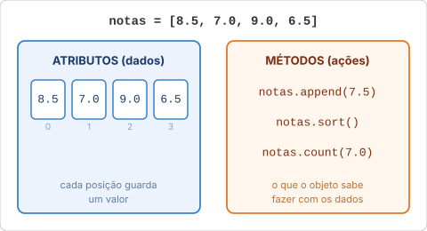
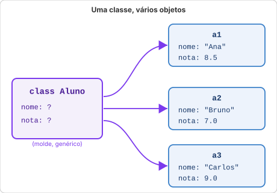
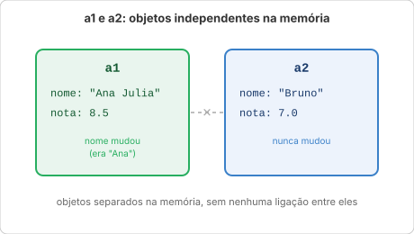
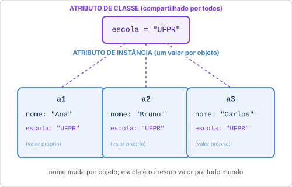
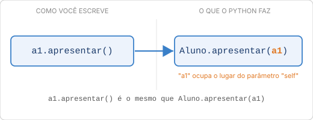
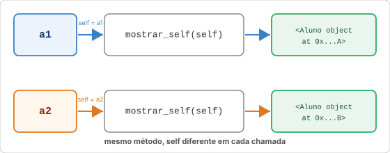

# Aula 16: Objetos e Classes

Você já usou objetos desde o começo sem perceber. Quando escreveu `"python".upper()`, estava chamando um método de um objeto. Quando fez `lista.append(5)`, também. A string é um objeto. A lista é um objeto. O número `2` é um objeto. Em Python, **tudo é objeto**.

Isso não é metáfora: é literal. O número `2` é uma instância da classe `int`, e por isso carrega métodos prontos que você pode chamar direto nele. Um exemplo que costuma surpreender:

```python
print((2).bit_length())   # 2: quantos bits (dígitos binários) são necessários pra guardar o número 2
print(type(2))            # <class 'int'>: a classe da qual 2 é uma instância
```

Até um número tem método, porque até um número é objeto. Esta aula explica o que isso significa e como criar seus próprios tipos.

---

## Onde objetos e classes aparecem

Antes de criar qualquer coisa, vale entender por que isso importa.

Quando você usa uma biblioteca em Python, quase tudo que ela retorna é um objeto:

- A biblioteca `datetime` representa datas como objetos: uma data sabe calcular a diferença para outra data, sabe formatar a si mesma em texto, sabe dizer que dia da semana é.
- A biblioteca `requests` (usada para fazer requisições HTTP) retorna um objeto `Response` com atributos como `.status_code` (200, 404...) e `.text` (o conteúdo da resposta).
- Em jogos, personagens são objetos: têm vida, posição, nome (atributos) e podem andar, atacar, morrer (métodos).
- Em interfaces gráficas, cada botão, janela e caixa de texto é um objeto com atributos (`texto`, `cor`, `tamanho`) e métodos (`clicar()`, `desabilitar()`).

Quando você aprende a criar classes, você aprende a pensar como essas bibliotecas foram construídas e a construir as suas próprias.

---

## O que é um objeto?

Um objeto é um valor que carrega consigo duas coisas juntas:

- **Atributos**: os dados que ele guarda (o que ele é ou tem)
- **Métodos**: as ações que ele sabe fazer (o que ele pode fazer com seus dados)

Exemplo com uma lista, que você já conhece da [Aula 09](09_listas.md):

```python
notas = [8.5, 7.0, 9.0, 6.5]

# Atributo implícito: a lista guarda seus elementos
print(notas[0])       # 8.5

# Métodos: ações que a lista sabe fazer com seus dados
notas.append(7.5)     # adiciona ao final
notas.sort()          # ordena a si mesma
print(notas.count(7.0))  # conta quantas vezes 7.0 aparece
```

A lista não é só um container passivo: ela é um objeto que sabe fazer coisas com seus próprios dados. Isso é o que diferencia um objeto de uma variável simples: atributo é o dado que ele guarda, método é a ação que ele sabe fazer com esse dado. (Tem uma versão ainda mais direta dessa diferença no [FAQ](../extras/faq.md#qual-a-diferença-entre-atributo-e-método).)



---

## O que é uma classe?

Uma **classe** é o molde que define como um tipo de objeto funciona: quais atributos ele vai ter e quais métodos ele vai oferecer.

A analogia mais clara: pense numa **receita de bolo**. A receita define os ingredientes (atributos) e o modo de preparo (métodos). Cada bolo feito a partir dessa receita é um objeto independente: todos seguem a mesma estrutura, mas cada um tem seus próprios valores (um tem mais açúcar, outro é menor).

Em programação, a receita é a **classe**. Cada bolo feito é uma **instância**, um objeto criado a partir daquela classe.



```python
class Aluno:
    pass   # classe vazia por enquanto, só para ver a sintaxe
```

O nome de classes em Python segue a convenção **PascalCase**: cada palavra começa com maiúscula, sem underscore.

Certo: `Aluno`, `ContaBancaria`, `Produto`

Foge do padrão (mas o Python roda do mesmo jeito):

```python
class aluno:           # minúsculo: parece nome de variável, não de classe
    pass

class conta_bancaria:  # underscore com minúsculas: é o padrão de variável e função, não de classe
    pass

class Conta_Bancaria:  # mistura PascalCase com underscore, não é nem uma coisa nem outra
    pass

class ALUNO:           # tudo maiúsculo: parece nome de constante
    pass
```

Repare que nenhuma dessas quatro dá erro. Python não te impede de escrever `class aluno:`, PascalCase é convenção, não regra da linguagem. Mas é uma convenção seguida por praticamente todo código Python que existe, então quando você ver `class nome_assim:` em algum lugar, vai estranhar, e se você escrever assim, quem ler seu código também vai. (O nome desse padrão de minúsculas com underscore que você já usa em variáveis e funções é `snake_case`, você vai ver o termo formalmente na [Aula 18](18_avancado.md).)

---

## Criando uma classe com atributos: `__init__`

O método `__init__` é o **construtor** da classe: o nome vem de "initialize", inicializar. Ele é chamado automaticamente toda vez que você cria um objeto novo, e é onde você define quais atributos esse objeto vai ter.

Pra ver por que ele é necessário, olha o que acontece sem ele:

```python
class Aluno:
    pass

a1 = Aluno("Ana", 8.5)
# TypeError: Aluno() takes no arguments
```

A classe `Aluno` vazia não sabe o que fazer com `"Ana"` e `8.5`: ela não tem nenhum lugar pra guardar esses valores. O `__init__` é exatamente esse lugar:

```python
class Aluno:
    def __init__(self, nome, nota):
        self.nome = nome
        self.nota = nota
```

O que acontece por trás quando você escreve `Aluno("Ana", 8.5)`:

1. O Python cria um objeto novo, ainda vazio, sem `nome` nem `nota`.
2. O Python chama o `__init__` sozinho, passando esse objeto (que dentro do método vira o `self`, você vê isso já na próxima seção) e os valores `"Ana"` e `8.5`.
3. Dentro do `__init__`, `self.nome = nome` grava `"Ana"` no objeto, e `self.nota = nota` grava `8.5`.
4. O objeto, agora com `nome` e `nota` preenchidos, é o que volta pra variável `a1`.


Tudo isso acontece numa fração de segundo, sem você escrever nada disso explicitamente. Criando dois objetos a partir da classe:

```python
a1 = Aluno("Ana", 8.5)
a2 = Aluno("Bruno", 7.0)

print(a1.nome)   # Ana
print(a2.nota)   # 7.0
```

`a1` e `a2` são objetos completamente independentes: cada um tem sua própria cópia dos atributos. Prova rápida:

```python
a1.nome = "Ana Julia"
print(a1.nome)   # Ana Julia (mudou)
print(a2.nome)   # Bruno (não mudou)
```

Mudar o `nome` de `a1` não teve nenhum efeito sobre `a2`, porque são dois objetos separados na memória, criados a partir do mesmo molde mas sem nenhuma ligação entre si depois de criados.



Repare que todo atributo criado até aqui nasce dentro do `__init__`, com `self.`. Isso faz dele um **atributo de instância**: pertence ao objeto, não à classe, e cada objeto tem o seu próprio valor.

Existe também o **atributo de classe**: escrito direto dentro da classe, fora de qualquer método, sem `self.`. Ele não pertence a um objeto específico, pertence à classe inteira, e por isso é o mesmo valor pra todos os objetos ao mesmo tempo:

```python
class Aluno:
    escola = "UFPR"   # atributo de classe: mesmo valor pra todo mundo

    def __init__(self, nome, nota):
        self.nome = nome   # atributo de instância: um valor por objeto
        self.nota = nota

a1 = Aluno("Ana", 8.5)
a2 = Aluno("Bruno", 7.0)

print(a1.escola, a2.escola)   # UFPR UFPR (compartilhado entre os dois)
print(a1.nome, a2.nome)       # Ana Bruno (cada um o seu)
```

Atributo de classe é bem menos comum e foge do escopo desta aula (guarde só o nome da coisa), mas o exemplo acima já deixa claro o critério: se o valor é o mesmo pra qualquer objeto daquela classe, é atributo de classe; se cada objeto pode ter um valor diferente, é atributo de instância, e vive dentro do `__init__` com `self.`.



---

## Entendendo `self`

`self` é a parte que mais confunde no começo. Vamos entender de vez.

Lembra da receita de bolo? A classe é a receita: genérica, ainda sem saber qual bolo específico vai sair dela. Um método definido dentro da classe também é genérico, ele descreve uma ação que qualquer objeto daquela classe pode fazer, mas ainda não sabe em qual objeto especificamente. `self` é a forma de o método dizer "faça isso neste objeto aqui, o que me chamou, não em outro qualquer".

Quando você cria um objeto, o Python precisa de uma forma de diferenciar *este* objeto dos outros criados pela mesma classe. `self` é exatamente isso: é a referência ao objeto específico que está sendo usado naquele momento.

### `self` não é uma palavra reservada

`self` não é um comando especial do Python, é só um nome de parâmetro, igual `nome` ou `nota`. Funciona por convenção, não por regra da linguagem. Prova:

```python
class Aluno:
    def __init__(eu_mesmo, nome, nota):   # funciona, mas não faça isso de verdade
        eu_mesmo.nome = nome
        eu_mesmo.nota = nota

a1 = Aluno("Ana", 8.5)
print(a1.nome)   # Ana, funciona normalmente
```

Esse código roda sem erro nenhum. `eu_mesmo` está fazendo exatamente o que `self` faria, o Python não liga pro nome que você escolhe pro primeiro parâmetro. A única razão pra sempre usar `self` é que **todo mundo** usa `self`, é a convenção universal da comunidade Python, e código que foge dela vira difícil de ler pra qualquer outra pessoa (inclusive você mesmo, semanas depois). E aqui não será diferente, esta aula sempre usa `self`, como convenção.

Olhe o `__init__` de perto:

```python
def __init__(self, nome, nota):
    self.nome = nome   # cria o atributo "nome" NESTE objeto
    self.nota = nota   # cria o atributo "nota" NESTE objeto
```

A linha `self.nome = nome` cria um atributo que vai *viver dentro do objeto* depois que o `__init__` terminar. É o que permite que você acesse `a1.nome` mais tarde.

**Por que `self` é sempre o primeiro parâmetro?**

Porque quando você chama `a1.apresentar()`, o Python traduz isso internamente para `Aluno.apresentar(a1)`: ele passa o próprio objeto como primeiro argumento. `self` é o nome que você dá a esse argumento dentro da função.



### Provando que `self` muda de objeto para objeto

Se `self` é mesmo "o objeto que chamou o método", então em objetos diferentes ele tem que ser um objeto diferente. Dá pra ver isso ao vivo:

```python
class Aluno:
    def __init__(self, nome, nota):
        self.nome = nome
        self.nota = nota

    def mostrar_self(self):
        print(self)

a1 = Aluno("Ana", 8.5)
a2 = Aluno("Bruno", 7.0)

a1.mostrar_self()   # <__main__.Aluno object at 0x759c306b30e0>
a2.mostrar_self()   # <__main__.Aluno object at 0x759c2fd74cd0>, endereço diferente
```

Os números depois de `at` são endereços de memória (esses vão fazer mais sentido daqui a pouco, na seção do `__str__`), e cada chamada imprime um endereço diferente. Isso confirma que `self` dentro de `mostrar_self()` é literalmente o objeto que fez a chamada: `a1` na primeira linha, `a2` na segunda. Não existe um `self` genérico compartilhado, cada chamada tem o seu.



Na hora de *criar* o objeto, você não passa `self`:

```python
a1 = Aluno("Ana", 8.5)   # você passa "Ana" e 8.5; o Python passa self sozinho
```

`self` foi o conceito que mais me confundiu no começo. "por que preciso declarar isso se o Python já sabe em qual objeto estou?" Quando entendi que `a1.apresentar()` é basicamente `Aluno.apresentar(a1)`, o `self` virou só um parâmetro normal com um nome convencionado. (Tem outra explicação da mesma ideia no [FAQ](../extras/faq.md#para-que-serve-o-self).)

---

## Adicionando métodos

Métodos são funções que você já conhece da Aula 13, a única diferença real é que elas vivem dentro da classe e recebem `self` como primeiro parâmetro automaticamente. É por `self` que o método acessa os atributos do objeto:

```python
class Aluno:
    def __init__(self, nome, nota):
        self.nome = nome
        self.nota = nota

    def situacao(self):
        if self.nota >= 7:
            return "Aprovado"
        elif self.nota >= 5:
            return "Recuperação"
        else:
            return "Reprovado"

    def apresentar(self):
        situacao = self.situacao()   # método chamando outro método do mesmo objeto
        print(f"{self.nome} | Nota: {self.nota:.1f} | {situacao}")
```

```python
a1 = Aluno("Ana", 8.5)
a1.apresentar()   # Ana | Nota: 8.5 | Aprovado

a2 = Aluno("Bruno", 4.0)
a2.apresentar()   # Bruno | Nota: 4.0 | Reprovado
```

Repare que `apresentar()` chama `self.situacao()`, um método pode chamar outro método do mesmo objeto. Isso é o que torna classes poderosas: você compõe comportamentos a partir de partes menores.

Lembra da explicação de `self` da seção anterior? Aqui está uma demonstração, as duas linhas abaixo fazem exatamente a mesma coisa:

```python
a1.apresentar()          # forma normal: o Python passa a1 como self sozinho
Aluno.apresentar(a1)     # mesma chamada, com self passado manualmente
```

Na segunda linha você chama o método a partir da classe (`Aluno.apresentar`, não `a1.apresentar`) e entrega `a1` como um argumento comum, no lugar que seria do `self`. É basicamente o que o Python faz sozinho por baixo dos panos toda vez que você escreve `objeto.metodo()`.

---

## O método `__str__`: como o objeto aparece no `print`

Sem `__str__`, fazer `print` de um objeto mostra algo inútil:

```python
a = Aluno("Ana", 8.5)
print(a)   # <__main__.Aluno object at 0x7f3a2c1b4d90>
```

Esse endereço hexadecimal é onde o objeto mora na memória (o mesmo tipo de endereço que aparece no [FAQ](../extras/faq.md#como-o-python-guarda-variáveis-na-memória--e-o-que-o-is-realmente-verifica) quando o assunto é como o Python guarda variáveis). Na primeira vez que aparece na tela, parece que alguma coisa quebrou; não quebrou, o Python só está sendo literal ("aqui está o objeto, no endereço tal"), sem saber que forma bonita você queria ver.

E isso já diz algo importante: mesmo sem você escrever nada, o Python já sabia *o que* mostrar quando você faz `print(a)`, só que o jeito padrão dele é esse endereço feio. Escrever seu próprio `__str__` não inventa essa capacidade do zero, você está só trocando o jeito padrão pelo seu:

```python
class Aluno:
    def __init__(self, nome, nota):
        self.nome = nome
        self.nota = nota

    def __str__(self):
        return f"Aluno({self.nome}, nota={self.nota:.1f})"
```

```python
a = Aluno("Ana", 8.5)
print(a)          # Aluno(Ana, nota=8.5)
print(str(a))     # Aluno(Ana, nota=8.5), mesmo resultado
```

O nome `__str__` vem de *string*: é o método que diz como transformar o objeto em texto legível. Ele também entra em ação sozinho quando você coloca o objeto dentro de uma f-string:

```python
print(f"Ficha do aluno: {a}")   # Ficha do aluno: Aluno(Ana, nota=8.5)
```

**Uma pegadinha:** colocar uma *lista* de objetos no `print` volta a mostrar o endereço feio, mesmo com `__str__` já definido:

```python
a1 = Aluno("Ana", 8.5)
a2 = Aluno("Bruno", 7.0)
print([a1, a2])
# [<__main__.Aluno object at 0x702979c70e10>, <__main__.Aluno object at 0x702979c70f50>]
```

Isso acontece porque, dentro de uma lista, o Python usa um método parecido chamado `__repr__` em vez do `__str__`. Como só definimos `__str__` aqui, o padrão feio volta a aparecer. Os detalhes completos, inclusive o porquê da seção anterior usar `for aluno in turma: aluno.apresentar()` em vez de `print(turma)` direto, estão no [FAQ](../extras/faq.md#por-que-print-de-uma-lista-de-objetos-mostra-o-endereço-feio-mesmo-com-__str__-definido).

`__init__` e `__str__` fazem parte de um grupo de métodos que o Python chama sozinho, sem você nunca escrever `objeto.__init__()` ou `objeto.__str__()` na mão. Esse grupo se chama **métodos especiais** ou **dunder methods** (do inglês *double underscore*, "underscore duplo", por causa dos dois underscores no nome, obviamente). Alguns outros que você vai encontrar por aí:

- `__repr__`: o "parente" do `__str__` que acabou de aparecer, usado dentro de listas e outras estruturas
- `__len__`: entra em ação quando você faz `len(objeto)`
- `__eq__`: entra em ação quando você compara com `==`
- `__lt__`: entra em ação quando você compara com `<` (`>`, `<=` e `>=` têm os seus próprios: `__gt__`, `__le__`, `__ge__`)
- `__iter__`: é o que deixa um objeto ser percorrido num `for`, e é ele que faz `for linha in leitor` funcionar com o `csv.DictReader` que você viu na [Aula 15](15_modulos.md)

Até operador matemático usa esse mecanismo: quando você viu `Path("dados") / "turma" / "notas.txt"` também na Aula 15, aquele `/` não era divisão, era o método `__truediv__` da classe `Path` entrando em ação, mudando o que `/` significa pra ela. Por enquanto, `__init__` e `__str__` já resolvem a grande maioria dos casos que você vai precisar nesta disciplina; o resto você reconhece quando aparecer, porque a ideia é sempre a mesma: nome com dois underscores, chamado sozinho pelo Python na hora certa.

---

## Modificando atributos

Você pode ler e modificar atributos de fora da classe diretamente:

```python
a1 = Aluno("Ana", 8.5)
print(a1.nota)    # 8.5

a1.nota = 9.0     # atualiza diretamente
print(a1.nota)    # 9.0
```

Você também pode criar métodos específicos para modificar, isso permite validar o valor antes de aceitar:

```python
class Aluno:
    def __init__(self, nome, nota):
        self.nome = nome
        self.nota = nota

    def atualizar_nota(self, nova_nota):
        if 0 <= nova_nota <= 10:
            self.nota = nova_nota
        else:
            print(f"Nota inválida: {nova_nota}. Use um valor entre 0 e 10.")
```

```python
a1 = Aluno("Ana", 8.5)
a1.atualizar_nota(9.5)    # funciona, atributo atualizado
a1.atualizar_nota(15)     # Nota inválida: 15. Use um valor entre 0 e 10.
```

A vantagem de passar pela função é que você pode garantir que o objeto nunca fique em um estado inválido: uma nota de 15 ou -3 nunca vai entrar. Isso é uma das ideias centrais da Programação Orientada a Objetos, que você vai aprofundar na [Aula 17](17_poo.md).

---

## Múltiplos objetos: trabalhando com listas

Classes ficam mais poderosas quando você cria vários objetos e os organiza em estruturas que já conhece:

```python
turma = [
    Aluno("Ana", 8.5),
    Aluno("Bruno", 7.0),
    Aluno("Carlos", 4.5),
    Aluno("Diana", 9.0),
]

for aluno in turma:
    aluno.apresentar()

# Média da turma
soma = 0
for aluno in turma:
    soma += aluno.nota
media = soma / len(turma)
print(f"\nMédia da turma: {media:.2f}")

# Quem passou
print("\nAprovados:")
for aluno in turma:
    if aluno.situacao() == "Aprovado":
        print(f"  {aluno.nome}")
```

A lista `turma` guarda objetos `Aluno`. Você itera sobre ela com `for`, acessa atributos com `.nota`, chama métodos com `.apresentar()`. Tudo que você aprendeu sobre listas se aplica a listas de objetos.

Um adianto: essa lista também poderia ter objetos de classes diferentes ao mesmo tempo, desde que todos entendam os mesmos métodos, o `for` nem percebe a diferença. Isso tem nome, **polimorfismo**, e é um dos quatro pilares que você vai estudar na [Aula 17](17_poo.md).

---

## Por que criar classes em vez de dicionários?

Você poderia representar um aluno com um dicionário:

```python
aluno = {"nome": "Ana", "nota": 8.5}

# Para verificar a situação, você precisaria de uma função separada
def situacao(aluno):
    if aluno["nota"] >= 7:
        return "Aprovado"
    return "Reprovado"
```

Isso funciona para casos simples. O problema aparece quando o programa cresce:

- As funções que operam sobre alunos ficam espalhadas pelo código, sem vínculo claro com os dados
- Qualquer parte do código pode modificar qualquer campo do dicionário sem validação
- Não há como saber o que um dicionário representa sem ler o código que o criou

Com uma classe:

```python
class Aluno:
    def __init__(self, nome, nota):
        self.nome = nome
        self.nota = nota

    def situacao(self):
        if self.nota >= 7:
            return "Aprovado"
        return "Reprovado"
```

Os dados e os comportamentos relacionados ficam juntos. Você sabe exatamente o que um `Aluno` é, o que ele guarda e o que ele sabe fazer, só de ler a classe. E quando você cria `Aluno("Ana", 8.5)`, está criando algo com significado claro, não só um dicionário anônimo.

Isso não quer dizer que dicionário virou proibido: para dados soltos e temporários, ele continua sendo a ferramenta certa. A diferença aparece quando o mesmo conjunto de dados volta a aparecer várias vezes no programa, sempre com as mesmas operações em cima. Nesse ponto, uma classe organiza melhor do que um dicionário nunca vai conseguir.


---

## Exemplo completo: vida de um personagem

Um exemplo que mostra objetos com estado que muda ao longo do tempo, a mesma ideia da seção anterior, agora com mais regras de validação em jogo:

```python
class Personagem:
    def __init__(self, nome, vida_maxima=100):
        self.nome = nome
        self.vida_maxima = vida_maxima
        self.vida = vida_maxima

    def receber_dano(self, valor):
        if valor <= 0:
            print("Dano inválido.")
            return
        self.vida = max(self.vida - valor, 0)
        if self.vida == 0:
            print(f"{self.nome} sofreu {valor} de dano e morreu!")
        else:
            print(f"{self.nome} sofreu {valor} de dano. Vida: {self.vida}/{self.vida_maxima}")

    def curar(self, valor):
        if valor <= 0:
            print("Cura inválida.")
            return
        if self.vida == 0:
            print(f"{self.nome} está morto e não pode ser curado.")
            return
        vida_antes = self.vida
        self.vida = min(self.vida + valor, self.vida_maxima)
        curado = self.vida - vida_antes
        print(f"{self.nome} recuperou {curado} de vida. Vida: {self.vida}/{self.vida_maxima}")

    def __str__(self):
        return f"{self.nome}, Vida: {self.vida}/{self.vida_maxima}"


heroi = Personagem("Alexios")
print(heroi)              # Alexios, Vida: 100/100

heroi.receber_dano(30)    # Alexios sofreu 30 de dano. Vida: 70/100
heroi.curar(50)           # Alexios recuperou 30 de vida. Vida: 100/100
heroi.receber_dano(150)   # Alexios sofreu 150 de dano e morreu!
heroi.curar(20)           # Alexios está morto e não pode ser curado.

print(heroi)              # Alexios, Vida: 0/100
```

A vida de `heroi` ao longo do exemplo, em barra:

```text
100/100  [██████████████████████████████]  Alexios intacto
 70/100  [█████████████████████░░░░░░░░░]  depois de receber_dano(30)
100/100  [██████████████████████████████]  depois de curar(50)
  0/100  [░░░░░░░░░░░░░░░░░░░░░░░░░░░░░░]  morto, depois de receber_dano(150)
```

O objeto `heroi` guarda seu próprio estado (a vida atual) e cada ação o modifica de forma controlada: a vida nunca ultrapassa `vida_maxima` nem fica negativa, e um personagem morto não pode ser curado. Repare também que `curar()` calcula quanto foi efetivamente recuperado (`curado`), não simplesmente o valor pedido; sem isso, curar 50 de vida com apenas 30 faltando reportaria "recuperou 50" mesmo a vida só tendo subido 30. Sem a classe, você precisaria passar a vida como argumento para cada função e devolvê-la atualizada a cada chamada, bem mais fácil de errar.

---

Exemplo rodável desta aula: [`exemplos/16_objetos_classes.py`](../exemplos/16_objetos_classes.py)

## Exercício sugerido

1. Crie uma classe `Produto` com atributos `nome`, `preco` e `estoque`.
2. Adicione um método `disponivel()` que retorna `True` se o estoque for maior que zero.
3. Adicione um método `vender(qtd)` que diminui o estoque, mas só se houver quantidade suficiente.
4. Adicione um método `reabastecer(qtd)` que aumenta o estoque.
5. Adicione `__str__` que exibe as informações do produto formatadas.
6. Crie três produtos, realize algumas vendas e reabastecimentos, e exiba o estado final de cada um.

---

> Na [Aula 17](17_poo.md) você vai aprender os quatro pilares da Programação Orientada a Objetos: encapsulamento, herança, polimorfismo e abstração, conceitos que constroem sobre tudo que você viu aqui.

---

## Exercícios de debug relacionados

| Nível | Arquivo |
| --- | --- |
| Fácil | [`../debug/facil/08_classes.py`](../debug/facil/08_classes.py) |
| Médio | [`../debug/medio/08_classes.py`](../debug/medio/08_classes.py) |
| Difícil | [`../debug/dificil/02_caixa_registradora.py`](../debug/dificil/02_caixa_registradora.py) |

Tente corrigir e compare com a saída esperada descrita no cabeçalho do arquivo. No fácil, se travar num `TypeError` estranho sobre número de argumentos, tem uma explicação direta no [FAQ](../extras/faq.md#por-que-meu-método-dá-typeerror-takes-1-positional-argument-but-2-were-given). O difícil não usa herança nem os outros pilares da [Aula 17](17_poo.md) de propósito: só classes, dicionários e várias camadas de lógica de negócio, para caber ainda aqui.

> **Resposta do exercício:** [`respostas/16_objetos_classes.py`](../respostas/16_objetos_classes.py)
