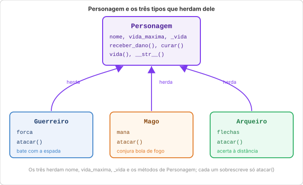

# Aula 17: Programação Orientada a Objetos (POO)

Na [Aula 16](16_objetos_classes.md) você aprendeu a criar classes e objetos. Essa aula é sobre dar nome aos bois: os **quatro pilares** que todo mundo cita quando fala de POO (encapsulamento, herança, polimorfismo, abstração) soam intimidadores, mas são coisas simples que você provavelmente já ia descobrir sozinho na marra, escrevendo classe o suficiente. Vou usar o mesmo `Personagem` da aula passada do início ao fim; se o Alexios ainda estiver fresco na sua cabeça, você vai reconhecer tudo.

---

## Encapsulamento

Encapsulamento é, no fundo, controlar quem pode mexer nos dados internos de um objeto. Em vez de deixar qualquer parte do código sair alterando atributo à vontade, você decide o que é interno e oferece métodos para mexer nisso com segurança.

Sem esse controle, qualquer parte do programa pode colocar o objeto num estado que não deveria existir, tipo um personagem com -50 de vida, o que não significa nada dentro do jogo. Com controle, é o próprio objeto que garante que seus dados sempre fazem sentido, não importa quem está usando ele.

Lembra do `Personagem` da [Aula 16](16_objetos_classes.md)? Lá, `vida` era um atributo comum: qualquer código podia fazer `heroi.vida = -50` e nada impedia. Compare as duas versões (isto é pseudocódigo comparando duas implementações diferentes da mesma classe, não um único bloco rodável):

```python
# Versão da Aula 16, sem encapsulamento: vida é um atributo comum
heroi.vida = -50   # ninguém impediu isso, o personagem "existe" com vida negativa

# Versão desta aula, com encapsulamento: vida vira um método que passa pelo objeto
heroi.receber_dano(9999)   # o método trava a vida em 0, nunca deixa negativa
```

### A convenção `_` em Python

Diferente de linguagens como Java, Python não tem "atributo privado" de verdade. É mais no estilo combinado não sai caro: um `_` na frente do nome sinaliza "isto é interno, não mexe direto", sem travar nada de fato:

```python
class Personagem:
    def __init__(self, nome, vida_maxima):
        self.nome = nome
        self.vida_maxima = vida_maxima
        self._vida = vida_maxima   # _ indica: use os métodos, não acesse direto

    def receber_dano(self, valor):
        if valor <= 0:
            print("Dano inválido.")
            return
        self._vida = max(self._vida - valor, 0)

    def curar(self, valor):
        if valor <= 0:
            print("Cura inválida.")
            return
        self._vida = min(self._vida + valor, self.vida_maxima)

    def vida(self):
        return self._vida

    def __str__(self):
        return f"{self.nome}, Vida: {self._vida}/{self.vida_maxima}"
```

```python
heroi = Personagem("Alexios", 100)
heroi.receber_dano(40)
heroi.curar(10)
heroi.receber_dano(9999)   # vida trava em 0, nunca fica negativa
print(heroi.vida())   # 0
```

Repare no que mudou em relação à Aula 16: `vida` deixou de ser um atributo que você lê direto (`heroi.vida`, sem parênteses) e virou um método que você chama (`heroi.vida()`, com parênteses). O valor de verdade agora mora em `self._vida`; `vida()` só entrega uma cópia dele pra quem pedir. É assim que encapsulamento costuma aparecer na prática: o nome continua familiar, mas quem manda no acesso é o objeto.

Tecnicamente ainda dá pra fazer `heroi._vida = -50` e furar tudo isso: Python não vai te impedir. Mas quase ninguém faz, porque o `_` é um combinado silencioso ("isso aqui é interno, nem olha") que a comunidade Python inteira leva a sério. Quebrar esse combinado é malvisto, mesmo sem nenhum erro te avisando.

---

## Herança

Herança permite criar uma nova classe que **aproveita tudo** que outra já tem, podendo adicionar atributos e métodos novos ou modificar comportamentos existentes.

Sem ela, você copia e cola o mesmo `__init__` e a mesma lógica de vida em cada tipo de personagem que criar, e se um dia decidir mudar como a cura funciona, vai ter que lembrar de mudar em cada cópia espalhada pelo código. Com herança, você escreve o que é comum uma vez só, no `Personagem`, e cada tipo especializa apenas o que muda de verdade.

A relação de herança é sempre "é um": um `Guerreiro` *é um* `Personagem`. Um `Estudante` *é uma* `Pessoa`. Se a frase "X é um Y" soar natural, herança provavelmente é uma boa ideia. Se soar forçada, desconfie.

Vamos dar três classes de personagem pro nosso RPG, todas herdando do `Personagem` da Aula 16 (aqui já com o encapsulamento que você acabou de ver):

```python
class Personagem:
    def __init__(self, nome, vida_maxima):
        self.nome = nome
        self.vida_maxima = vida_maxima
        self._vida = vida_maxima

    def receber_dano(self, valor):
        if valor <= 0:
            print("Dano inválido.")
            return
        self._vida = max(self._vida - valor, 0)

    def curar(self, valor):
        if valor <= 0:
            print("Cura inválida.")
            return
        self._vida = min(self._vida + valor, self.vida_maxima)

    def vida(self):
        return self._vida

    def __str__(self):
        return f"{self.nome}, Vida: {self._vida}/{self.vida_maxima}"
```

```python
class Guerreiro(Personagem):
    def __init__(self, nome, vida_maxima=120):
        super().__init__(nome, vida_maxima)      # aproveita o __init__ do Personagem
        self.forca = 15

    def atacar(self):                            # método novo, específico do Guerreiro
        return self.forca * 2                     # bate com a espada


class Mago(Personagem):
    def __init__(self, nome, vida_maxima=80):
        super().__init__(nome, vida_maxima)
        self.mana = 50

    def atacar(self):
        if self.mana < 10:
            print(f"{self.nome} está sem mana para conjurar.")
            return 0
        self.mana -= 10
        return 25                                  # bola de fogo


class Arqueiro(Personagem):
    def __init__(self, nome, vida_maxima=90):
        super().__init__(nome, vida_maxima)
        self.flechas = 12

    def atacar(self):
        if self.flechas <= 0:
            print(f"{self.nome} ficou sem flechas.")
            return 0
        self.flechas -= 1
        return 18
```

Repare que nenhuma das três classes reescreve `__init__` do zero: cada uma chama `super().__init__(nome, vida_maxima)` e deixa o `Personagem` cuidar de `nome`, `vida_maxima` e `_vida`, só acrescentando o que é próprio dela (`forca`, `mana`, `flechas`). `receber_dano()`, `curar()`, `vida()` e `__str__()` nem precisam ser reescritos: os três tipos já ganham eles de graça, só por herdar.

```python
alexios = Guerreiro("Alexios")
print(alexios)                # Alexios, Vida: 120/120
print(alexios.atacar())       # 30

alexios.receber_dano(50)      # herdado do Personagem, sem reescrever nada
print(alexios)                # Alexios, Vida: 70/120
```

A relação de herança entre as classes fica assim:



### `super()`

`super()` é a forma de acessar a classe mãe de dentro da classe filha. Você vai usá-lo em dois lugares:

- No `__init__` da filha: para inicializar os atributos que vêm da mãe, sem repetir o código
- Em métodos sobrescritos: para chamar a implementação da mãe e estender, não substituir completamente

---

## Polimorfismo

Polimorfismo significa que objetos de classes diferentes respondem ao mesmo método, cada um do seu jeito. O código que usa esses objetos nem precisa saber qual tipo específico está lidando: ele só chama o método e deixa cada objeto se virar com a própria versão.

Isso rende um código genérico que funciona com qualquer tipo da hierarquia. Daqui a um mês você pode inventar uma classe `Ladino` nova, adicionar ao grupo, e o `for` abaixo nem percebe: continua funcionando sem você tocar numa linha dele.

```python
grupo = [
    Guerreiro("Alexios"),
    Mago("Zoe"),
    Arqueiro("Kassandra"),
]

dano_total = 0
for personagem in grupo:
    dano = personagem.atacar()   # cada um ataca do seu jeito
    dano_total += dano
    print(f"{personagem.nome} atacou causando {dano} de dano.")

print(f"\nDano total do grupo: {dano_total}")
```

```text
Alexios atacou causando 30 de dano.
Zoe atacou causando 25 de dano.
Kassandra atacou causando 18 de dano.

Dano total do grupo: 73
```

O `for` não sabe, e não precisa saber, se cada item é `Guerreiro`, `Mago` ou `Arqueiro`. Ele só chama `atacar()` e cada objeto responde do seu jeito: o guerreiro multiplica a força, o mago torra mana, o arqueiro gasta flecha.

Isso é polimorfismo na prática: mesma chamada (`atacar()`), resultado diferente dependendo de quem responde.

---

## Abstração

Abstração é separar o que uma classe faz de como ela faz por dentro. Quem usa a classe só precisa conhecer os métodos disponíveis, não os detalhes de implementação, e isso significa que você pode reescrever o miolo inteiro sem quebrar o código de quem usa.

Vamos dar uma armadura ao `Guerreiro`. Ela deve reduzir o dano recebido, mas sem mudar como o resto do código chama `receber_dano()`:

```python
class Guerreiro(Personagem):
    def __init__(self, nome, vida_maxima=120):
        super().__init__(nome, vida_maxima)
        self.forca = 15
        self.armadura = 5

    def atacar(self):
        return self.forca * 2

    def receber_dano(self, valor):                    # sobrescreve o receber_dano do Personagem
        dano_reduzido = max(valor - self.armadura, 0)
        super().receber_dano(dano_reduzido)             # reaproveita a trava de vida mínima do Personagem
```

```python
alexios = Guerreiro("Alexios")
alexios.receber_dano(30)   # a chamada é idêntica à de qualquer outro Personagem
print(alexios.vida())      # 95  (dano de 30 reduzido para 25 pela armadura de 5)
```

Quem escreveu `alexios.receber_dano(30)` não precisou saber que por trás existe uma conta de armadura, nem que ela chama `super().receber_dano()` pra travar a vida em zero. Se amanhã a fórmula da armadura mudar, virar uma porcentagem em vez de um valor fixo, digamos, essa linha continua exatamente igual. É isso que abstração separa: o que a classe promete fazer (`receber_dano(valor)` reduz a vida de forma segura) e como ela cumpre essa promessa por dentro, que pode mudar à vontade.

---

## Os quatro pilares juntos

Na prática, os quatro não aparecem separados, um de cada vez: eles se misturam no mesmo código. Olha só o `Personagem` desta aula:

- **Encapsulamento**: `_vida` é interno, só acessado via `receber_dano()`, `curar()` e `vida()`
- **Herança**: `Guerreiro`, `Mago` e `Arqueiro` herdam de `Personagem`
- **Polimorfismo**: `atacar()` funciona diferente em cada tipo
- **Abstração**: quem usa só precisa saber que todo `Personagem` tem `receber_dano()`, não como cada um trata armadura ou resistência por dentro

Uma classe bem pensada usa os quatro ao mesmo tempo, sem você ficar consciente disso, tipo "agora vou aplicar herança, agora encapsulamento". Eles aparecem sozinhos quando o código está organizado com cuidado; é mais consequência do que meta.

---

## Boas práticas

**Uma responsabilidade por classe.** Vale a mesma regra de funções: se você não consegue descrever o que a classe faz numa frase só, sem "e", ela provavelmente está fazendo coisa demais.

**Prefira composição a herança quando fizer sentido.** Herança é pra "é um". Se a relação for "tem um" (um `Guerreiro` *tem uma* `Arma`, não *é uma* `Arma`), use um atributo, não herança. Forçar herança onde é composição é um erro clássico até de gente que já programa há anos.

**Nomes descritivos.** `receber_dano()`, `atacar()`, `curar()`: verbo, às vezes verbo mais substantivo. Fuja de nomes vagos tipo `processar()` ou `fazer()` que não dizem nada sobre o que o método realmente faz.

---

Exemplo rodável desta aula: [`exemplos/17_poo.py`](../exemplos/17_poo.py)

## Exercício sugerido

1. Crie uma classe `Animal` com atributos `nome` e `som`, e um método `fazer_som()` que imprime `"{nome} faz {som}"`.
2. Crie `Cachorro` e `Gato` herdando de `Animal`. Cada um sobrescreve `fazer_som()` com comportamento próprio.
3. Adicione encapsulamento: `_energia` (começa em 100). Métodos `alimentar(qtd)` (aumenta energia, máximo 100) e `brincar()` (gasta 20 de energia; recusa se energia < 20).
4. Crie uma lista com vários animais de tipos diferentes e chame `fazer_som()` em todos: polimorfismo em ação.

> **Resposta do exercício:** [`respostas/17_poo.py`](../respostas/17_poo.py)

---

> Na [Aula 18](18_avancado.md), a última do material base, você vai conhecer ferramentas que deixam qualquer código mais compacto e robusto: compreensões, `zip`, `enumerate`, type hints e tratamento de erros. Elas funcionam tanto em código solto quanto dentro de classes, incluindo as que você acabou de criar aqui.
